# Akashic Agent Runtime 3.0 完整架构设计

> 文档状态：目标架构提案（PROPOSAL）<br>
> 本地已缓存远端源码基线：`origin/main@f91cf99341a858f1ad6a5524eb7adda973c3d4b1`（2026-07-10，`akasha (#103)`）<br>
> 适用范围：本地优先的单用户/少量用户常驻 Agent，Telegram/Web/CLI 多通道，被动对话、主动推送、Drift 后台任务、插件、MCP 与长期记忆。<br>
> 重要说明：本文不会展示 `config.toml`、环境变量或任何真实凭据；所有 SLO 数字均为待压测校准的初始目标，不代表当前实测结果。

## 0. 一句话结论

Akashic 下一阶段不应重写成微服务，也不应把一切都 MCP 化；应在现有 Python 模块化单体上建立一个**可信、可恢复、按会话串行的 Agent Runtime**：主动和被动链路中的业务工具与业务流程可插拔，但会话顺序、生命周期校验、工具安全裁决、记忆事实、可靠投递、密钥与审计仍由核心 Runtime 掌握。

## 1. 标记与决策摘要

本文使用以下证据标签：

| 标签 | 含义 |
|---|---|
| **FACT** | 已由当前源码、测试或仓库文档直接确认 |
| **EXTERNAL EVIDENCE** | 来自论文、标准或官方工程文档的一手证据 |
| **INFERENCE** | 基于事实推导出的工程判断，尚未由运行数据完全验证 |
| **PROPOSAL** | 本文提出的目标设计 |
| **ASSUMPTION** | 需要产品或运维进一步确认的前提 |

### 1.1 核心决策

1. **PROPOSAL：继续采用模块化单体。** Python 负责可信 Runtime、持久化和策略；TypeScript 负责 Web Chatbox、Dashboard 与插件面板。暂不引入 Go，也不拆微服务。
2. **PROPOSAL：统一 Turn Kernel。** Passive、Proactive、Drift 都编译成版本化 Lifecycle，在同一套 `TurnEnvelope -> Lifecycle -> TurnOutcome` 协议上运行。
3. **PROPOSAL：Session Actor 取代全局被动锁。** 同一 `session_key` 一次只允许一个会修改状态的 Turn，不同会话可在有界并发下运行。
4. **PROPOSAL：Durable Inbox + Transactional Outbox。** 接收、会话提交和投递意图持久化；渠道发送采用至少一次尝试、幂等键和状态对账，实现“效果上一次”，不宣称严格 exactly-once。
5. **PROPOSAL：模型只产生候选决策。** LLM 可以提出工具调用、记忆候选和 `DeliveryIntent`，但最终授权、状态提交和外部副作用由确定性核心代码裁决。
6. **PROPOSAL：业务可插拔、内核不可随意替换。** Lifecycle 模块、业务工具、Ranker、Judge、Memory Engine、Channel Adapter 可扩展；Runtime 事务、Tool Policy、Outbox、Secrets、Audit 不是普通插件。
7. **PROPOSAL：MemoryEventLog 是事实变化账本。** `sessions/messages` 仍保存原始对话；Markdown 是人可读投影，memory2/Akasha 是可重建检索投影，任何写入都带来源、版本和可撤销关系。
8. **PROPOSAL：主动推荐形成可评估闭环。** 候选召回、规则过滤、排序、LLM 判断、打扰策略、投递、反馈归因分层；日志必须记录 exposure/propensity，避免把“没点开”直接当成“不感兴趣”。
9. **PROPOSAL：插件分信任等级。** 仓库内置插件可同进程；第三方 Python 插件和 MCP 默认子进程隔离，并显式声明权限、网络、文件和密钥能力。
10. **PROPOSAL：演进式迁移。** 新旧链路通过适配器和 feature flag 并行验证，先补可靠投递，再统一执行内核，最后迁移记忆和主动学习，不做一次性大爆炸重写。

## 2. 范围与非目标

### 2.1 本设计要解决

- 用户消息从 Telegram/Web/CLI 进入后的持久化、顺序、取消、恢复与投递一致性。
- 主动 Tick 从候选获取到最终发送/跳过的可解释、可评估和可恢复闭环。
- Passive/Proactive/Drift 三条链路共享执行语义，同时保持业务插件化。
- 内置工具、插件工具、MCP 工具统一发现，但由核心策略做最终授权。
- Markdown、memory2、Akasha 与会话原文之间的事实边界和重建机制。
- 插件版本、能力、隔离、故障熔断与可观测性。
- Dashboard 的鉴权、审计和运维闭环。
- Windows 本地部署、Telegram、DeepSeek/Qwen/Ollama、Chrome-CDP/MCP 的清晰边界。

### 2.2 明确非目标

- **不**把 Akashic 改造成面向海量租户的云原生微服务平台。
- **不**承诺网络副作用的严格 exactly-once；目标是幂等、对账和效果上一次。
- **不**让模型直接拥有数据库提交、密钥读取、消息发送或安全策略修改权限。
- **不**把 session、memory authority、runtime transaction、proactive policy、audit/eval 做成 MCP。
- **不**用向量库替代原始会话和版本化事实。
- **不**在没有曝光概率、离线评估和回滚能力时直接上线自学习推荐策略。
- **不**把“本地运行”误认为“天然安全”；本地插件、CDP、stdio MCP 仍具有用户权限边界。

## 3. 当前版本事实与问题

### 3.1 当前架构事实

| 结论 | 标签 | 源码证据 |
|---|---|---|
| 入口由 `main.py` 构建 `AppRuntime`，再启动 Core、Channels 与循环任务 | FACT | `main.py:106 serve`；`bootstrap/app.py:64 AppRuntime`；`bootstrap/app.py:98 AppRuntime.start` |
| 被动链路已有七个插件阶段入口，Reasoner 内含 BeforeStep/AfterStep | FACT | `agent/core/passive_turn.py:101-116`；`agent/core/passive_turn.py:238 PassiveTurnPipeline`；`agent/plugins/base.py:29-47` |
| 主动链路已有 LifecycleSpec、slot 依赖检查和插件 Provider 冲突检查 | FACT | `proactive_v2/lifecycle.py:12-30`；`proactive_v2/lifecycle.py:172-181`；`proactive_v2/loop.py:225-238` |
| 默认主动流程、主动判断和 Drift 已拆为插件模块 | FACT | `plugins/default_proactive/plugin.py:29 DefaultProactivePlugin`；`plugins/proactive_flow/plugin.py:17 ProactiveFlowPlugin`；`plugins/drift_flow/plugin.py:17 DriftFlowPlugin` |
| MCP Source 复用全局 ToolRegistry，而不是另建一套工具系统 | FACT | `proactive_v2/mcp_sources.py:40 SharedMcpGateway`；`proactive_v2/loop.py:177-185` |
| Session 与 Message 已保存到 SQLite，消息有主键和 `(session_key, seq)` 唯一约束 | FACT | `session/store.py:21 SessionStore`；`session/store.py:43-63`；`session/manager.py:302` |
| Telegram 有 allowlist 和进程内消息去重 | FACT | `infra/channels/telegram_channel.py:71`；`infra/channels/telegram_channel.py:221`；`infra/channels/telegram_channel.py:262` |
| ToolRegistry 有 read-only/write/external-side-effect 元数据；Hook 可 deny 或改参 | FACT | `agent/tools/registry.py:65-71`；`agent/tool_hooks/executor.py:226-231` |
| Markdown 记忆把稳定档案、待归档候选和近期上下文分开，并为 PENDING 提供崩溃回滚 | FACT | `agent/memory.py:29-39`；`agent/memory.py:90-171` |
| Akasha 明确把 `sessions.db/messages` 作为事实源，把自身数据库视为可重建索引/图 | FACT | `plugins/akasha/REBUILD.md:8-18`；`plugins/akasha/engine.py:103-116` |
| Dashboard 使用 FastAPI，默认绑定 `0.0.0.0`，当前入口未见强制认证依赖 | FACT | `bootstrap/dashboard_api.py:701-737`；`bootstrap/dashboard_api.py:1285`；`bootstrap/dashboard_api.py:1335` |

### 3.2 当前关键缺口

| 缺口 | 直接证据 | 影响 |
|---|---|---|
| 被动 Turn 使用全局锁 | `agent/looping/core.py:128`、`:652-654` | 一个慢会话会阻塞其他会话；无法利用多模型/API 并发 |
| MessageBus 与 EventBus 关键队列在内存中 | `bus/queue.py:122-127`；`bus/event_bus.py:127-153` | 进程崩溃会丢未处理消息、观察事件或投递任务 |
| 出站仅固定延迟重试一次，最终可彻底丢失 | `bus/queue.py:176-201` | 无持久重试、死信、幂等和人工对账 |
| ToolRegistry 上下文是共享可变字典 | `agent/tools/registry.py:122-130`、`:238-256` | 开放跨会话并发后可能发生上下文串扰 |
| 工具风险标签存在，但最终授权不是独立核心策略引擎 | `agent/tools/registry.py:65-71`；`agent/tool_hooks/executor.py:25` | 插件 Hook 可参与保护，但缺少不可绕过的统一裁决点 |
| 主动会话和发送前副作用早于渠道确认 | `agent/turns/orchestrator.py:47-79` | 进程在发送边界崩溃时，历史与真实投递状态可能不一致 |
| 主动投递成功通过结果字符串判断 | `agent/turns/outbound.py:44-72` | 协议脆弱，无法表达 unknown、retryable、channel_message_id |
| 插件通过 `exec_module` 在主进程加载 | `agent/plugins/manager.py:418-428` | 第三方 Python 插件等同获得宿主进程权限，不能称为安全沙箱 |
| 原始会话、Markdown、memory2、Akasha 通过事件和约定协作，但缺少统一可审计的记忆变化账本 | `memory2/store.py:49-66`；`plugins/default_memory/engine.py:651-677`；`plugins/akasha/engine.py:645-646` | 难以统一处理更新、遗忘、冲突、人工编辑和投影游标 |
| 主动反馈目前主要是 `interesting/not_interesting` 回写 source | `proactive_v2/mcp_sources.py:261-281`；`plugins/default_proactive/resolve.py:84-116` | 缺少曝光概率、行为置信度、延迟反馈与反事实离线评估 |
| Dashboard 默认广泛监听且未见强制认证 | `bootstrap/dashboard_api.py:737`、`:1285` | 在局域网或端口转发场景存在管理面暴露风险 |
| CI 只覆盖 Python 类型检查和单测 | `.github/workflows/ci.yml:1-36` | 前端构建、依赖/密钥扫描、插件契约、崩溃恢复和安全回归缺位 |

### 3.3 当前系统图

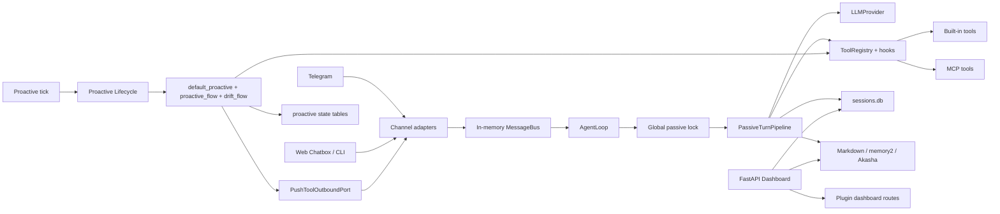

**INFERENCE：**当前架构已经具备很好的“阶段化 + 插件化”骨架，问题不是缺少抽象，而是可靠性、安全性和事实所有权没有成为不可绕过的内核约束。因此目标设计应复用现有 Phase/Lifecycle，而不是再叠一套 Agent Framework。

## 4. 外部证据如何影响设计

| 一手来源 | 关键发现 | 对 Akashic 的设计约束 |
|---|---|---|
| [ReAct, ICLR 2023](https://iclr.cc/virtual/2023/poster/11003) | 推理与行动交错能改善任务执行，但行动会把模型接到外部环境 | 保留 ReAct 式循环；把行动授权和副作用提交放到模型之外 |
| [ToolEmu, ICLR 2024](https://proceedings.iclr.cc/paper_files/paper/2024/hash/7274ed909a312d4d869cc328ad1c5f04-Abstract-Conference.html) | 高风险工具场景存在大量长尾失败 | CI 必须加入模拟工具、危险参数、失败注入和安全评估 |
| [AgentDojo, NeurIPS 2024](https://proceedings.neurips.cc/paper_files/paper/2024/hash/97091a5177d8dc64b1da8bf3e1f6fb54-Abstract-Datasets_and_Benchmarks_Track.html) | 外部工具返回的不可信文本可通过间接 Prompt Injection 劫持 Agent | 工具结果标注 provenance/trust；数据不能自动升级为指令；敏感工具二次授权 |
| [tau-bench, ICLR 2025](https://proceedings.iclr.cc/paper_files/paper/2025/hash/1b126cc38b8638e07bef37e7b2bb72bf-Abstract-Conference.html) | 工具 Agent 不仅要完成任务，还要稳定遵守领域策略；pass^k 揭示重复运行不一致 | 用最终状态与策略违规评估，不只看一次回答是否“看起来对” |
| [LongMemEval, ICLR 2025](https://openreview.net/pdf?id=wIonk5yTDq) | 长期对话记忆要覆盖提取、多会话、时间、更新和拒答 | Memory Eval 必须分别测 recall、temporal update、supersede、abstention |
| [Lost in the Middle, TACL 2024](https://aclanthology.org/2024.tacl-1.9/) | 长上下文中间位置的信息利用显著退化 | 不把全部历史直接塞给模型；先检索、重排、压缩并保留证据引用 |
| [Generative Agents, UIST 2023](https://research.google/pubs/generative-agents-interactive-simulacra-of-human-behavior/) | 经验记录、反思和动态检索可支持长期行为 | 保留原始经历、结构化反思和检索投影的分层，而不是只留摘要 |
| [HippoRAG, NeurIPS 2024](https://proceedings.neurips.cc/paper_files/paper/2024/hash/6ddc001d07ca4f319af96a3024f6dbd1-Abstract-Conference.html) | 图关系与 Personalized PageRank 有助于跨片段、多跳知识整合 | Akasha 适合作为可重建图检索投影，不应成为唯一事实库 |
| [SQLite WAL 官方文档](https://www.sqlite.org/wal.html) | WAL 提升单机读写并发，但同一时刻仍只有一个 writer，且不适合网络文件系统 | 单机 RuntimeStore 采用 WAL、短事务、checkpoint 监控；数据库必须位于本机磁盘 |
| [Orleans Virtual Actors](https://www.microsoft.com/en-us/research/publication/orleans-distributed-virtual-actors-for-programmability-and-scalability/) | Actor 通过实体身份封装状态和顺序，降低并发与恢复复杂度 | 采用轻量 Session Actor/Mailbox，不引入完整 Orleans 依赖 |
| [Temporal 架构说明](https://github.com/temporalio/temporal/blob/main/docs/architecture/README.md) | 可恢复工作流依赖持久历史、确定性编排，以及幂等或不重试的 Activity | Akashic 先实现轻量 checkpoint/outbox；LLM 与工具调用视为非确定性 Activity |
| [Transactional Outbox, Debezium](https://debezium.io/documentation/reference/stable/transformations/outbox-event-router.html) | 业务状态与待发布事件同事务写入，可消除“写库成功但消息未发”的窗口 | 会话提交、MemoryEvent 和 DeliveryIntent 在同一 RuntimeStore 事务提交 |
| [Python Context Variables](https://docs.python.org/3/library/contextvars.html) | `ContextVar` 原生支持 asyncio，避免并发上下文泄漏 | 用不可变 `ExecutionContext` + `ContextVar` 替代 ToolRegistry 全局可变 context |
| [MCP Architecture](https://modelcontextprotocol.io/docs/learn/architecture) | MCP 负责 AI 应用与外部资源/工具的标准化连接 | MCP 是能力边界，不是 Runtime、Session 或 Memory Authority |
| [MCP Security Best Practices](https://modelcontextprotocol.io/docs/tutorials/security/security_best_practices) | 要防 confused deputy、token passthrough、SSRF 等 | MCP Supervisor 隔离凭据，校验 audience/origin/目标地址，不透传 token |
| [OWASP LLM Top 10 2025](https://owasp.org/www-project-top-10-for-large-language-model-applications/assets/PDF/OWASP-Top-10-for-LLMs-v2025.pdf) | Prompt Injection、插件设计和 Excessive Agency 是关键风险 | 最小工具集、最小权限、参数约束、人工批准和审计必须由核心执行 |
| [NIST SP 800-207](https://csrc.nist.gov/pubs/sp/800/207/final) | 不能因网络位置或“本地”而隐式信任主体 | Dashboard、Plugin、MCP、Channel 都按身份与能力授权，不以 localhost 作为唯一安全条件 |
| [OpenTelemetry Context Propagation](https://opentelemetry.io/docs/concepts/context-propagation/) 与 [W3C Trace Context](https://www.w3.org/TR/trace-context/) | 跨执行单元传播 context 才能关联 trace/log/metric | `trace_id/correlation_id/causation_id` 贯穿 Channel、Turn、Tool、Memory、Delivery |
| [Contextual Bandit, WWW 2010](https://doi.org/10.1145/1772690.1772758) | 个性化推荐需同时处理探索、利用和反馈闭环 | 主动排序器要记录选择概率，探索受预算和打扰策略约束 |
| [Unbiased Learning-to-Rank, WSDM 2017](https://www.cs.cornell.edu/~tj/publications/joachims_etal_17a.pdf) | 点击/停留等隐式反馈受曝光位置偏差影响 | 不把未点击直接当负样本；训练和评估记录 propensity/exposure |
| [Doubly Robust Policy Evaluation, ICML 2011](https://icml.cc/2011/papers/554_icmlpaper.pdf) | 结合 reward model 与 logging policy 可降低离线评估偏差/方差 | 新 Ranker 先 shadow，使用 IPS/DR 离线评估后再小流量启用 |
| [Cascading Bandits, NeurIPS 2023](https://proceedings.neurips.cc/paper_files/paper/2023/hash/f95606d8e870020085990d9650b4f2a1-Abstract-Conference.html) | 推荐频率与延迟反馈会共同影响用户流失 | DeliveryPolicy 必须把频率、冷却、安静时段和延迟反馈纳入状态 |
| [Google SRE SLO](https://sre.google/sre-book/service-level-objectives/) | 应从用户关心的可用性、延迟、正确性定义 SLI/SLO | 同时衡量回复成功、重复副作用、投递延迟、记忆正确性和策略违规 |
| [Metastable Failures, OSDI 2022](https://www.usenix.org/conference/osdi22/presentation/huang-lexiang) | 重试和工作放大会让短时过载变成持续故障 | 所有队列有界；重试采用退避、抖动、预算和熔断，禁止无限自激活 |

## 5. 架构驱动因素与质量属性

| 属性 | 优先级 | 设计目标 | 主要机制 |
|---|---:|---|---|
| 正确性 | P0 | 同会话消息有序；状态、记忆事件和投递意图可追踪 | Session Actor、事务提交、版本化契约 |
| 副作用安全 | P0 | 未授权工具不会因模型输出直接执行 | ToolPolicyEngine、最小工具集、批准、幂等 |
| 可恢复性 | P0 | 进程重启后未完成 Turn/Delivery 可继续或对账 | Durable Inbox/Outbox、lease、reconciler、DLQ |
| 隐私与密钥 | P0 | 模型和插件默认拿不到原始凭据 | SecretBroker、capability token、redaction |
| 可扩展性 | P1 | 主动/被动业务模块与工具可插拔 | LifecycleCompiler、CapabilityRegistry、插件 manifest |
| 可解释性 | P1 | 能回答“为何调用工具/写记忆/推送” | DecisionRecord、source refs、reason codes、trace |
| 性能 | P1 | 不同会话并发；单会话严格顺序；资源有界 | Session Mailbox、worker pool、deadline/budget |
| 可维护性 | P1 | 尽量复用现有模块，避免双 Runtime 长期共存 | Ports/Adapters、阶段迁移、contract tests |
| 本地优先 | P1 | 单机 Windows/Linux 可运行，离线能力可选 | SQLite WAL、subprocess supervisor、provider adapters |
| 可评估性 | P1 | 模型/Ranker/Memory 可离线回放和比较 | ReplayBundle、golden trace、shadow policy、eval gates |

## 6. 目标架构总图

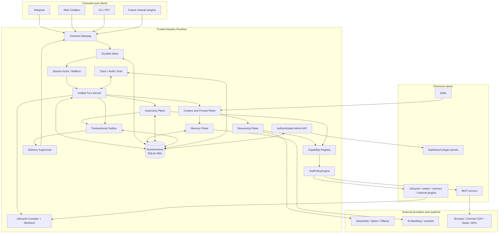

### 6.1 上下文边界图

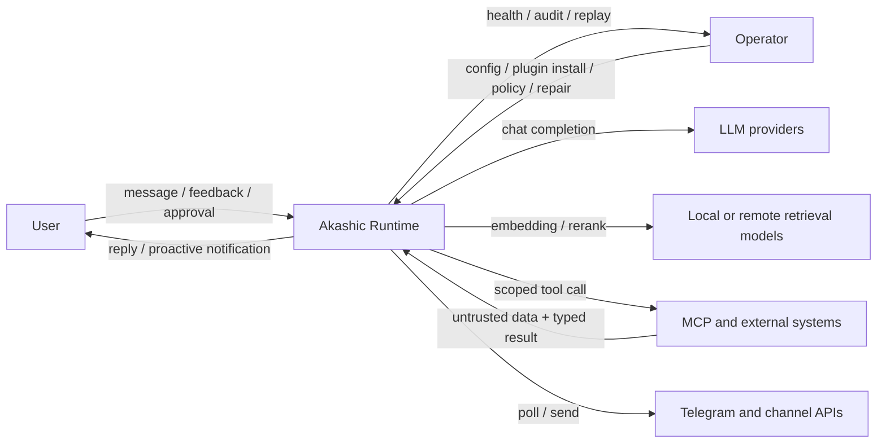

### 6.2 核心与扩展边界

| 能力 | 核心 Runtime | Lifecycle 插件 | 业务工具插件 | MCP | Skill |
|---|---:|---:|---:|---:|---:|
| Turn 事务、状态机、取消、恢复 | **是** | 否 | 否 | 否 | 否 |
| Lifecycle 模块与业务编排 | 编译/校验 | **是** | 可参与 | 否 | 可提供提示流程 |
| 会话顺序与 mailbox | **是** | 否 | 否 | 否 | 否 |
| 工具发现 | Registry 在核心 | 可声明 allowlist | **是** | **是** | 否 |
| 工具最终授权与批准 | **是** | 只能提出约束 | 不能覆盖 | 不能覆盖 | 否 |
| 外部浏览器、文件、Feed、第三方 API | 只做代理/策略 | 否 | 可适配 | **首选边界** | 只能描述步骤 |
| `message_push`/渠道发送 | **Outbox + Channel Port** | 仅产生 Intent | 不直接暴露给 LLM | 不作为普通 MCP | 否 |
| 原始会话与 MemoryEvent 权威 | **是** | 可提交候选 | 可提交候选 | 可返回证据 | 否 |
| 检索算法/图/向量投影 | 接口和一致性 | 可注入 | 可实现 | 可做外部检索源 | 否 |
| 主动候选、Ranker、Judge | 策略框架/硬门禁 | **是** | **是** | 候选来源 | 可提供判断规则 |
| 频率、安静时段、配额、撤回 | **是** | 可提供建议 | 否 | 否 | 否 |
| 密钥、审计、权限清单 | **是** | 只拿 capability | 只拿 capability | 只拿 scoped credential | 否 |

**不变量：主动和被动链路中的业务工具都支持可插拔，但核心 Runtime、可靠投递和安全策略不做成普通插件。**

## 7. 组件设计

### 7.1 组件职责矩阵

| 组件 | 职责与权威 | 输入 | 输出 | 依赖 | 扩展方式 | 失败与恢复 |
|---|---|---|---|---|---|---|
| Channel Gateway | 规范化渠道身份、消息、附件与发送回执；不拥有会话业务状态 | Telegram/Web/CLI 事件 | `InboundEnvelope`、`DeliveryReceipt` | Channel adapters | Channel plugin | 渠道断连退避重连；update id 参与去重 |
| Durable Inbox | 接收入站、幂等去重、租约与重放 | `InboundEnvelope` | 可领取的 `TurnEnvelope` | RuntimeStore | 不可替换，仅存储后端可替换 | lease 过期重投；超过预算进 DLQ |
| Session Actor/Mailbox | 同会话串行、跨会话有界并发；拥有会话内 mutating turn 顺序 | `TurnEnvelope` | Turn 执行任务 | Inbox、TurnKernel | 调度策略可配置 | actor 崩溃后从持久状态重建 |
| Unified Turn Kernel | 生命周期执行、checkpoint、预算、取消、事务提交 | `TurnEnvelope` | `TurnOutcome` | Lifecycle、Store、Policy | 核心不可插件化 | 从最后 committed checkpoint 恢复或明确终止 |
| LifecycleCompiler | 编译 module graph；校验 slot、类型、顺序、冲突和版本 | LifecycleSpec + module providers | `CompiledLifecycle` | Schema registry | Lifecycle plugin | 编译失败则插件不激活，不影响已激活版本 |
| Typed SlotStore | Turn 内不可变/版本化中间状态，禁止任意字典污染 | typed slots | 新 SlotStore snapshot | contract schemas | slot type 可扩展 | 类型/所有权冲突 fail fast |
| Context Plane | 拼装身份、近期对话、记忆证据、skills、策略与 token budget | Turn + MemoryEvidence | `PromptBundle` | Memory、Skill、Prompt renderer | render module | 超预算按证据优先级降级并记录丢弃项 |
| Reasoning Plane | 调用 LLM、解析结构化动作、控制 step/成本/时间预算 | `PromptBundle` | `ActionProposal` / final candidate | Provider adapters | model/provider plugin | provider fallback、deadline、circuit breaker |
| Capability Registry | 统一索引 built-in、plugin、MCP 工具及来源、版本、风险 | manifests/tool schemas | 候选工具集合 | Plugin/MCP supervisors | tool provider | provider 掉线时原子撤销 capability snapshot |
| ToolPolicyEngine | 工具最终授权；不可被插件绕过 | SecurityContext + ToolCall + ToolMeta | allow/deny/require_approval/rewrite constraints | PolicyStore、Audit | policy rule provider 只能加严 | 默认拒绝；决策写审计；批准过期自动失效 |
| Tool Executor | 执行已授权调用，隔离超时、并发、重试和幂等 | AuthorizedToolCall | `ToolResultEnvelope` | supervisors | executor adapters | 外部副作用默认不盲重试；unknown 进入对账 |
| RuntimeStore | 可信事实：session、message、turn、inbox、outbox、tool ledger、memory/feedback events、audit | 事务命令 | 版本化记录 | SQLite WAL 初始实现 | StoragePort | crash recovery、backup、integrity_check、migration journal |
| Memory Plane | 接受候选、验证来源、提交事件、投影与召回 | TurnCommitted/ManualEdit | MemoryEvent、EvidenceBundle | RuntimeStore、projectors | Memory Engine/Projector plugin | projector 可重放；失败不影响原始会话 |
| Autonomy Plane | 候选召回、排序、判断、干扰控制、反馈归因 | Tick + profile + source items | `DeliveryIntent` / skip / DriftIntent | Ranker、Judge、Policy | source/ranker/judge plugin | stage 超时可降级/skip；绝不绕过 delivery gate |
| Transactional Outbox | 与状态提交同事务保存投递意图和幂等键 | `DeliveryIntent` | 待发送记录 | RuntimeStore | 不可普通插件化 | lease、退避、DLQ、人工重放、对账 |
| Delivery Supervisor | 二次发送门禁、渠道发送、回执归一化 | outbox record | typed `DeliveryResult` | Channel Gateway | adapter | sent/failed/unknown 分流；unknown 主动查证 |
| Capability Supervisor | 插件/MCP 子进程生命周期、健康、权限与版本 | plugin manifests | capability snapshots | OS/process sandbox | supervisors | 熔断、重启预算、隔离故障、回滚版本 |
| Observability/Eval | trace、metric、structured log、audit、replay bundle | 全链路事件 | dashboard/alerts/eval artifacts | OTel、RuntimeStore | exporters/evaluators | 采集失败不能阻塞主链路；audit 失败时敏感动作 fail closed |
| Admin API/Dashboard | 受认证的配置、记忆、插件、DLQ、审计和回放管理 | operator requests | typed API results | AuthN/Z、RuntimeStore | UI panel plugin | 默认 localhost；远程访问需 TLS/认证；所有写操作审计 |

### 7.2 建议代码布局

这是增量目标，不要求一次移动全部现有文件：

```text
agent/
  runtime/
    contracts.py          # TurnEnvelope, TurnOutcome, ids, budgets
    kernel.py             # UnifiedTurnKernel
    lifecycle.py          # versioned compiler and typed SlotStore
    session_actor.py      # per-session mailbox and scheduler
    execution_context.py  # immutable ContextVar-backed context
  policy/
    tools.py              # core ToolPolicyEngine
    delivery.py           # disturbance, quota, quiet-hours policies
    approvals.py
  delivery/
    outbox.py
    supervisor.py
    contracts.py
  autonomy/
    gateway.py            # candidate gateway
    ranking.py
    feedback.py
    attribution.py
  memory/
    event_log.py
    reconciler.py
    projectors.py
  capabilities/
    registry.py
    supervisor.py
    manifest.py
  observe/
    tracing.py
    audit.py
    replay.py
session/
  runtime_store.py        # evolve SessionStore; same SQLite authority
infra/
  channels/               # existing adapters implement new contracts
plugins/
  default_proactive/      # adapted, not rewritten at once
  proactive_flow/
  drift_flow/
  default_memory/
  akasha/
```

### 7.3 为什么仍然是模块化单体

- **FACT：**当前代码主要是 Python，运行数据在本机 SQLite，外部依赖主要是模型/渠道/MCP；没有独立团队、独立扩缩和跨地域一致性需求。
- **EXTERNAL EVIDENCE：**SQLite WAL 明确适合单主机并发，不适合网络文件系统。
- **PROPOSAL：**可信内核保持一个进程和一个事实库，减少跨服务事务；不可信插件/MCP 用子进程做安全/故障隔离，而不是为了“架构先进”拆业务微服务。
- **未来拆分触发条件：**单机写锁成为实测瓶颈、需要多实例 HA、多租户隔离、任务量超出本机资源，或团队需要独立部署。触发后优先替换 `RuntimeStore` 和 worker transport，而不是重写上层 Lifecycle。

## 8. 统一执行模型

### 8.1 Turn 类型

| kind | 触发者 | 典型生命周期 | 是否允许直接面向用户 |
|---|---|---|---:|
| `passive` | 用户消息 | prepare -> retrieve -> reason/tool -> commit -> reply | 是 |
| `proactive` | scheduler/tick | sense -> retrieve -> rank -> judge -> delivery policy -> intent | 仅经 Outbox |
| `drift` | 主动链路 skip/空闲预算 | select skill -> plan -> bounded work -> checkpoint | 默认否，需单独 intent |
| `system` | operator/recovery | reconcile -> repair -> audit | 否 |
| `spawn` | 父 Turn | bounded subtask -> result -> parent resume | 否 |

### 8.2 核心状态机

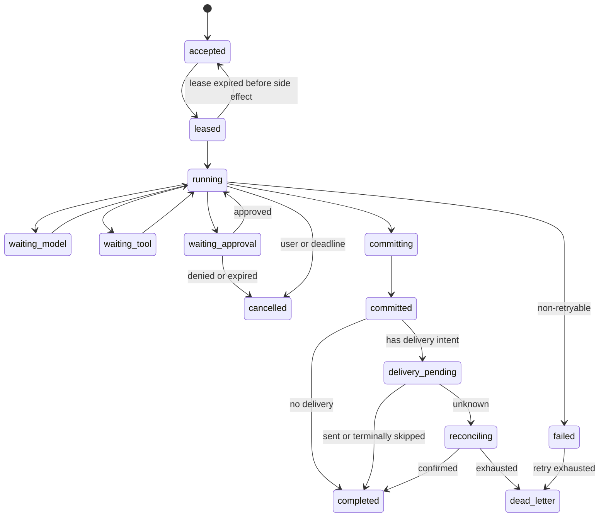

### 8.3 Lifecycle 编译规则

1. 每个 Lifecycle 有 `id + semantic_version + contract_version + module set hash`。
2. Module 显式声明 `requires`, `produces`, `collects`, `side_effect_class`, `timeout`, `owner`。
3. Slot 有类型、生产者、可见范围和合并策略；普通插件不能覆盖 core-owned slot。
4. 编译器检测缺失依赖、重复唯一生产者、循环、terminal slot 缺失、权限超集和不兼容版本。
5. 一个 Turn 固定使用开始时的 Lifecycle/Config/Capability snapshot；运行中热更新不改变它。
6. 新 Lifecycle 先 compile + contract test，再原子发布；旧版本保留到所有 in-flight Turn 完成。

### 8.4 执行预算

每个 `TurnEnvelope` 必须包含或派生：

- deadline；
- 最大 LLM steps、tool calls、parallel tools；
- token/cost budget；
- tool risk ceiling；
- retry budget；
- cancellation policy；
- max output/media size；
- proactive disturbance budget。

预算属于核心硬限制。插件可以收紧，不能放宽到超过用户/管理员策略。

## 9. 关键运行链路

### 9.1 被动消息链路

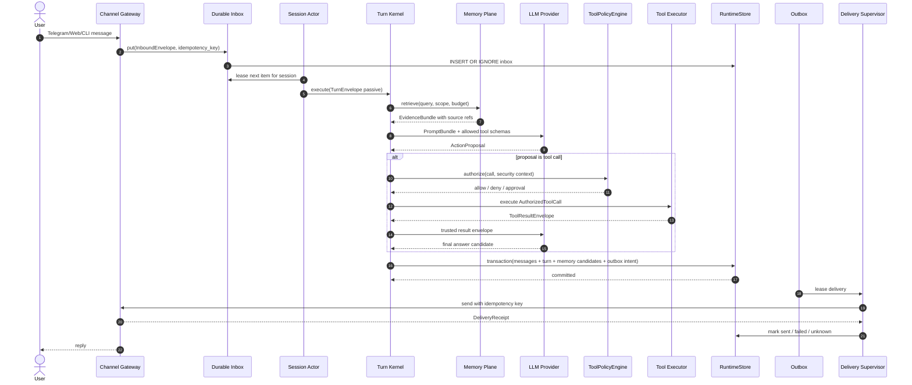

关键语义：

- Channel 收到消息后先持久化，再 ACK 渠道；Telegram update/message id 与 Akashic idempotency key 共同去重。
- 同一 session 的 mutating Turn 串行，不同 session 由 worker semaphore 并发。
- 记忆返回的是带 `EvidenceRef` 的证据，不是无来源的 prompt 文本。
- ToolPolicyEngine 在模型选工具后、执行前再次检查；工具结果作为 untrusted data 回到模型。
- 最终回答、会话消息、MemoryCandidate 和 DeliveryIntent 同事务提交。
- 用户取消只停止尚未提交的后续工作；已发生外部副作用写入 ledger，并明确向用户说明状态。

### 9.2 主动推送链路

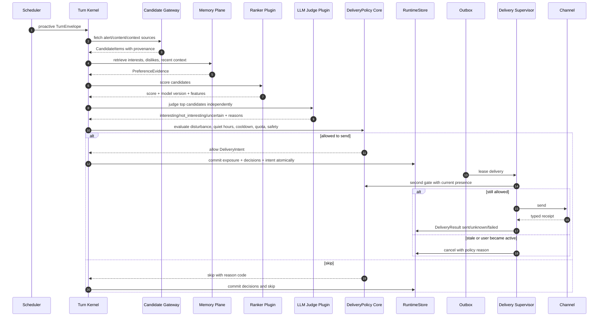

分层原则：

1. **Candidate Gateway** 只负责从 Feed/MCP/插件获取候选和来源，不决定是否打扰用户。
2. **Hard Filter** 先做去重、过期、安全、语言、黑名单和规则检查。
3. **Ranker** 低成本排序，允许插件实现；其输出只是候选分数。
4. **LLM Judge** 逐条给出语义兴趣判断和理由，避免一条命中导致整批标记。
5. **DeliveryPolicy** 是核心确定性门禁，综合安静时段、最近交互、频率预算、风险和用户显式设置。
6. **Outbox second gate** 在真正发送前重新检查用户是否刚刚活跃，解决判断与发送之间的时间差。
7. **FeedbackAttributor** 在发送之后异步生成反馈事件；未响应默认是 `unknown`，不是负反馈。

### 9.3 Drift 链路

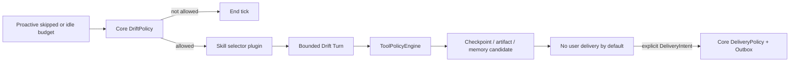

Drift 与 Proactive 共用调度和预算，但不是“没内容时无限自主循环”。核心限制：

- 单次 Drift 有 deadline、step/tool/cost 限额；
- 不能自行提高频率或创建无界递归任务；
- 默认只能产生本地 artifact、checkpoint 或 MemoryCandidate；
- 若要通知用户，必须产生独立 `DeliveryIntent` 并再次过打扰策略；
- Skill 只是工作说明，不能绕过 ToolPolicyEngine 或直接提交可信状态。

### 9.4 工具调用链路

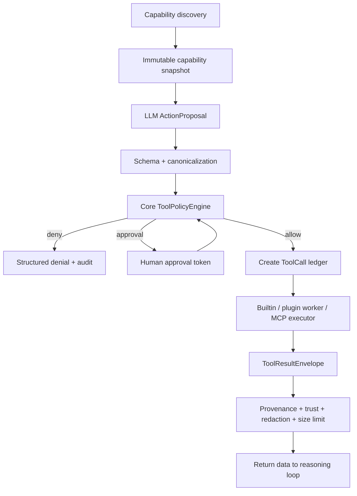

安全规则：

- LLM 只看到当前 Turn allowlist 内的工具，不是完整 Registry。
- `risk`, `source`, `permissions`, `data_classification`, `idempotency`, `retry_semantics` 由可信 manifest 或内核定义；MCP tool annotations 仅作提示，不直接信任。
- 外部副作用工具必须声明幂等能力；无法幂等且结果 unknown 时不自动重试，转入 reconciliation。
- 工具返回内容统一包装为“数据”，剥离其修改系统指令的权力。
- 文件/URL/命令参数做规范化和 allowlist；网络访问防 SSRF；输出做敏感信息脱敏和大小限制。
- 高风险调用需要短时、单次、绑定 `turn_id + tool_name + args_hash` 的批准令牌。

### 9.5 失败恢复链路

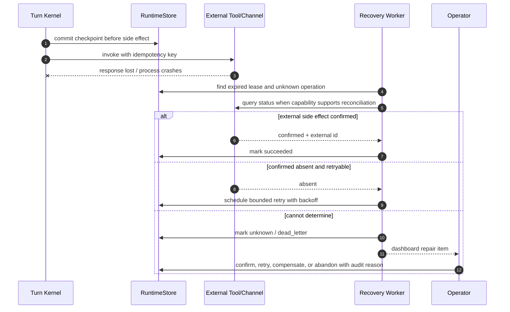

## 10. 数据架构与一致性

### 10.1 权威数据与投影

| 数据 | 权威存储 | 写入者 | 一致性 | 是否可重建 |
|---|---|---|---|---:|
| sessions/messages | RuntimeStore（初期沿用 `sessions.db`） | Turn Kernel | 单库事务、单会话有序 | 否，原始记录 |
| inbox/turn/checkpoints | RuntimeStore | Channel Gateway/Kernel | lease + compare-and-set | 部分 |
| tool_call_ledger | RuntimeStore | Tool Executor | 状态机 + idempotency key | 否，审计事实 |
| outbox/delivery_attempts | RuntimeStore | Kernel/Delivery Supervisor | transactional outbox | 否，投递事实 |
| memory_events | RuntimeStore | Memory Plane | append-only + supersedes | 否，记忆变化事实 |
| Markdown memory | Workspace files | Markdown Projector/Reconciler | eventual + revision hash | 是 |
| memory2.db | sidecar | Vector Projector | eventual + cursor | 是 |
| akasha.db | sidecar | Akasha Projector | eventual + cursor | 是 |
| feedback_events/exposures | RuntimeStore | Autonomy/Attributor | append-only | 否，学习事实 |
| ranker features/models | versioned artifact store | Trainer/Admin | immutable version | 是/可回滚 |
| metrics/traces | OTel/observe store | instrumentation | best effort | 否 |
| audit_events | RuntimeStore + optional append-only export | core policy/admin | fail-closed for sensitive writes | 否 |

### 10.2 物理存储决策

**PROPOSAL：M1-M4 阶段不新建第二个权威 SQLite 文件。**直接演进现有 `SessionStore` 为 `RuntimeStore`，在同一个 `sessions.db` 中增加 runtime 表，启用 WAL。这样一次 SQLite 事务可以同时提交 message、turn outcome、memory event 和 outbox intent，避免跨两个数据库的伪原子双写。

建议新增逻辑表：

```text
runtime_schema_migrations
inbox_items
turns
turn_checkpoints
tool_calls
tool_approvals
outbox_messages
delivery_attempts
memory_events
projector_cursors
feedback_events
exposures
config_snapshots
capability_snapshots
audit_events
dead_letters
```

SQLite 运行约束：

- `journal_mode=WAL`，数据库仅放本机磁盘；
- 保持短写事务，LLM/MCP/Channel 网络调用绝不放在事务内；
- 配置 `busy_timeout`，监控 `SQLITE_BUSY`、WAL 大小和 checkpoint latency；
- 定时 `wal_checkpoint(PASSIVE)`，维护窗口可用 `RESTART/TRUNCATE`；
- 启动时检查 SQLite 版本和 `PRAGMA integrity_check`；
- 备份时使用 SQLite backup API，并把主库、WAL 状态作为一个一致整体处理；
- 当前 SQLite 官方文档披露过 WAL reset 竞态修复要求，因此部署清单必须固定已修复版本，而不是依赖系统自带旧 DLL。

### 10.3 事务边界

一个 Passive Turn 的可信提交事务包含：

```text
append user/assistant/tool ledger messages
update turn state to committed
append MemoryCandidate/MemoryEvent
insert DeliveryIntent into outbox
advance inbox item to completed
append audit summary
```

事务之后才执行渠道发送。外部 ToolCall 发生在事务外，但调用前后都更新 `tool_calls` 状态；若工具有副作用，先提交 `prepared` 和幂等键，再执行，再提交结果。

### 10.4 幂等与顺序

| 场景 | 幂等键 | 顺序键 | 重复处理结果 |
|---|---|---|---|
| Telegram/Web 入站 | `channel + account + external_message_id` | `session_key` | `INSERT OR IGNORE`，返回已接收状态 |
| Turn | `turn_id` 或 inbox id | `session_key + session_seq` | 已 committed 直接返回 outcome ref |
| ToolCall | `turn_id + step + tool + canonical_args_hash` | tool-specific | 幂等工具可返回已存在结果；非幂等转人工对账 |
| Delivery | `delivery_id` | `session_key` | 渠道支持时透传幂等键；否则本地去重 + receipt 对账 |
| MemoryEvent | `source_type + source_id + content_hash` | memory entity | 重复 source ref 不重复生成 active fact |
| FeedbackEvent | `delivery_id + item_id + signal_type + observed_window` | item/user | 合并重复观察，保留最高可信来源 |

### 10.5 MemoryEvent 模型

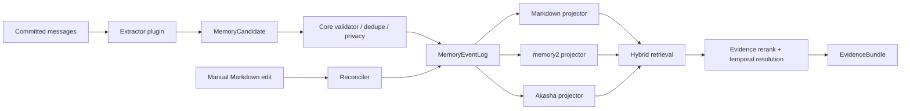

MemoryEvent 类型至少包括：

- `candidate_created`
- `fact_accepted`
- `fact_corrected`
- `fact_superseded`
- `fact_forgotten`
- `manual_edit_detected`
- `projection_completed`
- `projection_failed`

Memory fact 包含 `scope`, `subject`, `predicate/type`, `content`, `source_refs`, `confidence`, `valid_from`, `valid_to`, `sensitivity`, `retention`, `supersedes`, `status`。LLM 不能直接写 active fact，只能提交 candidate；确定性校验和插件化 consolidation 决定是否接受。

#### 为什么仍保留 Markdown + PENDING

- `MEMORY.md` 是人可读、可编辑的稳定投影，适合审计和迁移。
- `PENDING.md` 是高频候选缓冲，Optimizer 批量整理后再更新稳定投影，减少 prompt cache 高频失效和档案抖动。
- `sessions/messages` 与 `memory_events` 才是重建依据；Markdown 人工修改由 Reconciler 变成带 `manual_edit` 来源的事件，禁止静默双向覆盖。
- memory2/Akasha 负责检索，不承担事实最终权威；游标和 checksum 使其可重放、可对拍。

### 10.6 主动反馈与排序数据

`FeedbackEvent` 不再只有二值字符串，至少记录：

```text
feedback_id
user/session scope
candidate_item_id + source_id
delivery_id / exposure_id
objective: inspect | send | engage | explicit_preference
label: positive | negative | neutral | unknown
source: explicit | behavior | llm_pseudo | operator
confidence
reason_code
observed_at + attribution_window
logging_policy_version
propensity
rank_position
features_hash
```

反馈优先级：用户显式“别再推这个” > 用户显式喜欢 > 明确行为信号 > 延迟弱行为 > LLM pseudo label。`no_click/no_reply` 单独记录为 unknown；只有在定义明确窗口和可观测行为后才能作为低置信度信号。

Ranker 上线流程：

1. 规则/启发式 baseline；
2. 收集完整 exposure + propensity；
3. 离线训练，时间切分防泄漏；
4. 使用 replay、IPS/DR、coverage、calibration 与打扰指标评估；
5. shadow 只打分不影响发送；
6. 小流量 canary，核心 DeliveryPolicy 不变；
7. 达不到效果或安全阈值自动回滚模型版本。

## 11. 契约设计

以下为逻辑契约，实际实现建议用 frozen dataclass/Pydantic，并为落库/跨进程版本提供 JSON Schema。

### 11.1 Turn 契约

```python
@dataclass(frozen=True)
class TurnEnvelope:
    schema_version: str
    turn_id: str
    kind: Literal["passive", "proactive", "drift", "system", "spawn"]
    session_key: str
    session_seq: int
    idempotency_key: str
    correlation_id: str
    causation_id: str | None
    traceparent: str | None
    lifecycle_id: str
    lifecycle_version: str
    config_snapshot_id: str
    capability_snapshot_id: str
    security_context: "SecurityContext"
    payload: "TurnPayload"
    budget: "ExecutionBudget"
    accepted_at: datetime
    deadline_at: datetime


@dataclass(frozen=True)
class TurnOutcome:
    schema_version: str
    turn_id: str
    status: Literal["committed", "cancelled", "failed", "dead_letter"]
    final_response: "ResponseCandidate | None"
    tool_call_ids: tuple[str, ...]
    memory_candidate_ids: tuple[str, ...]
    delivery_intent_ids: tuple[str, ...]
    decision_record_ids: tuple[str, ...]
    usage: "UsageSummary"
    error: "ProblemDetail | None"
```

### 11.2 工具契约

```python
@dataclass(frozen=True)
class ToolDescriptor:
    name: str
    version: str
    source_type: Literal["core", "plugin", "mcp"]
    source_id: str
    input_schema: dict[str, object]
    output_schema: dict[str, object] | None
    risk: Literal["read", "write", "external_side_effect", "privileged"]
    permissions: frozenset[str]
    data_classes: frozenset[str]
    idempotency: Literal["native", "keyed", "none", "unknown"]
    retry_semantics: Literal["safe", "reconcile_first", "never"]
    timeout_ms: int


@dataclass(frozen=True)
class ToolDecision:
    decision: Literal["allow", "deny", "require_approval"]
    reason_code: str
    policy_version: str
    constrained_arguments: dict[str, object]
    approval_scope: "ApprovalScope | None"


@dataclass(frozen=True)
class ToolResultEnvelope:
    call_id: str
    status: Literal["succeeded", "failed", "timeout", "unknown"]
    content: tuple["ContentBlock", ...]
    provenance: tuple["EvidenceRef", ...]
    trust: Literal["trusted_system", "trusted_plugin", "external_untrusted"]
    external_operation_id: str | None
    retryable: bool
    problem: "ProblemDetail | None"
```

### 11.3 投递契约

```python
@dataclass(frozen=True)
class DeliveryIntent:
    delivery_id: str
    turn_id: str
    session_key: str
    channel: str
    recipient_ref: str
    content: tuple["ContentBlock", ...]
    idempotency_key: str
    policy_snapshot_id: str
    not_before: datetime
    expires_at: datetime
    priority: int
    reason_code: str


@dataclass(frozen=True)
class DeliveryResult:
    delivery_id: str
    status: Literal[
        "pending", "sending", "sent", "failed", "unknown", "cancelled", "dead_letter"
    ]
    attempt: int
    channel_message_id: str | None
    retryable: bool
    error_code: str | None
    observed_at: datetime
```

### 11.4 记忆与反馈契约

```python
@dataclass(frozen=True)
class MemoryEvent:
    event_id: str
    event_type: str
    memory_id: str
    scope: str
    content: dict[str, object]
    source_refs: tuple["EvidenceRef", ...]
    confidence: float
    sensitivity: str
    valid_from: datetime | None
    valid_to: datetime | None
    supersedes: tuple[str, ...]
    producer: str
    created_at: datetime


@dataclass(frozen=True)
class FeedbackEvent:
    feedback_id: str
    exposure_id: str
    item_id: str
    label: Literal["positive", "negative", "neutral", "unknown"]
    source: Literal["explicit", "behavior", "llm_pseudo", "operator"]
    confidence: float
    reason_code: str
    propensity: float | None
    observed_at: datetime
```

### 11.5 错误契约

内部和 Dashboard API 统一使用 [RFC 9457](https://www.ietf.org/rfc/rfc9457.html) 风格 `ProblemDetail`：`type`, `title`, `status`, `detail`, `instance`, `error_code`, `retryable`, `correlation_id`。面向用户的文本与内部错误分离，严禁把堆栈、路径、token 或上游原始响应直接发给用户。

### 11.6 管理 API

建议稳定 API：

| Method | Path | 用途 | 权限 |
|---|---|---|---|
| GET | `/api/v1/health/live` | 进程存活 | public/local |
| GET | `/api/v1/health/ready` | DB、provider、channel、migration readiness | operator |
| GET | `/api/v1/turns/{id}` | Turn 状态、trace 和决策 | operator |
| POST | `/api/v1/turns/{id}/cancel` | 取消未提交 Turn | operator/user owner |
| GET | `/api/v1/deliveries` | outbox/DLQ 查询 | operator |
| POST | `/api/v1/deliveries/{id}/repair` | retry/confirm/abandon | admin + audit |
| GET | `/api/v1/memory/events` | 记忆事件审计 | operator |
| POST | `/api/v1/memory/{id}/correct` | 纠正/遗忘 | user owner/admin |
| GET | `/api/v1/capabilities` | 当前 capability snapshot | operator |
| POST | `/api/v1/approvals/{id}` | 批准/拒绝工具调用 | user owner |
| GET | `/api/v1/plugins` | 版本、权限、健康 | operator |
| POST | `/api/v1/plugins/{id}/activate` | 激活已验证插件版本 | admin |
| POST | `/api/v1/replays` | 创建脱敏 ReplayBundle | admin |

## 12. 插件、MCP 与 Skill 架构

### 12.1 统一 Manifest

每个插件声明：

```yaml
id: example.plugin
version: 1.2.0
runtime_contract: ">=3.0,<4.0"
entrypoint: plugin:ExamplePlugin
trust_tier: isolated
provides:
  lifecycles: []
  lifecycle_modules: []
  tools: []
  memory_engines: []
  rankers: []
  channels: []
  jobs: []
  dashboard_panels: []
permissions:
  filesystem_read: []
  filesystem_write: []
  network_hosts: []
  secrets: []
  subprocess: false
resource_limits:
  memory_mb: 512
  cpu_seconds: 30
  max_concurrency: 2
```

Manifest 是请求，不是授权。管理员策略生成实际 `CapabilityGrant`；插件只能看到授予后的能力。

### 12.2 信任等级

| Tier | 示例 | 执行位置 | 默认权限 | 故障处理 |
|---|---|---|---|---|
| `core` | Runtime、Outbox、ToolPolicy | 主进程 | 内核专有 | 进程级告警，严格测试 |
| `bundled_trusted` | 仓库内 default_proactive/default_memory | 主进程，签名/固定版本 | manifest 声明范围 | 模块熔断，可回滚版本 |
| `isolated` | 第三方 Python 插件 | 子进程/受限 worker | 无网络、无密钥、workspace 受限 | 超时 kill、重启预算、隔离撤销 |
| `mcp_local` | stdio MCP | 独立子进程 | 显式环境变量和目录 | Supervisor 管理、stdout 协议隔离 |
| `mcp_remote` | HTTP MCP | 网络外部服务 | scoped OAuth/token | origin/audience/host 校验、熔断 |

Windows 上不能把普通子进程等同强沙箱。高风险第三方插件应进一步使用 Windows Sandbox、低权限专用账号、Job Object/AppContainer，或容器/WSL；架构文档必须如实标注实际隔离级别。

### 12.3 Lifecycle 插件

- 提供 Passive/Proactive/Drift 的业务 Module；
- 声明 typed slot 和副作用分类；
- 允许注入 Prompt、CandidateSource、Ranker、Judge、MemoryExtractor；
- 不能替换 Turn 事务、Session Actor、Outbox、ToolPolicy 最终决策；
- core-owned slots 只读；插件输出通过 schema 校验后进入下一阶段。

### 12.4 业务工具插件

- 被动和主动链路使用同一 `CapabilityRegistry`；
- 插件工具与 MCP 工具都可按 Lifecycle、用户、会话和风险生成 allowlist；
- 调用必须走 ToolPolicyEngine 和 Tool Executor；
- 业务工具不能通过持有 RuntimeStore 连接绕过策略；只拿窄 Port，例如 `MemoryCandidatePort`、`ArtifactPort`、`CandidateSourcePort`；
- 内置 `message_push` 迁移为核心 `DeliveryPort`，不再暴露给普通 LLM tool selection。

### 12.5 MCP 边界

适合 MCP：浏览器/Chrome-CDP、文件服务、Feed、搜索、日历、第三方 SaaS、论文库、图片生成等外部能力。

不适合 MCP：session 排序、Turn checkpoint、MemoryEvent authority、ToolPolicy、DeliveryPolicy、Outbox、Audit、Config snapshot、用户权限。

MCP Supervisor 必须：

- 固定 server id、版本或镜像 digest；
- 对 stdio 分离 stdout 协议和 stderr 日志；
- 启动/握手/工具调用分别设 timeout；
- 限制环境变量、工作目录、网络和文件系统；
- 维护 health/circuit state，不因单个 MCP 阻塞整个 Turn；
- 远程 HTTP 默认校验 TLS、Origin、OAuth audience 和目标 host；
- 禁止 token passthrough；凭据由 SecretBroker 按 server/operation 注入；
- 对返回内容标记 `external_untrusted`，限制大小、MIME 和 URI scheme；
- 浏览器连接复用已有 Chrome/CDP session，只有 session 失效后才重建，避免频繁打开新页面。

### 12.6 Skill 边界

Skill 是版本化提示词、检查清单和工作流说明，适合 Drift 或复杂任务的“怎么做”。它不拥有可靠状态、工具权限和副作用提交。Skill 中即使写着“执行命令/发送消息”，实际动作仍必须经过 Capability Registry、ToolPolicy 和 Outbox。

### 12.7 Dashboard 插件面板

- 面板只能调用版本化 Admin API，不能直接读取 DB 文件或挂任意未鉴权路由；
- 后端插件路由需要声明 scope，并统一经过 auth middleware；
- 前端资源做 CSP、完整性/版本检查和依赖扫描；
- 面板异常不影响核心 Dashboard；插件页按 Error Boundary 隔离。

## 13. 安全与治理

### 13.1 威胁模型

| 威胁 | 示例 | 核心控制 |
|---|---|---|
| 直接/间接 Prompt Injection | 网页或 Feed 内容诱导调用敏感工具 | provenance、data/instruction 分离、最小工具集、二次授权 |
| Excessive Agency | 模型反复发消息、删文件、执行命令 | hard budget、ToolPolicy、DeliveryPolicy、approval |
| Confused Deputy/token 泄露 | MCP 把一个服务 token 转给另一个 API | SecretBroker、audience 校验、禁止 passthrough |
| SSRF/DNS rebinding | MCP/浏览器访问本地管理端口或 metadata | URL canonicalization、host/IP policy、Origin 校验、egress rules |
| 插件供应链 | 第三方插件 import 时执行任意代码 | 固定版本/digest、manifest、签名、隔离 worker、依赖扫描 |
| 跨会话数据串扰 | 共享 ToolRegistry context 被并发覆盖 | immutable ExecutionContext + ContextVar + Session Actor |
| 记忆污染 | 工具返回或模型幻觉被写成用户事实 | candidate-only、source refs、confidence、supersede、用户纠错 |
| 重复副作用 | 超时重试导致重复消息/操作 | idempotency key、ledger、reconcile-first、outbox |
| 管理面暴露 | Dashboard `0.0.0.0` 无认证 | 默认 127.0.0.1、认证、CSRF/CORS、TLS/反代、审计 |
| 敏感输出 | 日志/错误/Replay 泄露 token 和隐私 | structured redaction、secret patterns、data classification |

### 13.2 ToolPolicy 决策顺序

```text
1. capability snapshot 中是否存在且版本一致
2. 当前 lifecycle 是否允许该工具
3. user/session/channel 身份是否具有 scope
4. risk ceiling 与 data classification 是否允许
5. 参数 schema、路径、URL、命令是否通过规范化约束
6. 是否命中速率、成本、时间、并发预算
7. 是否需要 human approval
8. 是否具备幂等/对账策略
9. 生成不可变 AuthorizedToolCall 与 audit decision
```

任一步缺失信息默认 deny。插件 Hook 可以提前 deny 或收紧参数，但不能把核心 deny 改成 allow。

### 13.3 密钥管理

- 配置文件只保存 secret reference，例如 `env:DEEPSEEK_API_KEY` 或 OS credential id；
- SecretBroker 在调用边界按 capability 注入，LLM prompt、ToolResult、trace 和 Dashboard 永不返回原值；
- stdio MCP 只获得其声明并获批的环境变量；
- 支持启动时 secret scanner 和日志 redaction；
- 插件安装、导出 ReplayBundle、错误包时再次扫描；
- token 轮换不要求重建整个 Runtime，provider/MCP connection 在安全点重连。

### 13.4 Dashboard 安全默认值

- 默认 `127.0.0.1`，不是 `0.0.0.0`；
- 首次启动生成本地管理员凭据或使用 OS user-bound session；
- 远程访问必须经过 TLS 反向代理或受控隧道，并启用短会话、CSRF 和明确 CORS；
- `/health/live` 可最小公开，其他 API 需要认证；
- 记忆编辑、插件激活、DLQ repair、secret/provider 更改属于高风险管理动作，写入不可抵赖审计。

## 14. 部署拓扑

### 14.1 推荐单机部署

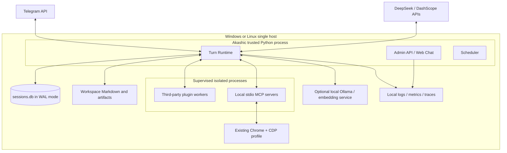

部署规则：

- Core、SQLite 与 workspace 在同一主机；不要把 WAL 数据库放到 SMB/NAS。
- Telegram 和云模型是外部 API；Ollama/本地 embedding 是可替换 Provider，不进入核心事务。
- Chrome-CDP 由专门 Browser MCP/Plugin 管理；复用 profile/tab/session，不让每轮 Turn 启新 Chrome。
- Dashboard 与 Web Chat 可同进程，但管理路由和用户聊天身份分离；公网暴露需要反向代理和认证。
- 本地 plugin/MCP 由 Supervisor 启动，不由 LLM 直接拼接任意命令启动。

### 14.2 可选扩展部署

只有达到拆分触发条件后，才升级为：PostgreSQL RuntimeStore + durable queue + 多 worker。Session Actor 通过 `session_key` 一致性路由，Outbox worker 独立扩缩；Lifecycle、ToolPolicy、Memory/Autonomy contracts 保持不变。不要先引入 Kafka/Temporal/Kubernetes 再寻找问题。

### 14.3 资源与背压

- 全局 worker pool、每 provider、每 MCP、每 tool 都有独立 semaphore；
- Session mailbox 和 source candidate 有界，溢出时按策略合并/拒绝，不无限堆积；
- 主动 Tick 若上一轮未完成，不为同 session 重叠启动；
- 重试采用指数退避 + jitter + retry budget；
- provider/MCP 连续失败触发 circuit breaker，半开探测；
- Drift 仅使用剩余预算，Interactive Passive 永远优先；
- 大附件先落 artifact store，消息总线只传引用和元数据。

## 15. 可观测性、SLO 与运维

### 15.1 统一关联字段

所有 structured log、metric exemplars、trace span、audit/event 表至少携带：

```text
trace_id / traceparent
correlation_id
causation_id
turn_id
session_key_hash
lifecycle_id + version
config_snapshot_id
capability_snapshot_id
tool_call_id / delivery_id / memory_event_id
provider/plugin/mcp id + version
```

日志中不记录原始 token、完整用户敏感内容或未脱敏工具结果；诊断需要内容时使用短期、受权限控制的 encrypted payload ref。

### 15.2 Span 模型

```text
channel.receive
inbox.persist
session.mailbox.wait
turn.execute
  lifecycle.module
  memory.retrieve
  prompt.render
  llm.call
  tool.policy
  tool.execute
  memory.commit
  outbox.enqueue
delivery.dispatch
delivery.reconcile
projector.apply
feedback.attribute
```

### 15.3 初始 SLO（PROPOSAL，待基线校准）

| SLI | 初始目标 | 测量窗口 | 说明 |
|---|---:|---|---|
| 已接受用户消息不丢失率 | >= 99.99% | 30 天 | 以 Durable Inbox 接收成功为起点 |
| Passive Turn 最终有明确结果率 | >= 99.5% | 7 天 | reply/cancelled/structured error 均算明确 |
| Passive 首个可见反馈 p95 | <= 3 s | 24 小时 | typing/progress/stream first token |
| Passive 完成延迟 p95 | <= 45 s | 24 小时 | 按普通文本 Turn 分桶；外部长任务另算 |
| Outbox 最终状态可判定率 | >= 99.99% | 30 天 | sent/failed/cancelled/dead_letter，unknown 不长期滞留 |
| 重复用户可见投递率 | <= 0.01% | 30 天 | 由 delivery id/内容/渠道回执联合检测 |
| 未经授权高风险工具执行 | 0 | 永久 | 违反即安全事故 |
| 跨会话上下文串扰 | 0 | 永久 | 由并发和 property tests 验证 |
| Memory projector lag p95 | <= 60 s | 24 小时 | memory event 到可检索投影 |
| 主动 quiet-hours 违规 | 0 | 30 天 | 除明确 alert override |
| 主动重复内容率 | <= 1% | 7 天 | 同源/近重复窗口需配置 |
| Replay 可重现决策率 | >= 99% | 发布前 | 非确定性调用使用已记录 result |

不能只监控平均延迟。需要 p50/p95/p99、队列等待、provider/tool 分桶、失败码和重试放大倍数。

### 15.4 运维面板

Dashboard 至少提供：

- Runtime health：inbox depth/age、active actors、turn state、event loop lag；
- Delivery：pending/unknown/DLQ、attempt、channel receipt、repair；
- Providers：latency、error、token/cost、circuit state；
- Tools/MCP：调用量、deny/approval、timeout、schema error、进程重启；
- Memory：event rate、projector cursor/lag、rebuild/checksum、纠错/遗忘；
- Autonomy：candidate funnel、rank/judge disagreement、send/skip reason、frequency、feedback coverage；
- Security：policy denies、approval、SSRF/path violations、secret redaction hits；
- Releases：lifecycle/config/capability/model versions 与 error budget。

### 15.5 Runbook 最小集合

1. Inbox 租约卡死与重放。
2. Delivery `unknown` 的渠道对账与人工 repair。
3. SQLite WAL 过大、`SQLITE_BUSY`、备份与 integrity failure。
4. Provider 限流/不可用时的 fallback 与成本熔断。
5. MCP/Chrome-CDP 无响应时复用会话、重连和最后重启顺序。
6. 插件升级失败的 capability snapshot 回滚。
7. Memory projector lag、rebuild、Markdown 冲突与人工纠错。
8. 主动发送异常增长的 kill switch。
9. 密钥泄露后的轮换、日志扫描和审计导出。

## 16. 测试与评估策略

### 16.1 测试金字塔

| 层级 | 必测内容 |
|---|---|
| Unit | 状态机、idempotency、policy rule、slot type、ranking feature、memory supersede |
| Contract | Channel/Provider/MCP/Plugin/MemoryEngine/Ranker/Delivery 接口版本兼容 |
| Property | 同 session 顺序、跨 session 隔离、重复消息、任意 crash point 不丢 committed intent |
| Integration | SQLite WAL、Telegram fake server、MCP subprocess、provider stub、Dashboard auth |
| Scenario | passive tool use、主动 alert/content/context、Drift、approval、cancel、unknown delivery |
| Security | prompt injection、tool result injection、SSRF、path traversal、secret exfiltration、plugin escape |
| Eval | tau-bench 风格策略遵循、AgentDojo 风格攻击、LongMemEval、主动排序离线评估 |
| Chaos | kill -9/reboot、DB busy/disk full、provider timeout、MCP hang、channel duplicate receipt |

### 16.2 确定性 ReplayBundle

ReplayBundle 保存脱敏后的：

- TurnEnvelope 与所有 snapshot id；
- Lifecycle graph 和 module versions；
- 检索 EvidenceRef 与 hash；
- LLM request hash、recorded response、usage；
- ToolDecision、canonical args、recorded ToolResult；
- Memory/Delivery/Feedback events；
- 预期最终 state assertions。

默认 replay 不重新调用外部 LLM/工具，而是消费已记录结果，验证编排、策略和状态提交。需要比较新模型时进入 Eval 模式，明确产生新 run id，绝不污染生产会话。

### 16.3 主动推荐评估

离线指标不能只有 accuracy：

- candidate recall、hard-filter precision；
- NDCG/precision@k、calibration；
- explicit negative rate、mute/unsubscribe rate；
- send frequency、quiet-hours violation、duplicate rate；
- feedback coverage 与 unknown ratio；
- IPS/DR policy value、effective sample size、propensity coverage；
- Ranker 与 LLM Judge disagreement；
- 每次有效互动的 token/API 成本。

### 16.4 CI/CD 门禁

在现有 pyright + pytest 基础上增加：

1. Python/TypeScript lint、typecheck、unit tests；
2. Dashboard/Web/Plugin panel production build；
3. JSON Schema/manifest compatibility tests；
4. SQLite migration forward + backup restore test；
5. crash-point property tests 与 outbox recovery test；
6. secret scan、dependency audit、SBOM、license scan；
7. plugin/MCP security fixtures；
8. golden ReplayBundle regression；
9. memory and autonomy eval smoke suite；
10. Windows + Linux matrix；
11. feature flag/canary rollback test。

## 17. ADR（架构决策记录）

### ADR-001：采用演进式模块化单体

- **状态：**Accepted for proposal
- **决策：**保留 Python trusted runtime + TypeScript UI；不引入 Go/微服务。
- **理由：**当前是单机本地优先、一个主要事实库和少量外部 API，拆服务只会提前引入分布式事务与部署复杂度。
- **替代方案：**全微服务、Temporal 集群、Go runtime 重写。
- **后果：**单机 SQLite writer 是上限；通过 Ports 保留未来替换存储/transport 的路径。

### ADR-002：Session Actor 取代全局 Passive Lock

- **状态：**Accepted for proposal
- **决策：**每个 `session_key` 一个逻辑 mailbox，同会话串行，跨会话有界并发。
- **理由：**保留顺序语义，同时消除全局 head-of-line blocking。
- **替代方案：**继续全局锁；完全无锁并发。
- **后果：**需要 immutable ExecutionContext、lease 和 actor recovery；不能让插件持有跨 Turn 可变全局状态。

### ADR-003：统一 Turn Kernel，不强行统一业务流程

- **状态：**Accepted for proposal
- **决策：**Passive/Proactive/Drift 共享 envelope、生命周期编译、预算、checkpoint、policy、store、trace；具体 modules 仍独立插件。
- **理由：**统一可靠性语义，同时保留三类任务不同的业务目标。
- **替代方案：**三套 loop；一套硬编码超级 pipeline。
- **后果：**需要 adapters 兼容现有 Phase 和 ProactiveLifecycleSpec。

### ADR-004：Transactional Outbox 管理所有用户可见投递

- **状态：**Accepted for proposal
- **决策：**模型和插件只产生 `DeliveryIntent`；核心 Outbox/Delivery Supervisor 发送。
- **理由：**消除先写 session/side effect 后发送失败的状态裂缝，并提供对账、DLQ 和审计。
- **替代方案：**继续 `message_push` 工具；直接 Channel callback。
- **后果：**消息可能延迟几毫秒到数秒；必须设计幂等和 unknown 状态。

### ADR-005：Runtime 事实先集中在现有 sessions.db

- **状态：**Accepted for proposal
- **决策：**扩展 `SessionStore` 为 RuntimeStore，使用同一 SQLite WAL；memory2/Akasha 仍为 sidecar 投影。
- **理由：**会话、Turn、MemoryEvent 和 Outbox 能单事务提交，避免两个权威 SQLite 文件双写。
- **替代方案：**新建 runtime.db；立即上 PostgreSQL；事件流平台。
- **后果：**要严格控制短事务和 WAL；未来规模化时通过 StoragePort 迁移。

### ADR-006：MemoryEventLog + 可重建投影

- **状态：**Accepted for proposal
- **决策：**原始消息和版本化 MemoryEvent 是依据；Markdown、memory2、Akasha 是投影。
- **理由：**统一更新、冲突、遗忘、人工编辑和 rebuild 语义。
- **替代方案：**各引擎独立写事实；只保留 Markdown；只保留向量库。
- **后果：**增加 projector/reconciler；换来审计、回滚和一致性验证。

### ADR-007：ToolPolicyEngine 是不可绕过的核心

- **状态：**Accepted for proposal
- **决策：**所有 built-in/plugin/MCP 调用经过统一核心策略；插件 Hook 只能加严。
- **理由：**风险元数据和 Prompt 约束不能替代确定性授权。
- **替代方案：**完全依赖模型判断；由各插件自行鉴权。
- **后果：**需要 policy DSL/代码、approval UI、兼容性测试；工具接入门槛略升。

### ADR-008：插件按信任等级部署

- **状态：**Accepted for proposal
- **决策：**bundled trusted 可同进程；第三方默认 isolated worker；MCP 由 Supervisor 管理。
- **理由：**当前 `exec_module` 模式无法提供安全或故障隔离。
- **替代方案：**所有插件同进程；所有插件容器化。
- **后果：**跨进程调用增加序列化与启动成本；高风险场景获得真实边界。

### ADR-009：主动 Ranker 采用 shadow + 反事实评估

- **状态：**Accepted for proposal
- **决策：**记录 exposure/propensity，离线 IPS/DR，通过后再 canary；核心 DeliveryPolicy 不由模型替换。
- **理由：**当前二值反馈会混合曝光偏差、位置偏差和延迟反馈。
- **替代方案：**直接在线训练；只靠 LLM Judge；只靠规则。
- **后果：**前期数据/评估工程较多，但可避免“越学越偏”和打扰用户。

### ADR-010：不采用严格 exactly-once 话术

- **状态：**Accepted for proposal
- **决策：**声明 at-least-once attempt + idempotency + reconciliation，目标为 effectively-once effect。
- **理由：**Telegram、MCP 和第三方 API 不提供统一原子事务；超时可能无法判断是否已执行。
- **替代方案：**宣传 exactly-once；失败时不重试。
- **后果：**契约显式保留 `unknown`，需要人工 repair 和补偿机制。

## 18. 分阶段迁移计划

### 18.1 总体策略

- 先建立观测和契约，再改变行为；
- 新表只增不破坏旧表，迁移脚本可重复执行；
- 新 Runtime 通过 adapter 调用现有 `PassiveTurnPipeline`、`ProactiveKernel` 与插件；
- 每阶段有 feature flag、shadow/canary、回滚和删除旧路径的明确退出条件；
- 不长期保留双写：双写只用于短期比对，权威写入者必须唯一。

### M0：基线、契约与可观测性（1-2 周）

**改动：**

- 新增 `TurnEnvelope`, `TurnOutcome`, `ProblemDetail`, `ExecutionContext`；
- 为现有 passive/proactive 生成 correlation/causation/turn id；
- 增加 OTel-style spans 和 structured logging；
- 记录当前延迟、错误、queue age、tool calls、delivery result；
- 建立 ReplayBundle v1，先记录不重放。

**主要文件：**`agent/runtime/contracts.py`、`agent/runtime/execution_context.py`、`agent/observe/*`，并在 `bootstrap/app.py`、`agent/looping/core.py`、`agent/core/passive_turn.py`、`proactive_v2/loop.py` 加 adapter。

**退出条件：**所有现有 Turn 可关联到唯一 turn id；日志不含敏感值；当前行为无回归。

### M1：可靠接收与投递（2-4 周）

**改动：**

- 扩展 `sessions.db` schema：inbox、turns、outbox、delivery_attempts、dead_letters；
- Channel Gateway 先持久化入站；
- `MessageBus` 保留为唤醒/快速通知，不再是唯一事实；
- 新增 typed `DeliveryResult`；
- Passive/Proactive 输出统一写 Outbox；
- 建立 lease、退避、DLQ、unknown reconciliation 和 repair API。

**兼容适配：**`PushToolOutboundPort` 暂时作为 Channel Adapter 后端；旧字符串结果在 adapter 内解析，并立即转 typed result，核心不再依赖字符串。

**退出条件：**在提交前后、发送前后每个 crash point kill 进程，重启后消息不丢，重复投递在目标阈值内，unknown 可人工闭环。

### M2：Session Actor 与 Unified Turn Kernel（3-5 周）

**改动：**

- 新增 per-session mailbox + bounded worker pool；
- 用 `ContextVar[ExecutionContext]` 替换 ToolRegistry 共享 context；
- 把现有 Passive Phase 和 ProactiveLifecycleSpec 适配到版本化 LifecycleCompiler；
- 引入 typed SlotStore 和 budget/cancellation；
- Passive/Proactive/Drift 都通过 Turn Kernel 执行，但业务 modules 不重写。

**迁移顺序：**先 shadow 编译现有图 -> Passive 小流量 -> Proactive -> Drift -> 删除全局 `_passive_runtime_lock`。

**退出条件：**并发 property tests 证明同会话严格顺序、跨会话无串扰；不同会话吞吐提升；现有插件 contract tests 全通过。

### M3：工具安全与能力隔离（3-5 周）

**改动：**

- Capability manifest/snapshot；
- Core ToolPolicyEngine、approval、tool ledger、风险/幂等/重试契约；
- `message_push` 从 LLM 工具集合移除，改为 DeliveryIntent；
- 第三方插件 isolated worker；MCP Supervisor、secret scopes、SSRF/Origin/audience 控制；
- Dashboard 默认 localhost + 强制 auth + 管理动作审计。

**退出条件：**所有工具调用可追踪到 policy decision；高风险工具无 approval 不执行；AgentDojo/OWASP 风格安全回归通过。

### M4：MemoryEventLog 与主动反馈闭环（4-7 周）

**改动：**

- MemoryCandidate/MemoryEvent、projector cursor、Markdown reconciler；
- default_memory/Akasha 作为 projector/engine adapter；
- 全量 rebuild + checksum/parity；
- exposures/FeedbackEvent/Attributor；
- Ranker baseline、shadow、IPS/DR eval 与 model registry；
- DeliveryPolicy second gate 和用户主动偏好控制。

**退出条件：**从 sessions/messages + memory events 可重建 Markdown/memory2/Akasha；LongMemEval 子集和当前回归不下降；Ranker 未经评估不能影响生产发送。

### M5：切换、清理与运行成熟度（2-4 周）

**改动：**

- 移除旧 in-memory authority、全局 context、字符串投递成功判断和直接 push；
- 删除临时双写/adapter；
- CI 完整门禁、Windows/Linux 构建、SBOM 和 migration restore；
- 完善 runbook、SLO/error budget、backup/restore 演练；
- 发布 Runtime Contract 3.0 与插件迁移指南。

**退出条件：**旧路径没有调用者；回滚演练完成；至少一个稳定周期满足校准后的 SLO。

### 18.2 迁移映射

| 当前模块 | 目标去向 | 策略 |
|---|---|---|
| `bus/queue.py MessageBus` | Durable Inbox/Outbox 的内存唤醒层 | 保留 API，改变 authority |
| `agent/looping/core.py AgentLoop` | Session Scheduler + Turn Kernel facade | 先 adapter，后缩减职责 |
| `agent/core/passive_turn.py` | Passive Lifecycle modules | 保留 Phase 实现，逐步声明 typed slots |
| `proactive_v2/lifecycle.py` | Generic LifecycleCompiler | 抽取公共 compiler，保留兼容 spec |
| `proactive_v2/loop.py` | Proactive Turn adapter | Tick 只创建 TurnEnvelope |
| `agent/tools/registry.py` | CapabilityRegistry | 工具索引保留；上下文和授权移出 |
| `agent/tool_hooks/*` | Policy pre/post extension hooks | Hook 只能加严，core decision 最终生效 |
| `agent/turns/outbound.py` | Delivery Adapter | typed result 后逐步删除 PushToolOutboundPort |
| `session/store.py` | RuntimeStore | 原地 schema 演进，保持单一事务库 |
| `agent/memory.py` | Markdown projector/reconciler | 保留文件 UX，移除事实权威歧义 |
| `memory2/*` | Vector projector/engine | 加 cursor、rebuild、parity |
| `plugins/akasha/*` | Graph memory projector/engine | 继续以 sessions/messages + events 为依据 |
| `agent/plugins/manager.py` | Capability Supervisor client | bundled 同进程，third-party 改 worker |
| `bootstrap/dashboard_api.py` | Authenticated Admin API | 路由版本化、统一 auth/audit |

### 18.3 回滚策略

- 每阶段保留上一 schema reader；schema migration 前做一致备份；
- Lifecycle/Config/Capability/Ranker 都通过 immutable version id 回滚；
- Outbox 一旦启用不能回退到“直接发送且不记账”，只能切换发送 adapter；
- Memory projectors 可回滚并从 cursor 重放，不回滚原始 message/memory event；
- canary 以 session cohort 划分，同一 session 不在一次 Turn 中切 Runtime；
- 触发 kill switch 时：停止 proactive/drift 新 Turn，继续 passive 和 outbox repair。

## 19. 风险登记与开放决策

### 19.1 风险登记

| 风险 | 概率 | 影响 | 缓解 | Owner |
|---|---:|---:|---|---|
| SQLite writer/长事务成为瓶颈 | 中 | 高 | 短事务、WAL 监控、单写队列、压测；达到阈值再迁移 PostgreSQL | Runtime |
| Outbox 改造导致重复/延迟 | 中 | 高 | idempotency、second gate、shadow、渠道对账、canary | Delivery |
| Lifecycle 泛化过度增加复杂度 | 中 | 中 | 仅抽公共执行语义；不统一业务 slot；contract tests | Runtime |
| 第三方插件子进程兼容性差 | 高 | 中 | bundled trusted 兼容期、SDK、doctor、逐插件迁移 | Plugin |
| Windows 隔离能力被高估 | 中 | 高 | 明示 trust tier；低权限账号/容器；不宣称普通 subprocess 是 sandbox | Security |
| MemoryEvent 与现有 Markdown 双向同步冲突 | 中 | 高 | revision hash、manual_edit event、单一 reconciler、冲突 UI | Memory |
| Ranker 学习曝光偏差并增加打扰 | 中 | 高 | propensity、unknown label、shadow、DR eval、hard DeliveryPolicy | Autonomy |
| Trace/Audit 数据泄露隐私 | 中 | 高 | 默认脱敏、采样、加密 payload ref、RBAC/retention | Observe |
| 插件/MCP 供应链攻击 | 中 | 高 | pin/digest/signature、permissions、isolation、SBOM | Security |
| 重试风暴使故障自维持 | 中 | 高 | 有界队列、jitter、budget、circuit、kill switch | Runtime |

### 19.2 需要确认的开放决策

1. **ASSUMPTION：**主要部署仍为单机单用户；若近期需要多人共用，身份、租户和数据隔离优先级必须提升到 M1。
2. Dashboard 是否需要远程访问；若需要，选择内置认证还是只支持受控反向代理/隧道。
3. Windows 第三方插件的实际隔离级别：低权限账号、WSL/container 还是只做故障隔离。
4. Telegram 渠道是否能稳定承载自定义幂等信息；若不能，需依赖本地 ledger + receipt heuristics。
5. 哪些用户行为可以合法、可靠地作为主动反馈，归因窗口多长。
6. Markdown 人工编辑的冲突策略：last-writer-wins、交互式合并或仅追加 correction event。
7. 是否保留 `sessions.db` 文件名长期作为 RuntimeStore，还是在一次 major migration 中改名；功能上不应因此产生第二权威库。
8. 何种实测阈值触发 PostgreSQL/多 worker，而非凭感觉提前拆分。

## 20. 验收矩阵

| 当前问题 | 目标机制 | 验收测试 | 回滚信号 |
|---|---|---|---|
| 全局 passive lock | Session Actor | 两会话并行；同会话 1,000 条随机消息顺序不乱 | 串扰/乱序任一出现 |
| 内存队列丢失 | Durable Inbox | 每个持久化/lease crash point 重启重放 | committed inbound 丢失 |
| 发送结果脆弱 | Typed Delivery + Outbox | response lost/duplicate/timeout/unknown 矩阵 | 重复率或 unknown backlog 超阈值 |
| 共享 tool context | ContextVar ExecutionContext | 并发 property test 检查 channel/chat/session 不串 | 任一跨 session 泄露 |
| 工具策略可绕过 | Core ToolPolicy | 插件尝试 allow core deny 必须失败 | 未审计高风险调用 |
| 插件同进程高权限 | trust tier + worker | 恶意插件读禁区/联网/挂死测试 | 越权或拖垮核心 |
| 多记忆投影漂移 | MemoryEvent + cursor | 全量重建 checksum、随机增量 parity | 无法从事实重建 |
| 主动反馈偏差 | exposure/propensity + shadow eval | 时间切分 IPS/DR + canary guardrails | negative/mute/频率恶化 |
| Dashboard 暴露 | localhost + auth/audit | 未认证 401/403、CSRF/CORS、远程绑定检查 | 管理 API 可匿名写 |
| CI 缺少系统性门禁 | contract/security/replay/Windows build | PR 必须全部通过 | 主分支出现不可重现失败 |

## 21. 设计质量门禁自检

### 21.1 证据与边界

- [x] 目标设计基于当前 `origin/main` 源码，而不是只读 README。
- [x] 明确区分 FACT、EXTERNAL EVIDENCE、INFERENCE、PROPOSAL、ASSUMPTION。
- [x] 每个关键组件定义了职责、权威、接口、失败与恢复。
- [x] 明确业务插件、MCP、Skill 与核心 Runtime 的边界。
- [x] 没有把模型输出当成可信提交；副作用由核心策略和 Outbox 管理。
- [x] 没有引入没有当前驱动因素的 Go、Kafka、Kubernetes 或微服务。

### 21.2 可靠性与安全

- [x] 定义了幂等键、unknown、reconciliation、DLQ 和人工 repair。
- [x] 定义了同会话顺序、跨会话并发和共享上下文修复。
- [x] 定义了插件信任级别、MCP 凭据边界、SSRF/Prompt Injection 控制。
- [x] Dashboard 有安全默认值和管理审计。
- [x] 重试有界并防止工作放大。

### 21.3 数据与演进

- [x] 数据所有权、事务边界、权威/投影、重建方式明确。
- [x] 新旧模块有逐项迁移映射、feature flag、退出和回滚条件。
- [x] SLO 被标为提案，未伪装成当前实测性能。
- [x] 当前未运行服务和未做负载测试，因此容量与 SLO 必须在 M0/M1 校准。

## 22. 当前源码证据索引

### 启动与 Runtime

- `main.py:106-114 serve -> build_app_runtime`
- `bootstrap/app.py:64 AppRuntime`
- `bootstrap/app.py:98 AppRuntime.start`
- `bootstrap/app.py:134 start_channels`
- `bootstrap/tools.py:70 CoreRuntime`
- `bootstrap/tools.py:464 MessageBus()`

### Passive

- `agent/looping/core.py:108 AgentLoop`
- `agent/looping/core.py:128 _passive_runtime_lock`
- `agent/looping/core.py:652-654 global lock use`
- `agent/core/passive_turn.py:101-116 phase overview`
- `agent/core/passive_turn.py:238 PassiveTurnPipeline`
- `agent/core/passive_turn.py:394/434/475/529/565 phase execution`
- `agent/plugins/base.py:29-47 passive module providers`

### Proactive 与 Drift

- `proactive_v2/lifecycle.py:12-30 ProactiveLifecycleSpec and slots`
- `proactive_v2/lifecycle.py:172-181 terminal slot validation`
- `proactive_v2/loop.py:162-175 runtime provider selection`
- `proactive_v2/loop.py:202-238 module/lifecycle provider validation`
- `proactive_v2/mcp_sources.py:40 SharedMcpGateway`
- `plugins/default_proactive/plugin.py:29 DefaultProactivePlugin`
- `plugins/proactive_flow/plugin.py:17 ProactiveFlowPlugin`
- `plugins/drift_flow/plugin.py:17 DriftFlowPlugin`
- `plugins/proactive_flow/judge.py:53-92 per-item classification/reflection`
- `plugins/default_proactive/resolve.py:84-146 feedback resolution`

### Message、Tool 与 Delivery

- `bus/queue.py:122-127 in-memory queues`
- `bus/queue.py:176-201 one retry and final loss path`
- `bus/event_bus.py:127-153 in-memory observe queue`
- `agent/tools/registry.py:65-71 ToolMeta risk`
- `agent/tools/registry.py:115-130 shared ToolRegistry context`
- `agent/tools/registry.py:238-256 execution/context merge`
- `agent/tool_hooks/executor.py:226-231 deny handling`
- `agent/turns/orchestrator.py:47-79 persistence/side-effect/dispatch order`
- `agent/turns/outbound.py:44-72 PushToolOutboundPort/string success`

### Session 与 Memory

- `session/store.py:21-67 SessionStore and schema`
- `session/manager.py:295-302 SessionManager/sessions.db`
- `agent/memory.py:29-39 Markdown memory files`
- `agent/memory.py:90-171 pending snapshot/rollback`
- `core/memory/engine.py:43 MemoryEngineDescriptor`
- `core/memory/engine.py:68 EvidenceRef`
- `core/memory/engine.py:263 MemoryEngine`
- `core/memory/runtime.py:30 MemoryRuntime`
- `memory2/store.py:49-66 memory_items/consolidation_events`
- `plugins/default_memory/engine.py:651-677 lifecycle event consumers`
- `plugins/akasha/REBUILD.md:8-18 truth and rebuild contract`
- `plugins/akasha/engine.py:103-116 descriptor truth`

### Plugin、Channel、Provider 与 Dashboard

- `agent/plugins/manager.py:283 load_all`
- `agent/plugins/manager.py:418-428 dynamic in-process import`
- `infra/channels/telegram_channel.py:71 TelegramChannel`
- `infra/channels/telegram_channel.py:221 allowlist`
- `infra/channels/telegram_channel.py:262 dedupe`
- `agent/provider.py:197-212 LLMProvider/AsyncOpenAI`
- `bootstrap/dashboard_api.py:701-737 FastAPI construction`
- `bootstrap/dashboard_api.py:1285/1335 default host`
- `.github/workflows/ci.yml:1-36 current Python CI`

## 23. 可信度与限制

### 已由源码确认

- 当前启动、Passive phase、Proactive lifecycle、插件 provider、MCP 共享工具、SessionStore、Markdown/memory2/Akasha、Telegram、Dashboard 和 CI 的结构。
- 当前全局被动锁、内存队列、共享 ToolRegistry context、发送顺序与字符串成功判断等具体缺口。

### 来自仓库文档

- Akasha 的 `sessions.db` truth / `akasha.db` rebuildable 定位。
- README/Handbook 对 Passive、Proactive、Drift、Memory 和插件的产品解释。

### 合理推断

- 全局锁会造成跨会话 head-of-line blocking；共享 context 在开放并发后会串扰。
- 当前多套记忆机制可以工作，但缺统一变化账本时，纠错/遗忘/人工编辑的一致性成本会持续升高。
- `0.0.0.0` 且无强制认证依赖的 Dashboard 在非严格本机场景风险较高。

### 仍需运行验证

- 本次刷新远端时遇到 TLS EOF，因此源码结论固定到上方明确的本地 `origin/main` 快照；晚于该提交的远端变化需要网络恢复后再增量审查。
- 当前实际 p50/p95/p99、吞吐、SQLite lock、WAL、模型成本和主动发送效果。
- 每个 Channel/MCP 对幂等键、状态查询和取消的支持程度。
- Windows 上可接受的插件隔离技术和性能开销。
- 主动反馈的可观测性、样本规模与 Ranker 是否真的优于规则/LLM baseline。

### 不可对外夸大

- 不能宣称当前已实现 durable/exactly-once、强沙箱、完整零信任或生产级 HA。
- 不能宣称 memory2/Akasha 的检索质量等于事实正确性。
- 不能把 LLM 的 `interesting/not_interesting` 当成真实用户标签。
- 不能把“插件化”解释成插件可以替换所有内核安全与事务语义。
- 不能把本文 SLO 当成已有压测结果。

## 24. 最终推荐

优先级应是：**M0 可观测与契约 -> M1 Durable Inbox/Outbox -> M2 Session Actor/Unified Turn Kernel -> M3 ToolPolicy/隔离 -> M4 MemoryEvent/主动反馈学习**。这一顺序先修复“消息和副作用是否可信”，再提升并发和扩展性，最后才让推荐模型从反馈中学习，能最大限度复用 Akashic 当前已经成熟的 Phase、Lifecycle、Memory Engine 与插件骨架。
