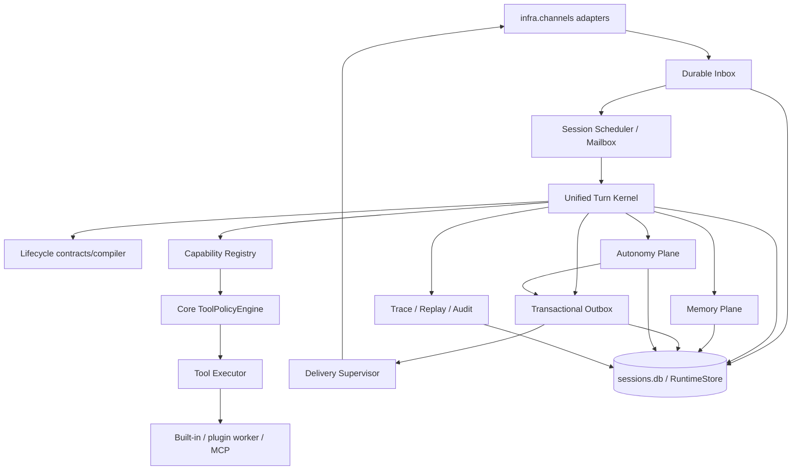
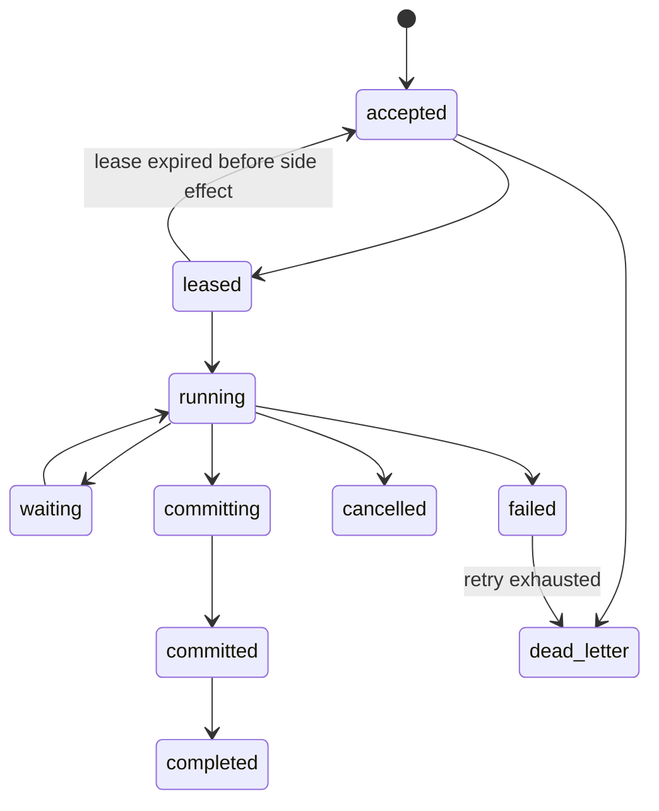
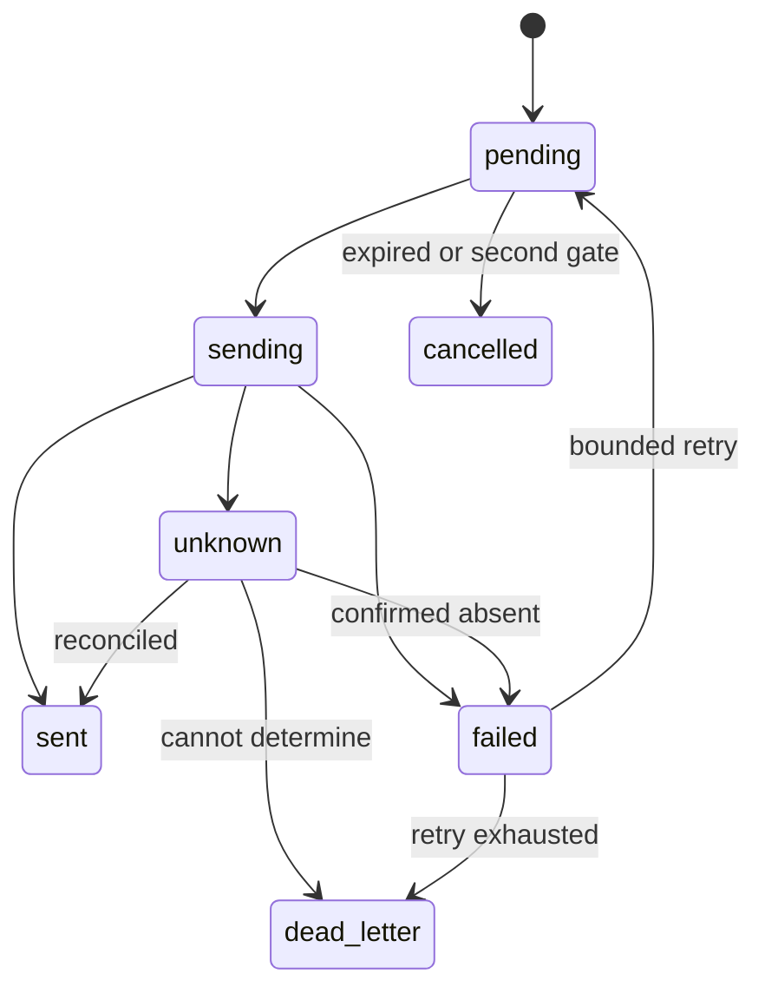

# Akashic Agent Runtime 3.0 实现级 SDD

> 文档类型：Software Design Description / Goal Execution Contract<br>
> 状态：实现基线 v1.0<br>
> 源码基线：`origin/main@f91cf99341a858f1ad6a5524eb7adda973c3d4b1`<br>
> 架构依据：`_handbook/akashic-agent-runtime-3.0-complete-architecture.zh.md`<br>
> 进度账本：`_handbook/akashic-agent-runtime-3.0-goal-progress.md`<br>
> 目标执行方式：Codex Goal，多轮持续执行；每个 Goal turn 最多完成一个工作单元。<br>

## 0. 文档权威与使用方式

本文是 Runtime 3.0 编码阶段的**规范性文件**。架构文档解释“为什么”，本 SDD 规定“必须实现什么、允许修改什么、何时停止”。发生冲突时按以下优先级处理：

1. 用户当前明确指令；
2. 本 SDD 的不变量、接口和当前工作单元；
3. Runtime 3.0 架构文档；
4. 仓库已有 `AGENTS.md`（若后续创建）和代码规范；
5. 当前代码实现。

Codex 不得为了让代码“看起来更完整”而越过当前工作单元。发现 SDD 缺口时，应记录阻塞或提出 SDD 变更，不得自行补写需求。

### 0.1 规范词

- **MUST / 必须**：验收所需，不满足不得完成工作单元。
- **MUST NOT / 禁止**：违反即退回。
- **SHOULD / 应当**：除非有当前源码证据证明不适用，否则执行。
- **MAY / 可以**：在范围预算内自主选择。
- **OUT OF SCOPE / 非目标**：当前单元不得实现。

### 0.2 完成定义

一个工作单元只有同时满足以下条件才是 `completed`：

- 只修改该单元允许的文件；
- 满足该单元全部验收条件；
- 指定测试、相关回归、pyright 均通过；
- 没有新增未授权 dependency、feature flag、fallback 或兼容分支；
- diff 自检通过范围、错误处理、并发、数据迁移和敏感信息检查；
- 更新进度账本并附实际命令和结果；
- 没有把后续单元提前“顺手实现”。

## 1. Codex Goal 执行协议

### 1.1 每轮固定流程

每个 Goal turn 必须严格执行：

1. 读取本 SDD、进度账本和最新用户指令。
2. 运行 `git status --short`，确认当前分支、工作树和上轮改动。
3. 从进度账本选择**第一个依赖已完成的 pending 单元**。
4. 只读取该单元相关源码和测试；禁止重新扫描全仓库，除非该单元明确要求。
5. 在编辑前列出：当前单元、允许文件、非目标、测试命令、fallback 预算。
6. 实现当前单元；达到范围上限立即停止并拆分，不得继续扩大。
7. 运行单元测试、相关回归和静态检查。
8. 检查 `git diff --check`、`git diff --stat` 和完整 diff。
9. 更新进度账本：状态、文件、命令、结果、剩余风险。
10. 停止当前 turn。下一单元由 Goal 的后续 turn 继续。

### 1.2 禁止行为

Codex MUST NOT：

- 一轮实现两个或更多工作单元；
- 未完成当前单元就修改下一阶段代码；
- 为未来可能需求增加通用框架、注册中心、配置项或扩展钩子；
- 重命名/移动与当前单元无关的模块；
- 顺手格式化整个文件或全仓库；
- 修改真实 `config.toml`、workspace、`runtime/` 或凭据；
- 自动 pull/rebase/merge 上游；
- 修改 SDD 来迁就实现；
- 因测试难写而降低验收条件；
- 通过宽泛 fallback 隐藏错误；
- 把“测试通过”替代为“人工看起来可用”。

### 1.3 Goal 完成条件

只有进度账本中所有 `required` 单元完成、发布门禁通过、旧路径按 M5 清理后，Goal 才能标记 complete。预算不足、某个单元困难或暂时缺少外部服务都不是完成理由。

## 2. 范围预算

### 2.1 默认单元预算

除非工作单元另有明确值：

| 项目 | 上限 |
|---|---:|
| 生产代码文件 | 4 个 |
| 测试文件 | 3 个 |
| 新生产模块 | 2 个 |
| 净新增生产代码 | 500 行（软上限） |
| 新 public 类型/协议 | 6 个 |
| 新配置项 | 0 个 |
| 新第三方依赖 | 0 个 |
| 数据库新表 | 仅限单元明确列出的表 |
| fallback/兼容路径 | 0 个，除非单元明确授权 |

达到软上限时，Codex 必须先判断能否删除非必要抽象；仍超限则把单元标记 `needs_split`，提出拆分建议并停止编码。不得用压缩代码、合并无关职责或少写测试来规避预算。

### 2.2 文件范围

- “允许文件”是白名单，而不是示例。
- 测试 fixture 或 `__init__.py` 只有被单元列出时才可修改。
- 生成物、lockfile、格式化结果只有单元要求时才可变更。
- 发现必须修改白名单外文件时，停止并记录 `scope_change_required`。

### 2.3 抽象准入

新抽象只在以下任一条件成立时允许：

1. 本 SDD 明确要求该核心契约；
2. 当前单元已有至少两个真实调用点，并且抽象能删除实际重复；
3. 需要隔离已存在的外部边界以便测试。

禁止为“未来可扩展”创建只有一个实现、没有当前调用者的 Factory/Registry/Strategy/Manager。核心 SDD 契约即使初期只有一个实现，也应保持窄接口，不提前增加未使用方法。

## 3. Fallback 与错误处理政策

### 3.1 默认政策

每个单元默认 `fallback_budget = 0`。没有明确写入单元卡的 fallback 不得实现。

### 3.2 允许的失败策略

| 错误类别 | 必须行为 |
|---|---|
| 编程错误、不变量破坏、Schema 不兼容 | fail fast，抛具体异常，测试覆盖 |
| 缺少必需配置/Provider/Plugin | 启动或激活失败，给出具体错误；不自动换实现 |
| 可预期业务拒绝 | 返回类型化 decision/result，不抛通用异常 |
| 瞬时网络/限流 | 仅在明确外部边界按有界策略重试 |
| 外部副作用结果不确定 | 标记 `unknown` 并进入 reconciliation；禁止盲重试 |
| 可选功能未启用 | 明确 `disabled/not_configured`；不伪造空成功 |
| 数据损坏/迁移失败 | 停止写入并报告；不创建空库覆盖旧数据 |

### 3.3 明确禁止的 fallback

- `except Exception: return False/""/[]/{}`；
- 捕获异常后静默尝试第二个 Provider、端口、文件、数据库或工具；
- import 失败后加载“简化实现”；
- Schema 解析失败后使用不校验的字典；
- 写新路径失败后继续走旧路径且不记录；
- 发送结果无法判断时按成功处理；
- 记忆检索失败时伪造“没有记忆”；
- 为兼容未知插件使用大量 `getattr/hasattr/callable` 分支；
- broad catch 只打印日志后继续提交状态；
- 无限重试、固定快速重试或重试中再产生新任务。

### 3.4 迁移适配器例外

只允许 SDD 明确列出的迁移适配器。每个适配器必须：

- 有唯一名称；
- 只有一个旧入口和一个新入口；
- 不包含业务决策；
- 有 contract test；
- 在进度账本记录删除单元；
- 不再嵌套第二层 fallback。

允许的适配器清单：

| ID | 用途 | 引入单元 | 删除单元 |
|---|---|---|---|
| `LegacyOutboundResultAdapter` | 将当前 bool/中文字符串发送结果转为 `DeliveryResult` | M1-05 | M5-04 |
| `PassivePipelineAdapter` | 让现有 `PassiveTurnPipeline` 运行在 TurnKernel 外壳中 | M2-04 | M5-04 |
| `ProactiveLifecycleAdapter` | 让现有 Proactive Lifecycle 运行在 TurnKernel 外壳中 | M2-05 | M5-04 |
| `LegacyMemoryEventAdapter` | 把现有 consolidation 结果变成 MemoryEvent | M4-02 | M5-04 |
| `BundledManifestDefaults` | 只为仓库内置插件补齐固定的 manifest 新字段，不适用于第三方插件 | M3-07 | M5-04 |

除此之外，新增兼容层必须先修改 SDD，经用户批准后才能编码。

## 4. 基线与前置条件

### 4.1 固定基线

- 实现分支必须从 `f91cf99341a858f1ad6a5524eb7adda973c3d4b1` 或用户批准的新基线创建。
- Goal 运行期间不得自动追踪 `origin/main`。
- 上游同步是单独的 SDD 变更，不得在工作单元内部 rebase。
- 实现工作树必须包含本 SDD、架构文档和进度账本。

### 4.2 工作树安全

当前源工作树曾包含用户未提交修改。实现 Goal SHOULD 使用独立 Codex worktree/branch，例如 `codex/runtime3-implementation`，不得覆盖源工作树中的：

- `agent/config_models.py`
- `bootstrap/channels.py`
- `infra/channels/telegram_channel.py`
- `scripts/build-plugins.mjs`
- `runtime/`

实际开始 Goal 时必须重新执行 `git status`，以上列表只是本 SDD 编写时的快照。

### 4.3 基线验证命令

```powershell
python -m pytest -q -W error tests/
pyright --level error
pyright --project pyrightconfig.tests.json --level error
npm run typecheck
npm run build
```

前端命令只在 `node_modules` 已按 lockfile 安装时执行。缺少依赖时报告前置条件，不自动升级 dependency。

## 5. 产品与系统范围

### 5.1 范围内

- Passive、Proactive、Drift 的统一 Turn 执行契约；
- 同会话顺序与跨会话有界并发；
- Durable Inbox、Transactional Outbox、投递对账；
- 统一 Tool capability 与核心 ToolPolicy；
- 插件/MCP 权限与进程监督；
- MemoryEvent 权威变化账本和可重建投影；
- 主动候选、排序、判断、打扰门禁与反馈归因；
- Dashboard 管理鉴权、审计、DLQ/repair；
- Trace、Replay、SLO 与 CI 门禁。

### 5.2 范围外

- 微服务、Kafka、Kubernetes、Temporal 集群；
- Go/Rust 重写；
- 多租户 SaaS；
- 严格 exactly-once 宣称；
- 新聊天 UI 设计；
- 更换 LLM、Embedding 或向量数据库；
- 与 Runtime 3.0 无关的插件功能；
- 自动修改用户真实配置和凭据；
- 为未知未来渠道预建协议。

## 6. 功能需求

| ID | 需求 |
|---|---|
| FR-001 | 每个入站消息有稳定 `message_id/idempotency_key`，重复接收不产生第二个 Turn。 |
| FR-002 | 每个 Turn 有 `turn_id`, `correlation_id`, `causation_id`, lifecycle/config/capability snapshot。 |
| FR-003 | 同一 `session_key` 的 mutating Turn 严格串行，不同 session 可有界并发。 |
| FR-004 | 接收成功的消息在进程崩溃后可重新领取，lease 过期可恢复。 |
| FR-005 | 会话提交和 DeliveryIntent 在同一 SQLite 事务落库。 |
| FR-006 | Delivery 状态至少表达 pending/sending/sent/failed/unknown/cancelled/dead_letter。 |
| FR-007 | 任何用户可见消息都经 Outbox/Delivery Supervisor，不由 LLM 直接发送。 |
| FR-008 | 所有 built-in/plugin/MCP 工具统一注册，但每次调用由核心 ToolPolicy 最终裁决。 |
| FR-009 | 高风险工具支持绑定 call/args hash 的短时批准。 |
| FR-010 | 工具调用保留输入 hash、policy decision、attempt、result 和 external operation id。 |
| FR-011 | Memory write 先形成 candidate/event，LLM 不直接写 active fact。 |
| FR-012 | Markdown、memory2、Akasha 都有 projector cursor，可由权威事实重建。 |
| FR-013 | Proactive 分离 candidate、hard filter、ranker、LLM judge、DeliveryPolicy。 |
| FR-014 | 发送前执行第二次打扰门禁，用户刚活跃时可取消过期主动消息。 |
| FR-015 | Feedback 记录 exposure、source、confidence、propensity；无响应默认 unknown。 |
| FR-016 | Dashboard 支持 Turn、Delivery、DLQ、MemoryEvent、Plugin 和 Audit 查询/repair。 |
| FR-017 | 第三方插件/MCP 有显式 manifest、权限、timeout、health 与 restart budget。 |
| FR-018 | 可生成脱敏 ReplayBundle，默认回放不重新调用外部副作用。 |

## 7. 非功能需求

| ID | 需求 |
|---|---|
| NFR-001 | Python 3.12+；不新增第三方依赖，除非独立 SDD 变更批准。 |
| NFR-002 | 核心契约使用 typed frozen dataclass/Protocol，遵循当前仓库风格。 |
| NFR-003 | SQLite 在本机文件系统使用 WAL；网络 I/O 不得位于写事务内。 |
| NFR-004 | 所有 queue、retry、step、tool、provider 并发均有界。 |
| NFR-005 | 不记录真实 secret；trace/replay/audit 默认脱敏。 |
| NFR-006 | 新旧行为切换必须有显式 flag 或适配器，不允许隐式探测。 |
| NFR-007 | 每个 schema migration 可重复检查、前向执行，失败不破坏已有数据。 |
| NFR-008 | 敏感动作审计写入失败时 fail closed。 |
| NFR-009 | 核心模块不得反向依赖具体 Telegram、MCP server 或 plugin 实现。 |
| NFR-010 | 单个插件/MCP/provider 失败不得无限占用 event loop 或阻塞其他 session。 |
| NFR-011 | 新 public contract 有单元测试、类型检查和版本字段。 |
| NFR-012 | 所有 SLO 在实测前标记 proposal，不写成已达成事实。 |

## 8. 核心不变量

| ID | 不变量 |
|---|---|
| INV-001 | 一个 `session_key` 同时最多一个 mutating Turn 处于 running/committing。 |
| INV-002 | committed Turn 不因重放再次执行已确认副作用。 |
| INV-003 | 外部副作用结果不确定时状态必须是 unknown，不得猜测成功/失败。 |
| INV-004 | 核心 deny 不能被 plugin hook、MCP annotation 或 LLM 输出改成 allow。 |
| INV-005 | LLM 输出只能产生 proposal/candidate/intent，不能直接提交核心事实。 |
| INV-006 | `sessions/messages` 和 Runtime events 是权威；memory2/Akasha 是可重建投影。 |
| INV-007 | Outbox 记录必须先于渠道发送存在。 |
| INV-008 | 同一 idempotency key 最多一个有效 inbox/outbox 逻辑记录。 |
| INV-009 | 每个 in-flight Turn 固定使用开始时的 lifecycle/config/capability snapshot。 |
| INV-010 | 任何 retry 都有次数、deadline、backoff 和最终状态。 |
| INV-011 | 所有 ExecutionContext 都是 task-local，不存于共享可变 Registry。 |
| INV-012 | 用户/管理员显式偏好与权限高于 Ranker/LLM 判断。 |

### 8.1 分阶段生效

这些是不变量的最终状态，不授权早期单元提前实现后续能力：

| Invariant | Enforced by | Earlier-stage behavior |
|---|---|---|
| INV-001/INV-011 | M2-07, M2-08 | M0/M1 只记录 identity/context；全局锁和旧 context 在指定迁移单元前保留 |
| INV-002/INV-003/INV-007/INV-008 | M1-04 至 M1-08 | M0 不声称具备 durable/effectively-once |
| INV-004/INV-005 | M3-03 至 M3-06 | M0-M2 不提前改 ToolPolicy/message_push |
| INV-006 | M4-01 至 M4-04 | M0-M3 保留现有记忆权威约定 |
| INV-009 | M2-06, M2-09, M2-10, M3-01, M3-02 | 早期 adapter 使用显式 `legacy-v1` marker；不得伪称真实 snapshot |
| INV-010 | M1-05, M2-03, M3-08 | 各单元只约束自己引入的 retry/budget |
| INV-012 | M4-08 | 早期保留现有主动判断行为 |

发布门禁必须确认不存在 `legacy-v1` snapshot marker。marker 是迁移状态，不是运行失败时的 fallback。

## 9. 目标模块与依赖方向



### 9.1 包边界

| 包 | 权威职责 | 禁止依赖 |
|---|---|---|
| `agent/runtime` | Turn contract、identity、ExecutionContext、Kernel、Session scheduler | 具体 Telegram、具体插件、Dashboard |
| `session` | SQLite RuntimeStore、schema、repository methods | LLM、Channel SDK、Prompt |
| `agent/delivery` | Delivery contract、Outbox、worker、reconciliation | 具体业务判断、LLM |
| `agent/policy` | Tool/Delivery 确定性策略、approval | 具体 MCP SDK、UI |
| `agent/capabilities` | descriptor、snapshot、manifest、supervisor port | Prompt 文本、会话业务 |
| `agent/memory_runtime` | MemoryEvent、projector/reconciler contracts | 具体 Channel |
| `agent/autonomy` | candidate/ranker/judge/feedback contracts | 直接 Channel send |
| `agent/observe` | trace、audit、replay | 改变业务 decision |
| `infra/channels` | 外部渠道协议适配 | RuntimeStore SQL、LLM prompt |
| `plugins/*` | 业务 module/tool/ranker/projector 实现 | 核心 DB 连接、secret 原值 |

现有 `agent/core/passive_turn.py`、`proactive_v2/*` 和插件在迁移期通过明确适配器接入，不立即移动目录。

## 10. 核心接口

以下签名是规范性最小接口。实现可以增加 private helper，不能擅自扩大 public API。

### 10.1 Turn contract

```python
TurnKind = Literal["passive", "proactive", "drift", "system", "spawn"]
TurnStatus = Literal[
    "accepted", "leased", "running", "waiting", "committing",
    "committed", "completed", "cancelled", "failed", "dead_letter",
]


@dataclass(frozen=True)
class ExecutionBudget:
    deadline_at: datetime
    max_steps: int
    max_tool_calls: int
    max_parallel_tools: int
    max_retries: int


@dataclass(frozen=True)
class TurnEnvelope:
    schema_version: str
    turn_id: str
    kind: TurnKind
    session_key: str
    session_seq: int
    idempotency_key: str
    correlation_id: str
    causation_id: str | None
    lifecycle_id: str
    lifecycle_version: str
    config_snapshot_id: str
    capability_snapshot_id: str
    accepted_at: datetime
    budget: ExecutionBudget
    payload: object


@dataclass(frozen=True)
class TurnOutcome:
    turn_id: str
    status: Literal["committed", "cancelled", "failed", "dead_letter"]
    final_response: object | None
    tool_call_ids: tuple[str, ...]
    memory_candidate_ids: tuple[str, ...]
    delivery_intent_ids: tuple[str, ...]
    error_code: str | None
```

约束：

- ID 使用标准库 `uuid.uuid4()` 字符串，不引入 ULID 依赖。
- 时间使用 timezone-aware UTC `datetime`，落库为 ISO 8601。
- `schema_version` 初始为 `"1"`；未支持版本直接拒绝。
- `payload` 在 M0 保持窄包装，M2 再拆 typed payload；M0 不提前建立完整 payload hierarchy。

### 10.2 ExecutionContext

```python
@dataclass(frozen=True)
class ExecutionContext:
    turn_id: str
    session_key: str
    channel: str
    chat_id: str
    correlation_id: str
    security_subject: str


current_execution_context: ContextVar[ExecutionContext | None]


@contextmanager
def bind_execution_context(ctx: ExecutionContext) -> Iterator[None]: ...


def require_execution_context() -> ExecutionContext: ...
```

约束：进入 Turn 时 bind，离开时 token reset；禁止把 context mirror 回 `ToolRegistry._context` 形成双权威。

### 10.3 Inbox/Turn repository

```python
class InboxRepository(Protocol):
    def accept(self, item: InboxItem) -> bool: ...
    def lease_next(self, worker_id: str, now: datetime, lease_until: datetime) -> InboxItem | None: ...
    def complete(self, inbox_id: str, turn_id: str, now: datetime) -> None: ...
    def release_expired(self, now: datetime) -> int: ...


class TurnRepository(Protocol):
    def create(self, turn: TurnRecord) -> None: ...
    def transition(self, turn_id: str, expected: str, target: str, now: datetime) -> None: ...
    def get(self, turn_id: str) -> TurnRecord | None: ...
```

状态迁移必须 compare-and-set；错误 expected state 抛 `InvalidStateTransition`，不直接覆盖。

### 10.4 Delivery contract

```python
DeliveryStatus = Literal[
    "pending", "sending", "sent", "failed", "unknown", "cancelled", "dead_letter"
]


@dataclass(frozen=True)
class DeliveryIntent:
    delivery_id: str
    turn_id: str
    session_key: str
    channel: str
    chat_id: str
    content: str
    media: tuple[str, ...]
    idempotency_key: str
    not_before: datetime
    expires_at: datetime
    reason_code: str


@dataclass(frozen=True)
class DeliveryResult:
    delivery_id: str
    status: DeliveryStatus
    attempt: int
    channel_message_id: str | None
    retryable: bool
    error_code: str | None
    observed_at: datetime


class DeliveryChannelPort(Protocol):
    async def send(self, intent: DeliveryIntent) -> DeliveryResult: ...
    async def reconcile(self, intent: DeliveryIntent) -> DeliveryResult | None: ...
```

`reconcile()` 不支持时返回 `None`，Delivery Supervisor 保持 unknown；不得把 `None` 转成 failed 后自动重试。

### 10.5 Tool contract

```python
@dataclass(frozen=True)
class ToolDescriptor:
    name: str
    version: str
    source_type: Literal["core", "plugin", "mcp"]
    source_id: str
    risk: Literal["read", "write", "external_side_effect", "privileged"]
    permissions: frozenset[str]
    idempotency: Literal["native", "keyed", "none", "unknown"]
    retry_semantics: Literal["safe", "reconcile_first", "never"]
    timeout_seconds: float


@dataclass(frozen=True)
class ToolDecision:
    decision: Literal["allow", "deny", "require_approval"]
    reason_code: str
    policy_version: str
    constrained_arguments: Mapping[str, object]


class ToolPolicy(Protocol):
    def decide(
        self,
        descriptor: ToolDescriptor,
        arguments: Mapping[str, object],
        context: ExecutionContext,
    ) -> ToolDecision: ...
```

M3 前保留现有 ToolRegistry API；M3 通过 adapter 接入，不在 M0/M1 顺手改工具系统。

### 10.6 Memory contract

```python
@dataclass(frozen=True)
class MemoryEvent:
    event_id: str
    event_type: Literal[
        "candidate_created", "fact_accepted", "fact_corrected",
        "fact_superseded", "fact_forgotten", "manual_edit_detected",
        "projection_completed", "projection_failed",
    ]
    memory_id: str
    scope: str
    content: Mapping[str, object]
    source_refs: tuple[EvidenceRef, ...]
    confidence: float
    supersedes: tuple[str, ...]
    producer: str
    created_at: datetime


class MemoryProjector(Protocol):
    projector_id: str
    async def apply(self, event: MemoryEvent) -> None: ...
```

### 10.7 Autonomy/feedback contract

```python
@dataclass(frozen=True)
class ExposureRecord:
    exposure_id: str
    turn_id: str
    item_id: str
    source_id: str
    rank_position: int
    logging_policy_version: str
    propensity: float | None
    exposed_at: datetime


@dataclass(frozen=True)
class FeedbackEvent:
    feedback_id: str
    exposure_id: str
    item_id: str
    label: Literal["positive", "negative", "neutral", "unknown"]
    source: Literal["explicit", "behavior", "llm_pseudo", "operator"]
    confidence: float
    reason_code: str
    observed_at: datetime
```

### 10.8 Runtime snapshot resolution contract

```python
@dataclass(frozen=True)
class RuntimeSnapshotRefs:
    config_snapshot_id: str
    capability_snapshot_id: str


class RuntimeSnapshotResolver(Protocol):
    def resolve(self) -> RuntimeSnapshotRefs: ...
```

Passive/Proactive adapter 在创建 TurnEnvelope 时各调用一次 resolver，并把返回值冻结到该 Turn。M2-10 的 capability id 仍是显式 `legacy-v1` 迁移 marker；M3-02 必须从同一 resolver 切到真实 capability snapshot。运行中不得重新 resolve。

### 10.9 Runtime Admin API contract

统一前缀为 `/api/runtime`。成功响应为 `{"schema_version":"1","data":...}`；失败响应为 `{"schema_version":"1","error":{"code":"...","message":"...","correlation_id":"..."}}`。列表默认不返回消息正文、工具参数、凭据或完整绝对路径。

| Method/path | Request | Success semantics |
|---|---|---|
| `GET /deliveries?status=<state>&limit=<1..200>` | query only | 按 `created_at,delivery_id` 稳定排序 |
| `POST /deliveries/{id}/reconcile` | `reason` | 调用 channel reconcile；不支持则保持 unknown |
| `POST /deliveries/{id}/confirm-sent` | `reason`, optional `channel_message_id` | unknown -> sent |
| `POST /deliveries/{id}/confirm-absent` | `reason` | unknown -> failed，标记可由人工 retry |
| `POST /deliveries/{id}/retry` | `reason` | 仅 confirmed-absent failed -> pending |
| `POST /deliveries/{id}/abandon` | `reason` | non-terminal -> dead_letter |
| `GET /dead-letters?entity_type=<type>&unresolved=true` | query only | 返回 unresolved DLQ metadata |
| `POST /dead-letters/{id}/resolve` | `reason`, `resolution` | 只记录人工 resolution，不隐式重放 |
| `GET /tool-approvals?state=requested&limit=<1..200>` | query only | 返回 call/tool/risk/args hash/expiry，不返回原始 args |
| `POST /tool-approvals/{id}/grant` | `reason`, `expected_call_id`, `expected_args_hash` | requested -> granted；actor 来自 auth principal |
| `POST /tool-approvals/{id}/deny` | `reason`, `expected_call_id`, `expected_args_hash` | requested -> denied；actor 来自 auth principal |

所有 mutating request 的 `reason` 去空格后必须为 1..512 字符。状态冲突返回 `409 invalid_state`，已过期 approval 返回 `410 approval_expired`，不存在返回 `404 not_found`，未知字段/非法 schema 返回 `422 invalid_request`。M1-08 只接通查询和内部 command handler，HTTP mutation 固定返回 403；M3-09 认证完成后才开放 Delivery/DLQ mutation，M3-10 再开放 approval routes。

## 11. SQLite 数据设计

### 11.1 共同约束

- 继续使用现有 `sessions.db`，不创建第二个权威 runtime 数据库。
- `PRAGMA journal_mode=WAL`、`PRAGMA foreign_keys=ON`、`PRAGMA busy_timeout=5000`。
- 单次事务只做数据库操作；禁止在事务中 await LLM/MCP/Channel。
- JSON 统一 `ensure_ascii=False`，读取失败视为数据错误，不返回空对象。
- 状态字段用 CHECK constraint；时间为 UTC ISO 8601 TEXT。
- migration 有版本号、事务、幂等检查和失败回滚。

### 11.2 M1 表

```sql
CREATE TABLE runtime_schema_migrations (
    version INTEGER PRIMARY KEY,
    applied_at TEXT NOT NULL
);

CREATE TABLE runtime_inbox (
    id TEXT PRIMARY KEY,
    idempotency_key TEXT NOT NULL UNIQUE,
    session_key TEXT NOT NULL,
    channel TEXT NOT NULL,
    chat_id TEXT NOT NULL,
    payload_json TEXT NOT NULL,
    state TEXT NOT NULL CHECK (state IN ('accepted','leased','completed','dead_letter')),
    available_at TEXT NOT NULL,
    lease_owner TEXT,
    lease_expires_at TEXT,
    attempt_count INTEGER NOT NULL DEFAULT 0,
    last_error_code TEXT,
    created_at TEXT NOT NULL,
    updated_at TEXT NOT NULL
);

CREATE INDEX runtime_inbox_ready_idx
ON runtime_inbox(state, available_at, lease_expires_at);

CREATE TABLE runtime_turns (
    turn_id TEXT PRIMARY KEY,
    inbox_id TEXT UNIQUE REFERENCES runtime_inbox(id),
    schema_version TEXT NOT NULL,
    idempotency_key TEXT NOT NULL UNIQUE,
    session_key TEXT NOT NULL,
    session_seq INTEGER NOT NULL,
    kind TEXT NOT NULL CHECK (kind IN ('passive','proactive','drift','system','spawn')),
    status TEXT NOT NULL CHECK (
        status IN ('accepted','leased','running','waiting','committing','committed',
                   'completed','cancelled','failed','dead_letter')
    ),
    correlation_id TEXT NOT NULL,
    causation_id TEXT,
    lifecycle_id TEXT NOT NULL,
    lifecycle_version TEXT NOT NULL,
    config_snapshot_id TEXT NOT NULL,
    capability_snapshot_id TEXT NOT NULL,
    budget_json TEXT NOT NULL,
    payload_json TEXT NOT NULL,
    error_code TEXT,
    created_at TEXT NOT NULL,
    updated_at TEXT NOT NULL,
    UNIQUE(session_key, session_seq)
);

CREATE TABLE runtime_outbox (
    delivery_id TEXT PRIMARY KEY,
    turn_id TEXT NOT NULL REFERENCES runtime_turns(turn_id),
    session_key TEXT NOT NULL,
    channel TEXT NOT NULL,
    chat_id TEXT NOT NULL,
    content TEXT NOT NULL,
    media_json TEXT NOT NULL,
    idempotency_key TEXT NOT NULL UNIQUE,
    status TEXT NOT NULL CHECK (
        status IN ('pending','sending','sent','failed','unknown','cancelled','dead_letter')
    ),
    not_before TEXT NOT NULL,
    expires_at TEXT NOT NULL,
    lease_owner TEXT,
    lease_expires_at TEXT,
    attempt_count INTEGER NOT NULL DEFAULT 0,
    channel_message_id TEXT,
    last_error_code TEXT,
    reason_code TEXT NOT NULL,
    created_at TEXT NOT NULL,
    updated_at TEXT NOT NULL
);

CREATE INDEX runtime_outbox_ready_idx
ON runtime_outbox(status, not_before, lease_expires_at);

CREATE TABLE runtime_delivery_attempts (
    id TEXT PRIMARY KEY,
    delivery_id TEXT NOT NULL REFERENCES runtime_outbox(delivery_id),
    attempt INTEGER NOT NULL,
    status TEXT NOT NULL CHECK (status IN ('started','sent','failed','unknown','cancelled')),
    started_at TEXT NOT NULL,
    finished_at TEXT,
    channel_message_id TEXT,
    error_code TEXT,
    UNIQUE(delivery_id, attempt)
);

CREATE TABLE runtime_dead_letters (
    id TEXT PRIMARY KEY,
    entity_type TEXT NOT NULL CHECK (entity_type IN ('inbox','turn','delivery','tool','projection')),
    entity_id TEXT NOT NULL,
    reason_code TEXT NOT NULL,
    payload_ref TEXT,
    created_at TEXT NOT NULL,
    resolved_at TEXT,
    resolution TEXT
);
```

### 11.3 M2/M3/M4 表

这些表属于后续 migration；表名、字段、约束和索引是规范，不由实现单元自行扩展。确有缺失时必须走第 26 节 SDD 变更流程。后续单元不得提前创建空表。

Snapshot 共同规则：

- `snapshot_id` 分别使用 `config-v1:<sha256>`、`capability-v1:<sha256>`；hash 输入是 UTF-8 canonical JSON：`sort_keys=True`、`separators=(",", ":")`、`ensure_ascii=False`。
- payload 只能由显式 frozen dataclass 字段序列化，禁止直接保存任意 `model_dump()`/`__dict__`。
- 字段名匹配 `api_key|token|secret|password|credential|cookie|authorization`（忽略大小写）的值不得进入 payload、hash、日志或错误文本。
- 相同有效 payload 必须得到相同 id；已有相同 id 只校验内容一致，不更新原记录。

#### 11.3.1 M2-09：配置快照

```sql
CREATE TABLE runtime_config_snapshots (
    snapshot_id TEXT PRIMARY KEY,
    schema_version INTEGER NOT NULL CHECK (schema_version > 0),
    payload_json TEXT NOT NULL,
    created_at TEXT NOT NULL
);
```

#### 11.3.2 M3-01：能力快照

```sql
CREATE TABLE runtime_capability_snapshots (
    snapshot_id TEXT PRIMARY KEY,
    schema_version INTEGER NOT NULL CHECK (schema_version > 0),
    payload_json TEXT NOT NULL,
    created_at TEXT NOT NULL
);
```

`payload_json` 只包含按 capability id 排序的 descriptor、版本、来源、风险级别、权限 grant、可见性、幂等语义和当时 health 状态；不得包含执行器对象、连接对象或凭据。

#### 11.3.3 M3-04：工具账本、批准和审计

```sql
CREATE TABLE runtime_tool_calls (
    call_id TEXT PRIMARY KEY,
    turn_id TEXT NOT NULL REFERENCES runtime_turns(turn_id),
    tool_name TEXT NOT NULL,
    capability_snapshot_id TEXT NOT NULL,
    args_hash TEXT NOT NULL,
    idempotency_key TEXT NOT NULL UNIQUE,
    policy_decision TEXT NOT NULL CHECK (
        policy_decision IN ('allow','deny','require_approval')
    ),
    state TEXT NOT NULL CHECK (
        state IN ('prepared','waiting_approval','executing','succeeded',
                  'failed','unknown','denied','cancelled')
    ),
    attempt_count INTEGER NOT NULL DEFAULT 0 CHECK (attempt_count >= 0),
    external_operation_id TEXT,
    result_json TEXT,
    error_code TEXT,
    created_at TEXT NOT NULL,
    updated_at TEXT NOT NULL
);

CREATE INDEX runtime_tool_calls_turn_idx
ON runtime_tool_calls(turn_id, created_at);

CREATE TABLE runtime_tool_approvals (
    approval_id TEXT PRIMARY KEY,
    call_id TEXT NOT NULL UNIQUE REFERENCES runtime_tool_calls(call_id),
    turn_id TEXT NOT NULL REFERENCES runtime_turns(turn_id),
    tool_name TEXT NOT NULL,
    args_hash TEXT NOT NULL,
    state TEXT NOT NULL CHECK (
        state IN ('requested','granted','consumed','denied','expired','revoked')
    ),
    approver_type TEXT,
    approver_id TEXT,
    expires_at TEXT NOT NULL,
    consumed_at TEXT,
    created_at TEXT NOT NULL,
    updated_at TEXT NOT NULL
);

CREATE INDEX runtime_tool_approvals_expiry_idx
ON runtime_tool_approvals(state, expires_at);

CREATE TABLE runtime_audit_events (
    audit_id TEXT PRIMARY KEY,
    event_type TEXT NOT NULL,
    actor_type TEXT NOT NULL,
    actor_id TEXT,
    turn_id TEXT REFERENCES runtime_turns(turn_id),
    subject_type TEXT NOT NULL,
    subject_id TEXT NOT NULL,
    decision TEXT,
    reason_code TEXT NOT NULL,
    payload_json TEXT NOT NULL,
    created_at TEXT NOT NULL
);

CREATE INDEX runtime_audit_events_subject_idx
ON runtime_audit_events(subject_type, subject_id, created_at);
```

`runtime_tool_calls` 只保存参数 hash；`result_json` 和 audit payload 必须通过统一 redactor。Approval 的 `granted -> consumed` 与 ToolCall 的 `waiting_approval -> executing` 必须在同一事务 CAS，保证 single-use。

#### 11.3.4 M4-01：MemoryEvent 与 projector cursor

```sql
CREATE TABLE runtime_memory_events (
    event_seq INTEGER PRIMARY KEY AUTOINCREMENT,
    event_id TEXT NOT NULL UNIQUE,
    idempotency_key TEXT NOT NULL UNIQUE,
    event_type TEXT NOT NULL CHECK (
        event_type IN ('candidate_created','fact_accepted','fact_corrected',
                       'fact_superseded','fact_forgotten','manual_edit_detected',
                       'projection_completed','projection_failed')
    ),
    memory_id TEXT NOT NULL,
    scope TEXT NOT NULL,
    content_json TEXT NOT NULL,
    source_refs_json TEXT NOT NULL,
    confidence REAL NOT NULL CHECK (confidence >= 0.0 AND confidence <= 1.0),
    supersedes_json TEXT NOT NULL,
    producer TEXT NOT NULL,
    created_at TEXT NOT NULL
);

CREATE INDEX runtime_memory_events_memory_idx
ON runtime_memory_events(memory_id, event_seq);

CREATE TABLE runtime_projector_cursors (
    projector_id TEXT PRIMARY KEY,
    last_event_seq INTEGER NOT NULL DEFAULT 0 CHECK (last_event_seq >= 0),
    revision INTEGER NOT NULL DEFAULT 0 CHECK (revision >= 0),
    updated_at TEXT NOT NULL
);
```

Cursor 以 `event_seq` 递增消费；projector side effect 成功后才以 `revision` 做 CAS 推进。`projection_completed/failed` 是观测事件，不允许对应 projector 递归消费自身观测事件。

#### 11.3.5 M4-05：Exposure 与 FeedbackEvent

```sql
CREATE TABLE runtime_exposures (
    exposure_id TEXT PRIMARY KEY,
    turn_id TEXT NOT NULL REFERENCES runtime_turns(turn_id),
    item_id TEXT NOT NULL,
    source_id TEXT NOT NULL,
    rank_position INTEGER NOT NULL CHECK (rank_position >= 0),
    logging_policy_version TEXT NOT NULL,
    propensity REAL CHECK (propensity IS NULL OR (propensity >= 0.0 AND propensity <= 1.0)),
    exposed_at TEXT NOT NULL,
    UNIQUE(turn_id, item_id)
);

CREATE TABLE runtime_feedback_events (
    feedback_id TEXT PRIMARY KEY,
    idempotency_key TEXT NOT NULL UNIQUE,
    exposure_id TEXT NOT NULL REFERENCES runtime_exposures(exposure_id),
    item_id TEXT NOT NULL,
    label TEXT NOT NULL CHECK (label IN ('positive','negative','neutral','unknown')),
    source TEXT NOT NULL CHECK (source IN ('explicit','behavior','llm_pseudo','operator')),
    confidence REAL NOT NULL CHECK (confidence >= 0.0 AND confidence <= 1.0),
    reason_code TEXT NOT NULL,
    observed_at TEXT NOT NULL
);

CREATE INDEX runtime_feedback_exposure_idx
ON runtime_feedback_events(exposure_id, observed_at);
```

Repository 必须校验 FeedbackEvent 的 `item_id` 与 Exposure 一致。未收到行为信号只产生 `unknown`，不得由定时任务改写成 negative。

#### 11.3.6 M4-07：Ranker 版本和 shadow 结果

```sql
CREATE TABLE runtime_ranker_versions (
    ranker_version_id TEXT PRIMARY KEY,
    ranker_name TEXT NOT NULL,
    implementation_version TEXT NOT NULL,
    feature_schema_version TEXT NOT NULL,
    config_json TEXT NOT NULL,
    artifact_hash TEXT NOT NULL,
    created_at TEXT NOT NULL,
    UNIQUE(ranker_name, implementation_version, feature_schema_version, artifact_hash)
);

CREATE TABLE runtime_ranker_evaluations (
    evaluation_id TEXT PRIMARY KEY,
    turn_id TEXT NOT NULL REFERENCES runtime_turns(turn_id),
    candidate_id TEXT NOT NULL,
    ranker_version_id TEXT NOT NULL REFERENCES runtime_ranker_versions(ranker_version_id),
    mode TEXT NOT NULL CHECK (mode IN ('shadow','active')),
    features_json TEXT NOT NULL,
    feature_hash TEXT NOT NULL,
    score REAL,
    reason_code TEXT NOT NULL,
    status TEXT NOT NULL CHECK (status IN ('succeeded','failed')),
    error_code TEXT,
    created_at TEXT NOT NULL,
    UNIQUE(turn_id, candidate_id, ranker_version_id, mode)
);

CREATE INDEX runtime_ranker_evaluations_turn_idx
ON runtime_ranker_evaluations(turn_id, mode, created_at);
```

M4 结束前 `mode` 只能写 `shadow`；切到 `active` 必须另立 SDD。`features_json` 只允许 feature schema 声明的脱敏字段，失败记录不得伪造 score。

### 11.4 数据所有权

只有下表 owner 可以写对应实体。Dashboard、插件、MCP 和 projector 必须调用 owner API，不得直接执行这些表的 SQL。

| Durable entity | Authoritative writer | Introduced by | Write rule |
|---|---|---|---|
| `runtime_schema_migrations` | `session/runtime_schema.py` | M1-01 | migration transaction only |
| `runtime_inbox` | `InboxRepository` | M1-02 | accept/lease/complete CAS |
| `runtime_turns` | `TurnRepository` / `RuntimeStore` | M1-04 | state transition CAS |
| `runtime_outbox` | `OutboxRepository` | M1-04 | commit intent, then supervisor CAS |
| `runtime_delivery_attempts` | `OutboxRepository` | M1-04 | append one row per attempt |
| `runtime_dead_letters` | `RuntimeStore` repair API | M1-04 | append; resolution is explicit admin action |
| `runtime_config_snapshots` | Config snapshot store | M2-09 | immutable insert-or-verify |
| `runtime_capability_snapshots` | Capability registry store | M3-01 | immutable insert-or-verify |
| `runtime_tool_calls` | Tool ledger repository | M3-04 | policy/executor state CAS |
| `runtime_tool_approvals` | Approval repository | M3-04 | single-use transactional CAS |
| `runtime_audit_events` | Audit repository | M3-04 | append-only, redacted |
| `runtime_memory_events` | MemoryEvent repository | M4-01 | append-only, idempotent |
| `runtime_projector_cursors` | Projector runner | M4-01 | advance by revision CAS after apply |
| `runtime_exposures` | Feedback repository | M4-05 | insert before feedback |
| `runtime_feedback_events` | Feedback repository | M4-05 | append-only, idempotent observation |
| `runtime_ranker_versions` | Ranker store | M4-07 | immutable insert-or-verify |
| `runtime_ranker_evaluations` | Ranker shadow runner | M4-07 | one result per turn/candidate/version/mode |

现有 `proactive_v2` state、memory2 sidecar 和 Akasha 索引在迁移期仍可保存派生状态，但不能反向覆盖上述权威事实。

## 12. 核心状态机

### 12.1 Turn



### 12.2 Delivery



禁止从 `unknown` 直接回 `pending`，必须先 reconciliation 证明副作用未发生。

## 13. 工作单元卡格式

每个工作单元必须按以下字段执行。未写明的能力属于非目标。

```text
ID / Title
Depends on
Objective
Allowed production files
Allowed test files
Required behavior
Non-goals
Tests
Scope budget
Fallback budget
Completion evidence
```

“允许创建”不代表必须创建；若现有文件能以更小改动满足目标，优先复用。

## 14. P0：实现准备

### P0-01 固定实现工作树与基线

- **依赖：**无。
- **目标：**建立不污染用户当前脏工作树的实现分支/工作树，并保存基线结果。
- **允许生产文件：**无。
- **允许测试文件：**无。仅允许把本 SDD、架构文档和进度账本带入实现工作树；不得修改其规范内容。
- **必须行为：**记录 commit、Python/Node 版本、`git status`、基线测试命令和结果。
- **非目标：**修复任何基线失败；拉取新上游；修改配置；安装/升级依赖。
- **测试：**第 4.3 节基线命令。
- **范围预算：**0 个代码文件。
- **Fallback：**0。
- **完成证据：**进度账本包含 clean/known-dirty 状态和每条命令的 exit code。基线失败则状态为 `blocked_baseline`，不进入 M0。

## 15. M0：契约、上下文与可观测基线

### M0-01 Turn 核心契约

- **依赖：**P0-01。
- **目标：**实现第 10.1 节最小 frozen dataclass，不接入现有链路。
- **允许生产文件：**创建 `agent/runtime/__init__.py`、`agent/runtime/contracts.py`。
- **允许测试文件：**创建 `tests/test_runtime_contracts.py`。
- **必须行为：**类型、默认值、UTC 校验、schema version 校验；无序列化框架。
- **非目标：**TurnKernel、DB、Lifecycle、Pydantic hierarchy、Provider。
- **测试：**构造合法/非法 budget、naive datetime 拒绝、frozen 行为、pyright。
- **范围预算：**2 生产 + 1 测试，净生产代码 250 行。
- **Fallback：**0。
- **完成证据：**`pytest tests/test_runtime_contracts.py` 和 pyright 通过。

### M0-02 task-local ExecutionContext

- **依赖：**M0-01。
- **目标：**实现第 10.2 节 `ContextVar` 绑定、读取和 reset。
- **允许生产文件：**创建 `agent/runtime/execution_context.py`；可修改 `agent/runtime/__init__.py` 导出类型。
- **允许测试文件：**创建 `tests/test_execution_context.py`。
- **必须行为：**嵌套绑定正确恢复；并行 asyncio tasks 不串值；缺少 context 抛具体异常。
- **非目标：**修改 ToolRegistry、Passive、Proactive。
- **测试：**同步嵌套、异常退出 reset、100 个并发 task isolation。
- **范围预算：**2 生产 + 1 测试，净生产代码 180 行。
- **Fallback：**0；禁止 thread-local fallback。
- **完成证据：**测试和 pyright 通过。

### M0-03 入站 Identity

- **依赖：**M0-01。
- **目标：**为 `InboundMessage` 提供稳定 external message id/idempotency key 读取规则和新消息 ID 生成器。
- **允许生产文件：**创建 `agent/runtime/identity.py`；修改 `bus/events.py`。
- **允许测试文件：**创建 `tests/test_turn_identity.py`。
- **必须行为：**优先使用 channel metadata 中的 external id；缺失时生成 UUID；不改 `session_key` 语义。
- **非目标：**持久化、Telegram 专属字段、dedupe。
- **测试：**相同 external id 产生相同规范键；不同 channel/account 不冲突；无 id 时唯一。
- **范围预算：**2 生产 + 1 测试，净生产代码 220 行。
- **Fallback：**0；禁止依次猜测多个 metadata key，允许键名必须在代码中固定列出并测试。
- **完成证据：**现有 `bus.events` 构造调用回归通过。

### M0-04 Passive Turn identity/context adapter

- **依赖：**M0-02、M0-03。
- **目标：**Passive Turn 开始时创建 TurnEnvelope identity 并 bind ExecutionContext，结束必定 reset。
- **允许生产文件：**修改 `agent/looping/core.py`、`agent/core/passive_turn.py`；创建 `agent/runtime/passive_adapter.py`。
- **允许测试文件：**创建 `tests/test_passive_runtime_identity.py`；可修改 `tests/test_agent_core_p5_agent_core.py`。
- **必须行为：**现有 Passive 行为不变；context 覆盖完整 pipeline；异常/取消后无残留。
- **非目标：**TurnKernel、DB、Outbox、全局锁删除。
- **测试：**success/error/cancel 三条路径；连续两 session 无串扰；现有 passive 相关回归。
- **范围预算：**3 生产 + 2 测试，净生产代码 350 行。
- **Fallback：**0；本单元不得新增把 ExecutionContext mirror 到 `ToolRegistry._context` 的代码，现有旧写路径留到 M2-07 统一迁移。
- **完成证据：**指定测试、`tests/test_loop_tool_visibility.py`、pyright 通过。

### M0-05 Proactive/Drift identity/context adapter

- **依赖：**M0-02、M0-03。
- **目标：**每个 proactive/drift tick 有 turn/correlation identity 和 task-local context。
- **允许生产文件：**修改 `proactive_v2/frame.py`、`proactive_v2/loop.py`；创建 `agent/runtime/proactive_adapter.py`。
- **允许测试文件：**修改 `tests/proactive_v2/test_agent_loop.py`；创建 `tests/proactive_v2/test_runtime_identity.py`。
- **必须行为：**tick 内 modules 看到同一 turn id；tick 结束 reset；现有 lifecycle slot 不变。
- **非目标：**统一 TurnKernel、主动流程重写、DeliveryIntent。
- **测试：**reply/skip/drift/error；并发 session isolation。
- **范围预算：**3 生产 + 2 测试，净生产代码 350 行。
- **Fallback：**0。
- **完成证据：**`tests/proactive_v2/` 相关测试和 pyright 通过。

### M0-06 Structured trace events

- **依赖：**M0-04、M0-05。
- **目标：**提供固定 trace event contract，并让 Passive/Proactive 在阶段边界发结构化事件。
- **允许生产文件：**创建 `agent/observe/__init__.py`、`agent/observe/trace.py`；修改 `agent/runtime/passive_adapter.py`、`agent/runtime/proactive_adapter.py`。
- **允许测试文件：**创建 `tests/test_runtime_trace.py`。
- **必须行为：**event 含 turn/correlation/session hash、stage、status、timestamp；默认不含消息正文。
- **非目标：**OpenTelemetry SDK、Dashboard、远程 exporter、metrics。
- **测试：**事件字段、顺序、异常状态、正文不泄露。
- **范围预算：**4 生产 + 1 测试，净生产代码 400 行。
- **Fallback：**0；trace sink 失败可以记录一次 logger error，但不得改变 Turn outcome，也不得递归 fallback。
- **完成证据：**测试、secret pattern test、pyright 通过。

### M0-07 ReplayBundle v1

- **依赖：**M0-06。
- **目标：**生成脱敏、版本化、只含 identity/stage/outcome 的 ReplayBundle；不记录外部内容。
- **允许生产文件：**创建 `agent/observe/replay.py`；可修改 `agent/observe/__init__.py`、`agent/observe/trace.py`。
- **允许测试文件：**创建 `tests/test_replay_bundle.py`。
- **必须行为：**原子写文件；固定 schema version；redaction；路径由调用方显式传入。
- **非目标：**自动写 workspace、回放执行器、LLM/tool payload、压缩。
- **测试：**原子写、无 secret、未知 schema 拒绝、JSON round-trip。
- **范围预算：**3 生产 + 1 测试，净生产代码 350 行。
- **Fallback：**0；写失败向调用方抛具体异常，不改写其他目录。
- **完成证据：**测试和 pyright 通过。

## 16. M1：Durable Inbox 与 Transactional Outbox

### M1-01 Runtime schema migration foundation

- **依赖：**M0-07。
- **目标：**为现有 `sessions.db` 增加版本化 migration runner，并配置 WAL/foreign keys/busy timeout。
- **允许生产文件：**创建 `session/runtime_schema.py`；修改 `session/store.py`。
- **允许测试文件：**创建 `tests/test_runtime_schema.py`。
- **必须行为：**空库、现有库、重复启动、migration 中途异常均有测试；不改变 messages/session 数据。
- **非目标：**创建 inbox/outbox 表；SQLAlchemy；数据库改名。
- **测试：**临时数据库 migration idempotency、PRAGMA 值、失败 rollback、现有 SessionStore 回归。
- **范围预算：**2 生产 + 1 测试，净生产代码 400 行。
- **Fallback：**0；WAL 设置失败即初始化失败。
- **完成证据：**schema tests、SessionStore 相关测试和 pyright 通过。

### M1-02 Durable Inbox repository

- **依赖：**M1-01。
- **目标：**创建 `runtime_inbox` 表和第 10.3 节 InboxRepository。
- **允许生产文件：**创建 `session/runtime_records.py`、`session/inbox_repository.py`；修改 `session/runtime_schema.py`、`session/store.py`。
- **允许测试文件：**创建 `tests/test_durable_inbox.py`。
- **必须行为：**accept dedupe、FIFO-ready lease、lease expiry、attempt、complete、dead-letter。
- **非目标：**Channel 接入、Turn 执行、Outbox。
- **测试：**重复 key、并发 lease 单赢家、过期释放、错误 transition、restart persistence。
- **范围预算：**4 生产 + 1 测试，净生产代码 500 行。
- **Fallback：**0；不得在 DB 错误时退回内存 queue。
- **完成证据：**Inbox tests、pyright、`git diff --check` 通过。

### M1-03 Channel durable ingest

- **依赖：**M1-02。
- **目标：**Channel 入站先写 Inbox，再用现有 MessageBus 作为 wake-up；重复消息不重复 publish。
- **允许生产文件：**修改 `bootstrap/channels.py`、`infra/channels/contract.py`、`bus/queue.py`；创建 `agent/runtime/inbox_adapter.py`。
- **允许测试文件：**修改 `tests/test_channel_host.py`、`tests/test_event_semantic_dedup.py`；创建 `tests/test_channel_durable_ingest.py`。
- **必须行为：**persist-before-publish；DB accept false 时视为已接收重复；bus 不再是事实源。
- **非目标：**逐个修改 Telegram/Web/CLI；Inbox worker；删除内存 queue。
- **测试：**首次、重复、DB 失败、publish 失败后 restart 可恢复。
- **范围预算：**4 生产 + 3 测试，净生产代码 500 行。
- **Fallback：**0；DB 写失败禁止继续 publish 到内存。
- **完成证据：**Channel/Bus 相关回归通过。

### M1-04 Turn 与 Outbox schema/repository

- **依赖：**M1-02。
- **目标：**创建 `runtime_turns`、`runtime_outbox`、`runtime_delivery_attempts`、`runtime_dead_letters` 与最小 repository。
- **允许生产文件：**创建 `agent/delivery/__init__.py`、`agent/delivery/contracts.py`、`session/outbox_repository.py`；修改 `session/runtime_schema.py`、`session/runtime_records.py`、`session/store.py`。
- **允许测试文件：**创建 `tests/test_outbox_repository.py`、`tests/test_turn_repository.py`。
- **必须行为：**CAS transition、idempotency、lease、attempt ledger、unknown/dead-letter。
- **非目标：**发送 worker、Channel、Passive integration。
- **测试：**每个合法/非法 transition、并发 lease、restart、expiry。
- **范围预算：**6 生产 + 2 测试，净生产代码 650 行；这是显式扩大单元。
- **Fallback：**0。
- **完成证据：**repository tests 和 pyright 通过。

### M1-05 Typed Delivery Supervisor

- **依赖：**M1-04。
- **目标：**实现有界 Delivery worker、typed result、`LegacyOutboundResultAdapter`，并接入应用 start/stop 生命周期。
- **允许生产文件：**创建 `agent/delivery/supervisor.py`、`agent/delivery/legacy_adapter.py`；修改 `agent/turns/outbound.py`、`agent/delivery/contracts.py`、`bootstrap/tools.py`、`bootstrap/app.py`。
- **允许测试文件：**创建 `tests/test_delivery_supervisor.py`、`tests/test_legacy_outbound_adapter.py`；修改 `tests/test_runtime_smoke.py`。
- **必须行为：**pending->sending->result；仅 retryable failed 可退避重试；unknown 不重试；adapter 只转换旧结果；CoreRuntime 只拥有一个 supervisor；AppRuntime start 后运行 worker，shutdown 显式 stop 且无 orphan task；重启时扫描 ready records，不只依赖内存 wake-up。
- **非目标：**Passive/Proactive 接入、Admin API、second gate。
- **测试：**sent/failed/unknown/timeout/cancel/restart；retry budget；adapter 中文结果兼容；AppRuntime start/stop/restart smoke。
- **范围预算：**6 生产 + 3 测试，净生产代码 800 行；这是显式扩大单元。
- **Fallback：**仅 `LegacyOutboundResultAdapter`，禁止第二发送路径。
- **完成证据：**Delivery/runtime smoke tests、两套 pyright 通过。

### M1-06 Passive transactional commit + Outbox

- **依赖：**M1-05。
- **目标：**Passive 最终消息通过同一 DB 事务提交 message、turn 和 outbox intent。
- **允许生产文件：**修改 `session/store.py`、`session/manager.py`、`agent/core/passive_turn.py`、`agent/runtime/passive_adapter.py`。
- **允许测试文件：**创建 `tests/test_passive_transactional_outbox.py`；修改 `tests/test_agent_core_p7_commit.py`、`tests/test_runtime_smoke.py`。
- **必须行为：**commit 成功后才可被 worker 发送；事务失败没有部分 message/outbox；`dispatch_outbound=false` 不建 intent。
- **非目标：**删除 MessageBus dispatch、Proactive、Session Actor。
- **测试：**每个 transaction crash point、重复 Turn、no-dispatch、restart worker。
- **范围预算：**4 生产 + 3 测试，净生产代码 600 行。
- **Fallback：**0；禁止事务失败后直接 Bus send。
- **完成证据：**commit/runtime smoke/Delivery 回归通过。

### M1-07 Proactive transactional commit + Outbox

- **依赖：**M1-06。
- **目标：**Proactive reply 只创建 DeliveryIntent，不直接调用 PushTool；skip 不创建 intent。
- **允许生产文件：**修改 `agent/turns/orchestrator.py`、`agent/turns/outbound.py`、`plugins/default_proactive/deliver.py`、`agent/runtime/proactive_adapter.py`。
- **允许测试文件：**创建 `tests/proactive_v2/test_transactional_outbox.py`；修改 `tests/proactive_v2/test_integration.py`、`tests/test_proactive_facade_phase4.py`。
- **必须行为：**session/decision/intent 原子提交；发送后 success/failure effect 由 typed DeliveryResult 驱动。
- **非目标：**重写 proactive judge/resolve、移除 message_push schema（M3-06）。
- **测试：**reply/skip/failed/unknown/restart；旧 proactive 行为回归。
- **范围预算：**4 生产 + 3 测试，净生产代码 600 行。
- **Fallback：**只允许 M1-05 adapter；禁止 direct push fallback。
- **完成证据：**Proactive suite、Delivery suite、pyright 通过。

### M1-08 Reconciliation、DLQ 与最小 Admin API

- **依赖：**M1-07。
- **目标：**按第 10.9 节提供 unknown reconciliation、dead-letter 查询和显式 retry/confirm/abandon 操作。
- **允许生产文件：**创建 `agent/delivery/reconcile.py`；修改 `agent/delivery/supervisor.py`、`bootstrap/dashboard_api.py`、`session/outbox_repository.py`。
- **允许测试文件：**创建 `tests/test_delivery_reconciliation.py`；修改 `tests/test_dashboard_api.py`。
- **必须行为：**repair 操作有 reason；unknown 无 reconcile support 时保持 unknown；manual retry 要先确认 absent；内部 command handler 完整，但 M3-09 前 HTTP mutation 固定 403。
- **非目标：**完整 Dashboard UI、认证（M3-09）、自动补偿。
- **测试：**status query、无 support、confirm sent/absent、权限占位禁止匿名 write（接口暂仅 localhost/internal）。
- **范围预算：**4 生产 + 2 测试，净生产代码 600 行。
- **Fallback：**0。
- **完成证据：**API/reconciliation tests、pyright 通过。

## 17. M2：Session Actor 与 Unified Turn Kernel

### M2-01 SessionMailbox

- **依赖：**M1-08。
- **目标：**实现每个 session FIFO mailbox，一次一个 mutating work item。
- **允许生产文件：**创建 `agent/runtime/session_mailbox.py`；可修改 `agent/runtime/contracts.py`。
- **允许测试文件：**创建 `tests/test_session_mailbox.py`。
- **必须行为：**同 session 串行、不同 session 可并行、cancel 不阻塞队列、空 mailbox 回收。
- **非目标：**接 AgentLoop、持久 lease、分布式 actor。
- **测试：**顺序 property test、100 session 并发、取消、异常、cleanup。
- **范围预算：**2 生产 + 1 测试，净生产代码 400 行。
- **Fallback：**0；禁止检测异常后改用全局锁。
- **完成证据：**mailbox tests 和 pyright 通过。

### M2-02 Bounded SessionScheduler

- **依赖：**M2-01。
- **目标：**把 Durable Inbox lease 分发到 mailbox，并限制全局 active Turn 数。
- **允许生产文件：**创建 `agent/runtime/session_scheduler.py`；修改 `agent/runtime/session_mailbox.py`、`agent/runtime/contracts.py`。
- **允许测试文件：**创建 `tests/test_session_scheduler.py`。
- **必须行为：**全局 semaphore、graceful stop、lease ownership、backpressure、无 busy loop。
- **非目标：**执行 Passive/Proactive、优先级调度、跨进程 worker。
- **测试：**并发上限、lease expiry、shutdown、queue saturation。
- **范围预算：**3 生产 + 1 测试，净生产代码 500 行。
- **Fallback：**0。
- **完成证据：**scheduler/Inbox tests 和 pyright 通过。

### M2-03 Unified TurnKernel 最小状态机

- **依赖：**M2-02。
- **目标：**实现 Turn 状态迁移、budget、cancel、handler port；不实现业务 lifecycle。
- **允许生产文件：**创建 `agent/runtime/kernel.py`、`agent/runtime/ports.py`；修改 `agent/runtime/contracts.py`、`agent/runtime/execution_context.py`。
- **允许测试文件：**创建 `tests/test_turn_kernel.py`。
- **必须行为：**accepted->running->committing->committed；error/cancel；context bind；deadline/step budget。
- **非目标：**checkpoint replay、LLM/tool 内部逻辑、generic lifecycle compiler。
- **测试：**合法/非法 transition、cancel race、deadline、handler exception、commit failure。
- **范围预算：**4 生产 + 1 测试，净生产代码 600 行。
- **Fallback：**0；handler 失败不调用另一个 handler。
- **完成证据：**Kernel/Store tests、pyright 通过。

### M2-04 PassivePipelineAdapter 接入

- **依赖：**M2-03。
- **目标：**让现有 `PassiveTurnPipeline` 成为 TurnKernel handler，保持现有 Phase 顺序与输出。
- **允许生产文件：**创建 `agent/runtime/passive_pipeline_adapter.py`；修改 `agent/runtime/passive_adapter.py`、`agent/looping/core.py`、`bootstrap/tools.py`。
- **允许测试文件：**创建 `tests/test_passive_kernel_adapter.py`；修改 `tests/test_agent_core_p5_agent_core.py`、`tests/test_runtime_smoke.py`。
- **必须行为：**新路径可由单一显式 flag/constructor wiring 开启；同一消息只走一条路径；outbox 语义保持。
- **非目标：**重写 Passive phases、删除 AgentLoop、删除全局锁。
- **测试：**old/new parity fixtures、error/cancel、tool call、streaming、outbox。
- **范围预算：**4 生产 + 3 测试，净生产代码 650 行。
- **Fallback：**仅 `PassivePipelineAdapter`；新路径运行失败不得动态切旧路径。
- **完成证据：**Passive regression、runtime smoke、pyright 通过。

### M2-05 ProactiveLifecycleAdapter 与 Drift 接入

- **依赖：**M2-04。
- **目标：**Proactive tick/Drift 创建 TurnEnvelope，并由 TurnKernel 调用现有 compiled lifecycle。
- **允许生产文件：**创建 `agent/runtime/proactive_lifecycle_adapter.py`；修改 `agent/runtime/proactive_adapter.py`、`proactive_v2/loop.py`、`bootstrap/proactive.py`。
- **允许测试文件：**创建 `tests/proactive_v2/test_kernel_adapter.py`；修改 `tests/proactive_v2/test_kernel_phase_order.py`、`tests/proactive_v2/test_drift.py`。
- **必须行为：**reply/skip/drift 使用固定 lifecycle snapshot；同一 tick 不双执行；Outbox 不变。
- **非目标：**generic compiler、Judge/Ranker 改造、业务 prompt 修改。
- **测试：**现有 phase order parity、reply/skip/drift/error/cancel。
- **范围预算：**4 生产 + 3 测试，净生产代码 650 行。
- **Fallback：**仅 `ProactiveLifecycleAdapter`；失败不得回旧 loop 重新执行。
- **完成证据：**全 proactive_v2 suite 和 pyright 通过。

### M2-06 Versioned LifecycleCompiler 与 Typed SlotStore

- **依赖：**M2-05。
- **目标：**抽取 Passive/Proactive 共享的最小 compiler contract，校验版本、requires/produces/terminal slots 和 core-owned slots。
- **允许生产文件：**创建 `agent/runtime/lifecycle.py`、`agent/runtime/slots.py`；修改 `agent/lifecycle/phase.py`、`proactive_v2/lifecycle.py`、`agent/runtime/passive_pipeline_adapter.py`、`agent/runtime/proactive_lifecycle_adapter.py`。
- **允许测试文件：**创建 `tests/test_runtime_lifecycle_compiler.py`；修改 `tests/test_lifecycle_phase.py`、`tests/proactive_v2/test_lifecycle_builder.py`。
- **必须行为：**compile fail fast；in-flight compiled graph immutable；禁止插件覆盖 core slot；两个 adapter 写入真实 lifecycle id/version，替换 lifecycle `legacy-v1` marker。
- **非目标：**自动转换所有现有 slot 为强类型类；热更新 UI；DAG 可视化重写。
- **测试：**missing/cycle/conflict/version/core-owned/terminal、现有 graph parity。
- **范围预算：**6 生产 + 3 测试，净生产代码 800 行；这是显式扩大单元。
- **Fallback：**0；编译失败不得禁用问题 module 后继续运行（现有旧语义只在 adapter 内保留到 M5）。
- **完成证据：**Lifecycle suites 和 pyright 通过。

### M2-07 Tool execution context 迁移

- **依赖：**M2-06。
- **目标：**停止从共享 `ToolRegistry._context` 读写会话信息，统一从 task-local ExecutionContext 取得 channel/chat/session。
- **允许生产文件：**修改 `agent/tools/registry.py`、`agent/tool_hooks/executor.py`、`agent/core/passive_turn.py`、`plugins/default_proactive/runtime.py`。
- **允许测试文件：**创建 `tests/test_tool_execution_context.py`；修改 `tests/test_loop_tool_visibility.py`、`tests/proactive_v2/test_tools.py`。
- **必须行为：**显式工具参数优先；context 只补允许的 channel/chat/session 参数；并发 session 不串值；旧 `set_context/get_context` 不再有运行时调用者。
- **非目标：**删除旧方法定义（M5-04）、ToolPolicy、工具搜索、参数 Schema 重构。
- **测试：**Passive/Proactive 并发工具调用、显式参数优先、缺 context、异常 reset、调用者 grep。
- **范围预算：**4 生产 + 3 测试，净生产代码 450 行。
- **Fallback：**0；不得在 ContextVar 缺失时读取共享 context。
- **完成证据：**Tool/Passive/Proactive tests、pyright 和 `set_context(` 调用者检查通过。

### M2-08 切换 SessionScheduler 并删除全局被动锁

- **依赖：**M2-07。
- **目标：**所有 Passive mutating Turn 由 SessionScheduler 串行，移除 `_passive_runtime_lock`。
- **允许生产文件：**修改 `agent/looping/core.py`、`bootstrap/tools.py`、`bootstrap/app.py`、`bus/queue.py`。
- **允许测试文件：**创建 `tests/test_cross_session_concurrency.py`；修改 `tests/test_runtime_smoke.py`、`tests/test_spawn_completion_flow.py`。
- **必须行为：**同 session 顺序、跨 session 并发、spawn completion 顺序正确、shutdown 无 orphan tasks。
- **非目标：**分布式 scheduler、优先级重构、删除 ChatLane 发送序列化。
- **测试：**多 session 并发、同 session 随机延迟、cancel、shutdown、spawn。
- **范围预算：**4 生产 + 3 测试，净生产代码 500 行，删除旧锁代码不计新增。
- **Fallback：**0；不得保留全局锁作为安全网。
- **完成证据：**相关回归、全 Python test suite、pyright 通过。

### M2-09 Config snapshot 持久化

- **依赖：**M2-08。
- **目标：**为每个 Turn 固定行为相关、已脱敏的配置快照，并持久化 `runtime_config_snapshots`。
- **允许生产文件：**创建 `agent/runtime/config_snapshot.py`；修改 `agent/config.py`、`session/runtime_schema.py`、`session/store.py`。
- **允许测试文件：**创建 `tests/test_config_snapshot.py`；修改 `tests/test_runtime_contracts.py`。
- **必须行为：**canonical JSON + stable hash id；API key/token/secret 字段排除；相同有效配置同 id；提供窄的 snapshot store API。
- **非目标：**Capability snapshot、动态 config reload、配置 UI、新配置项。
- **测试：**determinism、secret exclusion、behavior field change、DB dedupe/restart、unknown schema。
- **范围预算：**4 生产 + 2 测试，净生产代码 550 行。
- **Fallback：**0；快照失败时不得启动新 Turn。
- **完成证据：**Config snapshot/contract/schema tests、secret scan、pyright 通过。

### M2-10 RuntimeSnapshotResolver 与 config cutover

- **依赖：**M2-09。
- **目标：**实现第 10.8 节 resolver，让 Passive/Proactive Turn 使用真实 config snapshot id，不重复实现 snapshot 选择逻辑。
- **允许生产文件：**创建 `agent/runtime/snapshot_resolver.py`；修改 `agent/runtime/passive_adapter.py`、`agent/runtime/proactive_adapter.py`、`agent/looping/core.py`、`proactive_v2/loop.py`。
- **允许测试文件：**创建 `tests/test_turn_snapshot_resolver.py`；修改 `tests/test_passive_runtime_identity.py`、`tests/proactive_v2/test_runtime_identity.py`。
- **必须行为：**两个 adapter 的创建点显式注入同一窄 resolver contract；每个 Turn 只 resolve 一次；config id 替换 config `legacy-v1` marker；M3-02 前 capability id 仍明确为 `legacy-v1`；snapshot 失败时不创建/执行 Turn；并发 Turn 不串 snapshot。
- **非目标：**Capability snapshot、动态 config reload、修改 lifecycle snapshot、改动业务 pipeline。
- **测试：**Passive/Proactive 构造 wiring/config id、单次 resolve、failure、100 个并发 Turn、capability marker 明确存在。
- **范围预算：**5 生产 + 3 测试，净生产代码 650 行；这是显式扩大单元，禁止再增加文件。
- **Fallback：**0；不得在 resolver 失败时回到 marker config 或重新读取实时 config。
- **完成证据：**Snapshot resolver/identity tests、两套 pyright 通过。

## 18. M3：Capability、ToolPolicy 与隔离

### M3-01 Capability descriptor/snapshot

- **依赖：**M2-10。
- **目标：**实现第 10.5 节 descriptor、不可变 capability snapshot、持久化 `runtime_capability_snapshots`，并从现有 ToolRegistry 构建快照。
- **允许生产文件：**创建 `agent/capabilities/__init__.py`、`agent/capabilities/contracts.py`、`agent/capabilities/registry.py`；修改 `agent/tools/registry.py`、`session/runtime_schema.py`、`session/store.py`。
- **允许测试文件：**创建 `tests/test_capability_registry.py`；修改 `tests/test_loop_tool_visibility.py`、`tests/test_runtime_contracts.py`。
- **必须行为：**来源/版本/风险/权限/idempotency 完整；snapshot hash 稳定且持久化；同名冲突拒绝；repository API 可注入但本单元不切换正在运行的 Turn。
- **非目标：**Turn snapshot cutover、权限裁决、插件 manifest、MCP supervisor。
- **测试：**snapshot immutability/hash/conflict/filter、现有 tool visibility parity。
- **范围预算：**6 生产 + 3 测试，净生产代码 700 行；这是显式扩大单元。
- **Fallback：**0；缺 descriptor 的新工具不得默认 read-only。
- **完成证据：**Capability/tool visibility tests、pyright 通过。

### M3-02 Capability snapshot runtime cutover

- **依赖：**M3-01。
- **目标：**把 M3-01 的 CapabilityRegistry 注入第 10.8 节 resolver，结束 capability `legacy-v1` marker。
- **允许生产文件：**修改 `agent/runtime/snapshot_resolver.py`、`agent/capabilities/registry.py`、`agent/looping/core.py`、`proactive_v2/loop.py`。
- **允许测试文件：**修改 `tests/test_turn_snapshot_resolver.py`、`tests/test_capability_registry.py`、`tests/test_passive_runtime_identity.py`、`tests/proactive_v2/test_runtime_identity.py`。
- **必须行为：**Passive/Proactive 使用同一 registry 实例；每个 Turn 固定真实 capability snapshot id；snapshot 创建失败时不执行 Turn；marker grep 在运行路径为 0。
- **非目标：**ToolPolicy、approval、插件 manifest、工具执行改造。
- **测试：**Passive/Proactive real id、registry restart、in-flight immutability、并发注册冲突、marker grep。
- **范围预算：**4 生产 + 4 测试，净生产代码 600 行；这是显式扩大单元，禁止再增加文件。
- **Fallback：**0；不得保留 marker source 或运行时自动切回 marker。
- **完成证据：**Snapshot/capability/identity tests、两套 pyright 通过。

### M3-03 Core ToolPolicyEngine

- **依赖：**M3-02。
- **目标：**实现确定性 allow/deny/require_approval，插件 hook 只能加严。
- **允许生产文件：**创建 `agent/policy/__init__.py`、`agent/policy/tools.py`；修改 `agent/tool_hooks/executor.py`、`agent/tool_hooks/types.py`。
- **允许测试文件：**创建 `tests/test_tool_policy.py`；修改 `tests/test_pre_execution_interceptor.py`。
- **必须行为：**lifecycle allowlist、risk ceiling、permission、args constraint、deny precedence、reason code。
- **非目标：**approval persistence、UI、完整 path/URL sandbox。
- **测试：**decision matrix；plugin allow cannot override core deny；argument rewrite only narrows。
- **范围预算：**4 生产 + 2 测试，净生产代码 600 行。
- **Fallback：**0；缺 policy/context 默认 deny。
- **完成证据：**Tool policy/hook tests 和 pyright 通过。

### M3-04 Tool ledger 与 approval

- **依赖：**M3-03。
- **目标：**添加 tool call/approval/audit 表与 repository，批准绑定 turn/tool/args hash/expiry。
- **允许生产文件：**修改 `session/runtime_schema.py`、`session/runtime_records.py`、`session/store.py`；创建 `agent/policy/approvals.py`。
- **允许测试文件：**创建 `tests/test_tool_approval.py`、`tests/test_tool_call_ledger.py`。
- **必须行为：**single-use、expiry、hash binding、state transition、audit reason。
- **非目标：**Dashboard UI、工具实际执行接入。
- **测试：**reuse/expiry/wrong args/race/DB restart。
- **范围预算：**4 生产 + 2 测试，净生产代码 650 行。
- **Fallback：**0；approval store 不可用时高风险调用 deny。
- **完成证据：**Ledger/approval/schema tests 和 pyright 通过。

### M3-05 Tool Executor 接入核心策略与 Runtime wiring

- **依赖：**M3-04。
- **目标：**所有现有工具调用在执行前经过 snapshot + core policy + approval/ledger，并由 CoreRuntime 统一持有这些实例。
- **允许生产文件：**修改 `agent/tool_hooks/executor.py`、`agent/tools/registry.py`、`agent/core/passive_turn.py`、`plugins/default_proactive/runtime.py`、`bootstrap/tools.py`。
- **允许测试文件：**创建 `tests/test_tool_policy_integration.py`；修改 `tests/test_loop_tool_visibility.py`、`tests/proactive_v2/test_tools.py`、`tests/test_runtime_smoke.py`。
- **必须行为：**pre decision、ledger prepared/result、timeout、unknown side effect、post hook observe；CoreRuntime 只构造一套 capability/policy/approval/ledger；Passive/Proactive 注入同一套实例；缺失依赖启动失败，不存在 optional bypass。
- **非目标：**重写 ToolRegistry 搜索、MCP transport、并行工具优化。
- **测试：**builtin/plugin/MCP fake；deny/approval/timeout/unknown；Passive/Proactive parity；CoreRuntime start/stop wiring。
- **范围预算：**5 生产 + 4 测试，净生产代码 800 行；这是显式扩大单元，禁止再增加文件。
- **Fallback：**0；policy 失败不得绕过执行。
- **完成证据：**Tool integration/runtime smoke/Passive/Proactive tests、两套 pyright 通过。

### M3-06 移除 LLM 可见 message_push

- **依赖：**M3-05。
- **目标：**Passive/Proactive 模型只产生 response/DeliveryIntent，不再把消息发送当普通工具。
- **允许生产文件：**修改 `agent/tools/message_push.py`、`bootstrap/tools.py`、`plugins/proactive_flow/prompt.py`、`plugins/proactive_flow/tools.py`。
- **允许测试文件：**修改 `tests/proactive_v2/test_tools.py`、`tests/test_loop_tool_visibility.py`；创建 `tests/test_delivery_intent_visibility.py`。
- **必须行为：**Registry 不向 LLM 暴露 message_push；内部 DeliveryPort 仍可用；主动 prompt 不要求调用 message_push。
- **非目标：**删除 Channel send implementation、改变消息文案质量规则。
- **测试：**tool schemas 无 message_push；主动 reply 仍入 Outbox；Passive reply 不回归。
- **范围预算：**4 生产 + 3 测试，净生产代码 400 行。
- **Fallback：**0；不得在 prompt/tool 缺失时重新注册。
- **完成证据：**Tool visibility、Proactive integration、Delivery tests 通过。

### M3-07 Plugin manifest permissions/trust tier

- **依赖：**M3-02、M3-05。
- **目标：**扩展现有 manifest schema，声明 trust tier、permissions、resource limits；激活时生成 grant。
- **允许生产文件：**创建 `agent/capabilities/manifest.py`；修改 `agent/plugins/manager.py`、`agent/plugins/doctor.py`、`agent/plugins/aka_descriptor.py`。
- **允许测试文件：**修改 `tests/test_plugin_config_schema.py`、`tests/test_plugin_doctor.py`、`tests/test_plugin_manager.py`。
- **必须行为：**未知权限拒绝；bundled/isolated 明确；旧 bundled plugin 由单一 manifest migration rule 兼容。
- **非目标：**子进程执行、签名基础设施、Marketplace。
- **测试：**valid/invalid/unknown permission、grant narrowing、doctor output。
- **范围预算：**4 生产 + 3 测试，净生产代码 650 行。
- **Fallback：**仅 `BundledManifestDefaults`；第三方缺 manifest 不自动 trusted。
- **完成证据：**Plugin suites 和 pyright 通过。

### M3-08 Plugin/MCP Supervisor

- **依赖：**M3-07。
- **目标：**实现子进程生命周期、timeout、health、restart budget 和 capability 撤销；先覆盖 isolated plugin 与 local stdio MCP。
- **允许生产文件：**创建 `agent/capabilities/supervisor.py`、`agent/capabilities/process_worker.py`；修改 `agent/mcp/registry.py`、`agent/plugins/manager.py`。
- **允许测试文件：**创建 `tests/test_capability_supervisor.py`、`tests/fixtures/plugins/hanging/plugin.py`；修改 `tests/test_plugin_manager.py`。
- **必须行为：**stdout/stderr 分离、graceful stop/kill、最大重启次数、health fail 撤销 snapshot。
- **非目标：**声称 Windows subprocess 是安全 sandbox；容器/Kubernetes；远程 MCP OAuth 全实现。
- **测试：**hang/crash/protocol garbage/restart exhausted/shutdown。
- **范围预算：**4 生产 + 3 测试，净生产代码 750 行；显式扩大单元。
- **Fallback：**0；worker 失败不得回主进程加载第三方插件。
- **完成证据：**Supervisor/MCP/Plugin tests 和 pyright 通过。

### M3-09 Dashboard auth 与管理审计

- **依赖：**M3-04、M3-08。
- **目标：**Dashboard 默认 localhost；除 liveness 外使用浏览器原生 HTTP Basic 认证；管理写操作审计。
- **允许生产文件：**创建 `bootstrap/dashboard_auth.py`；修改 `bootstrap/dashboard_api.py`、`bootstrap/app.py`、`agent/config_models.py`、`config.example.toml`。
- **允许测试文件：**修改 `tests/test_dashboard_api.py`、`tests/test_setup_wizard.py`、`tests/test_runtime_smoke.py`；创建 `tests/test_dashboard_auth.py`。
- **必须行为：**AppRuntime 显式传入 auth 配置；默认 bind 127.0.0.1；仅 `/healthz` 匿名；静态资源和 API 共用 HTTP Basic middleware；`WWW-Authenticate` 正确；用户名和 secret 分别 constant-time compare；缺凭据启动失败；认证后开放第 10.9 节 Delivery/DLQ mutation；401/403；audit fail closed；示例只用占位符。
- **非目标：**OAuth/SSO、完整 RBAC、多用户、前端登录美化。
- **测试：**healthz anonymous、static/API bad/good Basic auth、write audit failure、host default、AppRuntime wiring、secret redaction。
- **范围预算：**5 生产 + 4 测试，净生产代码 800 行；这是显式扩大单元，禁止再增加文件。
- **Fallback：**0；认证配置错误不得自动关闭认证。
- **完成证据：**Dashboard/setup/security tests、secret scan、前端 build 通过。

### M3-10 Approval Admin API

- **依赖：**M3-09。
- **目标：**按第 10.9 节为 `require_approval` 提供受认证的 pending query 与 grant/deny 管理入口，并使用 Runtime 中同一 ApprovalRepository。
- **允许生产文件：**修改 `agent/policy/approvals.py`、`bootstrap/dashboard_api.py`、`bootstrap/app.py`。
- **允许测试文件：**修改 `tests/test_tool_approval.py`、`tests/test_dashboard_api.py`、`tests/test_dashboard_auth.py`。
- **必须行为：**AppRuntime 显式注入 repository；GET pending 和 POST grant/deny 均认证；grant 绑定 call/turn/tool/args hash/expiry；deny/grant 有 actor/reason audit；audit 写失败不改变 approval；过期请求不可批准。
- **非目标：**前端审批页面、Telegram 按钮审批、OAuth/RBAC、自动批准、修改工具风险级别。
- **测试：**anonymous/authorized list、grant/deny、wrong hash、expired、double grant race、audit failure、restart。
- **范围预算：**3 生产 + 3 测试，净生产代码 550 行。
- **Fallback：**0；repository/audit 不可用时不得以内存 approval 或默认 allow 继续。
- **完成证据：**Approval/Dashboard/auth tests、两套 pyright 和 secret scan 通过。

## 19. M4：MemoryEvent 与主动反馈闭环

### M4-01 MemoryEvent schema/repository

- **依赖：**M3-10。
- **目标：**实现第 10.6 节 MemoryEvent 与 `runtime_memory_events/projector_cursors`。
- **允许生产文件：**创建 `agent/memory_runtime/__init__.py`、`agent/memory_runtime/contracts.py`、`session/memory_event_repository.py`；修改 `session/runtime_schema.py`。
- **允许测试文件：**创建 `tests/test_memory_event_repository.py`。
- **必须行为：**append-only、source/idempotency、supersedes、cursor CAS、confidence range。
- **非目标：**修改现有 memory engines、projector、自动接受 fact。
- **测试：**duplicate、supersede、invalid confidence/schema、cursor race、restart。
- **范围预算：**4 生产 + 1 测试，净生产代码 600 行。
- **Fallback：**0。
- **完成证据：**Memory repository/schema tests 和 pyright 通过。

### M4-02 LegacyMemoryEventAdapter

- **依赖：**M4-01。
- **目标：**把现有 TurnCommitted/ConsolidationCommitted 结果转换为 candidate/accepted MemoryEvent。
- **允许生产文件：**创建 `agent/memory_runtime/legacy_adapter.py`；修改 `plugins/default_memory/engine.py`、`core/memory/events.py`。
- **允许测试文件：**创建 `tests/test_legacy_memory_event_adapter.py`；修改 `tests/test_consolidation_service.py`。
- **必须行为：**每个 source ref 幂等；没有来源不接受 active fact；现有 consolidation 行为保持。
- **非目标：**Markdown 改写、Akasha、全新 extractor prompt。
- **测试：**重复 event、无来源、失败 rollback、现有 consolidation parity。
- **范围预算：**3 生产 + 2 测试，净生产代码 500 行。
- **Fallback：**仅 `LegacyMemoryEventAdapter`；event append 失败不得继续更新投影。
- **完成证据：**Memory/consolidation tests 和 pyright 通过。

### M4-03 Markdown projector 与 manual edit reconciler

- **依赖：**M4-02。
- **目标：**由 MemoryEvent 生成稳定 Markdown 投影，并把人工修改转为 `manual_edit_detected`，不静默覆盖。
- **允许生产文件：**创建 `agent/memory_runtime/markdown_projector.py`、`agent/memory_runtime/reconciler.py`；修改 `agent/memory.py`、`core/memory/markdown.py`。
- **允许测试文件：**创建 `tests/test_markdown_memory_projector.py`、`tests/test_markdown_memory_reconciler.py`；修改 `tests/test_memory_optimizer.py`。
- **必须行为：**revision hash、原子文件替换、PENDING snapshot 语义保留、冲突明确失败。
- **非目标：**自动三方 merge、改变 MEMORY.md 格式、删除 Optimizer。
- **测试：**project/restart/manual edit/conflict/crash/PENDING rollback。
- **范围预算：**4 生产 + 3 测试，净生产代码 700 行。
- **Fallback：**0；冲突不得 last-write-wins。
- **完成证据：**Markdown/optimizer tests、pyright 通过。

### M4-04 memory2/Akasha projector cursor 与 rebuild parity

- **依赖：**M4-03。
- **目标：**两种检索投影消费 event/cursor，并能从权威 messages/events 重建后对拍。
- **允许生产文件：**创建 `agent/memory_runtime/projector_runner.py`；修改 `plugins/default_memory/engine.py`、`plugins/akasha/engine.py`、`plugins/akasha/replay.py`。
- **允许测试文件：**修改 `tests/test_fast_rebuild_parity.py`、`tests/test_memory2_consolidation_idempotency.py`；创建 `tests/test_memory_projector_cursor.py`。
- **必须行为：**cursor 仅在 apply 成功后推进；失败可重试同 event；checksum/parity；sidecar 仍非事实源。
- **非目标：**替换检索算法、embedding、图结构、性能调优。
- **测试：**crash before/after apply、重复 event、全量 rebuild、parity。
- **范围预算：**4 生产 + 3 测试，净生产代码 700 行。
- **Fallback：**0；投影失败不得返回伪造空检索结果。
- **完成证据：**Akasha/memory2/rebuild tests、pyright 通过。

### M4-05 Exposure/FeedbackEvent repository

- **依赖：**M4-01。
- **目标：**实现第 10.7 节 exposure/feedback 数据与状态，不改变线上排序。
- **允许生产文件：**创建 `agent/autonomy/__init__.py`、`agent/autonomy/contracts.py`、`session/feedback_repository.py`；修改 `session/runtime_schema.py`。
- **允许测试文件：**创建 `tests/test_feedback_repository.py`。
- **必须行为：**exposure 先于反馈；unknown 合法；propensity 可空但不能越界；重复观察幂等。
- **非目标：**行为归因、Ranker、训练。
- **测试：**valid/invalid、duplicate、late feedback、unknown、restart。
- **范围预算：**4 生产 + 1 测试，净生产代码 550 行。
- **Fallback：**0。
- **完成证据：**Feedback/schema tests、pyright 通过。

### M4-06 Candidate funnel 与反馈归因

- **依赖：**M4-05。
- **目标：**在现有主动链路记录 candidate->filter->rank->judge->send/skip；显式/行为/LLM pseudo 信号分源。
- **允许生产文件：**创建 `agent/autonomy/attribution.py`；修改 `plugins/default_proactive/runtime.py`、`plugins/default_proactive/resolve.py`、`proactive_v2/state.py`。
- **允许测试文件：**创建 `tests/proactive_v2/test_feedback_attribution.py`；修改 `tests/proactive_v2/test_post_guard_ack.py`、`tests/proactive_v2/test_integration.py`。
- **必须行为：**无响应写 unknown；explicit 优先级最高；每条内容独立 attribution；保留 source item id。
- **非目标：**改变发送决策、训练模型、把 no-click 当 negative。
- **测试：**explicit positive/negative、no response、delayed behavior、batch item isolation。
- **范围预算：**4 生产 + 3 测试，净生产代码 600 行。
- **Fallback：**0；归因缺证据时 unknown。
- **完成证据：**Proactive/feedback tests、pyright 通过。

### M4-07 Ranker baseline 与 shadow evaluation

- **依赖：**M4-06。
- **目标：**定义 Ranker port，提供确定性 heuristic baseline、`runtime_ranker_versions/runtime_ranker_evaluations` 和 shadow 记录；不得影响发送顺序。
- **允许生产文件：**创建 `agent/autonomy/ranking.py`、`agent/autonomy/shadow.py`；修改 `plugins/default_proactive/runtime.py`、`session/runtime_schema.py`、`session/store.py`。
- **允许测试文件：**创建 `tests/test_autonomy_ranker.py`、`tests/proactive_v2/test_ranker_shadow.py`；修改 `tests/test_feedback_repository.py`。
- **必须行为：**feature schema/version、immutable ranker version、确定性 tie-break、score/reason、每候选项 shadow evaluation 持久化且 `mode=shadow`。
- **非目标：**scikit-learn 训练、在线 bandit、production cutover、探索流量。
- **测试：**determinism、missing features、tie、shadow no effect、version/evaluation record、重复 evaluation 幂等。
- **范围预算：**5 生产 + 3 测试，净生产代码 700 行；这是显式扩大单元。
- **Fallback：**0；Ranker 错误使 shadow 记录 failed，不改变现有决策。
- **完成证据：**Ranker/proactive tests、pyright 通过。

### M4-08 DeliveryPolicy second gate

- **依赖：**M4-07、M1-08。
- **目标：**发送前重新检查 quiet hours、recent user activity、cooldown、expiry 和 hard safety。
- **允许生产文件：**创建 `agent/policy/delivery.py`；修改 `agent/delivery/supervisor.py`、`proactive_v2/presence.py`、`plugins/default_proactive/deliver.py`。
- **允许测试文件：**创建 `tests/test_delivery_policy.py`；修改 `tests/test_presence.py`、`tests/proactive_v2/test_integration.py`。
- **必须行为：**core deterministic deny 优先；过期 cancel；明确 alert override 有 reason/audit；policy snapshot 固定。
- **非目标：**ML 策略、UI 偏好编辑、自动探索。
- **测试：**quiet/recent/cooldown/expiry/alert override/race before send。
- **范围预算：**4 生产 + 3 测试，净生产代码 600 行。
- **Fallback：**0；policy 不可用时主动发送 fail closed。
- **完成证据：**Delivery/Presence/Proactive tests、pyright 通过。

## 20. M5：验证、清理与发布

### M5-01 Crash/replay/fault-injection suite

- **依赖：**M4-04、M4-08。
- **目标：**覆盖 Inbox、Turn、Tool、Outbox、Projector 的关键 crash point 和 deterministic replay。
- **允许生产文件：**修改 `agent/observe/replay.py`；创建 `eval/runtime3/__init__.py`、`eval/runtime3/faults.py`。
- **允许测试文件：**创建 `tests/runtime3/test_crash_recovery.py`、`tests/runtime3/test_replay.py`、`tests/runtime3/test_fault_matrix.py`。
- **必须行为：**recorded external result 默认不重调；每个 crash point 有最终状态断言；无真实 API。
- **非目标：**Chaos platform、真实 Telegram/LLM 破坏测试、性能 benchmark。
- **测试：**自身三组 suite，加相关 repository tests。
- **范围预算：**3 生产 + 3 测试，净生产代码 750 行；显式扩大单元。
- **Fallback：**0。
- **完成证据：**fault/replay tests 可重复通过三次。

### M5-02 CI、安全与前端门禁

- **依赖：**M5-01。
- **目标：**CI 增加 Windows/Linux、前端 typecheck/build、schema、secret、安全和 runtime3 smoke。
- **允许生产文件：**修改 `.github/workflows/ci.yml`、`package.json`、`pyproject.toml`、`pytest.ini`。
- **允许测试文件：**可创建 `scripts/check_runtime3_contracts.py`、`scripts/check_secrets.py`；不得引入第三方依赖。
- **必须行为：**现有检查保留；新 job 有 timeout；secret scanner 不输出 secret；Windows path 覆盖。
- **非目标：**发布流水线、Docker registry、第三方付费扫描服务。
- **测试：**本地运行所有新增脚本/命令；YAML 语法检查。
- **范围预算：**6 文件，净代码 500 行。
- **Fallback：**0；CI 失败不得自动标绿或 warning-only。
- **完成证据：**本地命令通过，远端 CI 后续由 PR 验证。

### M5-03 Telemetry、SLO 面板与 Runbook

- **依赖：**M5-02。
- **目标：**完成架构文档第 15 节定义的核心指标、受认证 Dashboard 查询和运维 Runbook。
- **允许生产文件：**修改 `agent/observe/trace.py`、`bootstrap/dashboard_api.py`；创建 `agent/observe/metrics.py`、`_handbook/runtime3-operations-runbook.zh.md`。
- **允许测试文件：**创建 `tests/test_runtime_metrics.py`；修改 `tests/test_dashboard_api.py`。
- **必须行为：**指标无高基数原始 session id；SLO 标 proposal；runbook 覆盖 DLQ/WAL/provider/MCP/kill switch。
- **非目标：**Grafana 部署、远程 telemetry backend、承诺实测 SLO。
- **测试：**metric labels、auth、redaction、API response schema。
- **范围预算：**4 生产/文档 + 2 测试，净代码 650 行。
- **Fallback：**0；metrics sink 失败不改变业务，但只能有一个明确 no-op sink 用于测试，不做运行时自动切换。
- **完成证据：**Metrics/Dashboard tests、文档检查通过。

### M5-04 删除迁移路径并发布 Contract 3.0

- **依赖：**M5-03。
- **目标：**删除第 3.4 节列出的五个临时迁移适配/默认规则、旧内存 authority、字符串投递判断、全局 context 和失效 flag；更新文档。
- **允许生产文件：**仅实际包含待删除 adapter/旧路径的文件；开始前必须在 turn 更新中列出精确白名单，最多 8 个生产文件。
- **允许测试文件：**相关 parity/contract tests，最多 5 个；删除只验证旧路径的测试。
- **必须行为：**没有旧入口调用者；RuntimeStore/Outbox/Policy/MemoryEvent 路径唯一；`legacy-v1` snapshot marker 和 deprecation grep 为 0。
- **非目标：**新功能、性能重构、目录大搬迁、API 美化。
- **测试：**全 Python suite、pyright 两套、npm typecheck/build、secret scan、fault/replay 三次。
- **范围预算：**8 生产 + 5 测试；净新增应接近 0 或为负。
- **Fallback：**0；所有临时 adapter 必须删除，不能以“安全”为由保留。
- **完成证据：**全门禁通过；进度账本列出删除项和 grep 结果；Contract 3.0 release note 完成。

## 21. 需求到工作单元追踪

### 21.1 功能需求

| Requirement | Primary units | Verification |
|---|---|---|
| FR-001 | M0-03, M1-02, M1-03 | duplicate ingress/restart tests |
| FR-002 | M0-01, M0-04, M0-05, M2-06, M2-09, M2-10, M3-01, M3-02 | identity and snapshot tests |
| FR-003 | M2-01, M2-02, M2-07, M2-08 | ordering/concurrency/context isolation tests |
| FR-004 | M1-02, M1-03, M2-02, M2-08 | lease/restart/live wiring tests |
| FR-005 | M1-04, M1-06, M1-07 | transaction crash matrix |
| FR-006 | M1-04, M1-05, M1-08 | delivery state tests |
| FR-007 | M1-06, M1-07, M3-06 | visibility/outbox tests |
| FR-008 | M3-01, M3-03, M3-05 | policy decision matrix |
| FR-009 | M3-04, M3-05, M3-10 | approval binding/race/API tests |
| FR-010 | M3-04, M3-05 | tool ledger tests |
| FR-011 | M4-01, M4-02 | MemoryEvent source tests |
| FR-012 | M4-03, M4-04 | rebuild/parity/cursor tests |
| FR-013 | M4-05, M4-06, M4-07 | funnel/shadow tests |
| FR-014 | M4-08 | second-gate race tests |
| FR-015 | M4-05, M4-06 | feedback semantics tests |
| FR-016 | M1-08, M3-09, M3-10, M5-03 | authenticated Admin API tests |
| FR-017 | M3-07, M3-08 | manifest/supervisor tests |
| FR-018 | M0-07, M5-01 | replay/fault tests |

### 21.2 非功能需求

| Requirement | Primary units | Verification |
|---|---|---|
| NFR-001 | 全部单元，M5-02 汇总 | dependency/lockfile diff；Python version CI |
| NFR-002 | M0-01, M0-02, M3-01, M4-01, M4-05 | pyright；frozen/Protocol contract tests |
| NFR-003 | M1-01, M1-02, M1-04 | WAL/foreign-key/busy-timeout tests；transaction fault tests |
| NFR-004 | M1-03, M2-01 至 M2-03, M3-08 | queue/budget/restart exhaustion tests |
| NFR-005 | M0-06, M0-07, M2-09, M3-04, M3-09, M3-10, M5-02 | redaction and secret scans |
| NFR-006 | M1-05, M2-04, M2-05, M4-02, M5-04 | adapter contract/deprecation grep |
| NFR-007 | M1-01 及所有 schema 单元 | migration replay/rollback/restart tests |
| NFR-008 | M3-04, M3-09, M3-10 | audit repository failure tests |
| NFR-009 | M0-01, M2-03, M3-01, M4-01, M5-02 | import/dependency contract check |
| NFR-010 | M2-03, M3-08 | timeout/hang/crash/restart-budget tests |
| NFR-011 | M0-01, M2-06, M3-01, M4-01, M4-05 | schema-version and type checks |
| NFR-012 | M5-03 | metric metadata/runbook review |

### 21.3 核心不变量

| Invariant | Primary units | Verification |
|---|---|---|
| INV-001 | M2-01, M2-02, M2-08 | same-session randomized ordering test |
| INV-002 | M1-04, M1-06, M1-07, M5-01 | committed replay and crash matrix |
| INV-003 | M1-05, M1-08, M3-05 | unknown/reconcile-first tests |
| INV-004 | M3-03, M3-05 | core-deny precedence matrix |
| INV-005 | M3-06, M4-01 | tool visibility and candidate-only writes |
| INV-006 | M4-01 至 M4-04 | rebuild parity and projector cursor tests |
| INV-007 | M1-04, M1-06, M1-07 | outbox-before-send crash assertions |
| INV-008 | M1-02, M1-04 | duplicate ingress/outbox key tests |
| INV-009 | M2-06, M2-09, M2-10, M3-01, M3-02 | in-flight snapshot immutability tests |
| INV-010 | M1-05, M2-03, M3-08 | budget/retry terminal-state tests |
| INV-011 | M0-02, M2-07, M2-08 | concurrent context isolation and caller grep |
| INV-012 | M3-03, M4-08 | explicit preference/permission precedence tests |

## 22. 测试矩阵

### 22.1 每单元最低命令

```powershell
python -m pytest -q -W error <unit-specific-tests>
pyright --level error
pyright --project pyrightconfig.tests.json --level error
git diff --check
```

### 22.2 阶段门禁

| Gate | 必须通过 |
|---|---|
| M0 | runtime contract/context/identity/trace/replay tests + Passive/Proactive targeted regression |
| M1 | SessionStore/Inbox/Outbox/Delivery/Passive/Proactive/Dashboard targeted regression + restart/crash tests |
| M2 | 全 Python tests + pyright 两套 + cross-session concurrency tests |
| M3 | 全 Python tests + plugin/MCP/security fixtures + frontend typecheck/build + secret scan |
| M4 | 全 Python tests + memory rebuild parity + proactive attribution/ranker/DeliveryPolicy tests |
| M5 | 全门禁 + fault/replay 连续 3 次 + Windows/Linux CI |

### 22.3 必须保留的负向测试

- 非法 state transition 被拒绝；
- naive datetime 被拒绝；
- 重复 idempotency key 不重复创建；
- core deny 无法被 plugin allow 覆盖；
- approval args hash 不匹配被拒绝；
- unknown delivery 不自动重试；
- projector 失败不推进 cursor；
- manual Markdown conflict 不覆盖；
- no-response 不标 negative；
- Dashboard 未认证写请求被拒绝；
- secret 不进入日志/Replay/API；
- 超出 queue/retry/budget 后有明确终态。

## 23. Diff 自检清单

每个 turn 在更新进度前必须回答：

1. 是否只完成当前单元？
2. 是否修改了白名单外文件？
3. 是否新增未使用 abstraction/config/flag？
4. 是否出现 broad `except Exception`？若现有边界必须捕获，是否立即转换为具体 typed result 并保留 cause？
5. 是否存在 silent fallback、双写、双发送或运行时自动换路径？
6. 是否在 DB transaction 中执行网络/await？
7. 是否改变当前单元非目标中的行为？
8. 是否覆盖 success、expected failure、crash/restart、concurrency（适用时）？
9. 是否泄露配置、token、消息正文或绝对用户隐私路径？
10. 是否需要删除临时代码，且已记录删除单元？

任一答案不合格，不得把单元标 completed。

## 24. 进度账本协议

进度账本是执行状态，不是设计文档。Codex 只能修改当前单元对应行和“当前执行记录”。

状态枚举：

- `pending`
- `in_progress`
- `completed`
- `blocked_baseline`
- `blocked_dependency`
- `needs_split`
- `scope_change_required`

每次记录必须包含：

```text
unit_id
started_at / finished_at
baseline_commit
files_changed
tests_run with exit codes
scope_budget actuals
fallbacks_added (must match SDD)
remaining_risks
next_unit
```

不得只写“tests passed”；必须列出真实命令和结果。不得提前把后续单元批量标 completed。

## 25. Codex Goal 主 Prompt

创建 Goal 时使用下面完整 Objective。不要把整份 SDD 再粘进 Prompt，以文件为权威，避免上下文里出现两个版本。

```text
目标：在独立实现分支/工作树中，严格按照当前工作树内的
_handbook/akashic-agent-runtime-3.0-sdd.zh.md
和
_handbook/akashic-agent-runtime-3.0-goal-progress.md
增量实现 Akashic Agent Runtime 3.0，直到所有 required 工作单元和发布门禁完成。

执行合同：
1. SDD 是规范性需求，架构文档只提供设计理由。不得自行扩大或改写 SDD。
2. 每个 goal turn 最多实现一个工作单元。必须选择第一个依赖已完成的 pending 单元。
3. 编码前必须声明当前 unit、允许文件、非目标、测试和 fallback 预算。
4. 只能修改 unit 白名单文件；需要额外文件时标记 scope_change_required 并停止。
5. 默认 fallback 预算为 0。禁止 silent fallback、双路径、宽泛异常吞掉、自动换 Provider/端口/文件/实现。
6. 不做顺手重构、未来扩展、无当前调用者的抽象、无 SDD 要求的配置和依赖。
7. 不修改真实 config.toml、workspace、runtime 数据或任何密钥；不覆盖用户已有改动。
8. 必须执行 unit 测试、相关回归、pyright 和 diff 检查；失败就修复当前 unit，不进入下一 unit。
9. 完成后只更新进度账本当前 unit，记录真实命令、exit code、文件、预算和风险，然后结束本 turn。
10. 只有全部 required units、全套测试、fault/replay、前端构建和安全扫描通过后才能完成 Goal。

固定架构边界：
- Passive/Proactive/Drift 业务模块和工具可插拔。
- Session ordering、Turn transaction、ToolPolicy、MemoryEvent authority、Outbox、Secrets、Audit 属于核心 Runtime，不做普通插件或 MCP。
- LLM 只产生 proposal/candidate/DeliveryIntent，不直接提交可信状态或发送消息。
- 保持 Python 模块化单体和 SQLite WAL，不引入微服务、Go、Kafka、Kubernetes 或 Temporal。

遇到 SDD 歧义：选择最窄、最少改动且不改变既有行为的解释；如果仍会影响接口、数据或安全边界，停止并报告，不得靠 fallback 猜测。
```

### 25.1 单个工作单元重试 Prompt

当某个单元需要人工重新触发时使用：

```text
只继续工作单元 <UNIT_ID>。先读取 SDD 对应单元和进度账本，不处理其他单元。
列出允许文件、非目标、测试、范围预算和 fallback 预算后再编辑。
修复当前失败并完成验收；不要扩大实现或新增兼容路径。
完成后更新当前单元进度并停止。
```

### 25.2 审查 Prompt

阶段结束后用独立 Codex task 审查，不让实现 Goal 自我放宽标准：

```text
以代码审查方式检查 Runtime 3.0 阶段 <M0/M1/...>。
以 SDD 为唯一验收规范，重点寻找：越过工作单元范围、未授权 fallback、双路径、状态机漏洞、
事务边界错误、跨 session 上下文泄露、重复副作用、缺失 crash/restart 测试和敏感信息泄露。
先输出按严重度排序的 findings，并给出文件/行号；不要直接扩大架构或实现后续阶段。
```

### 25.3 建议的最小 AGENTS.md 规则

[Codex Customization 官方指南](https://developers.openai.com/codex/concepts/customization#agents-guidance)建议把长期仓库规则放在 `AGENTS.md`，并保持精简。本项目开始实现前，可以在实现分支根目录加入下面的短规则；详细要求仍只保留在 SDD，避免两份规范漂移。

```markdown
## Runtime 3.0 implementation

- Read `_handbook/akashic-agent-runtime-3.0-sdd.zh.md` and its progress ledger first.
- Implement at most one SDD work unit per turn.
- Treat each unit's allowed files as a strict whitelist.
- Default fallback budget is zero; never add silent fallback or dual execution paths.
- Do not implement later units, unrelated refactors, new dependencies, or new config unless the unit authorizes them.
- Run the unit tests, related regressions, both pyright checks, and `git diff --check` before completion.
- Update only the current unit in the progress ledger, then stop.
```

## 26. SDD 变更控制

只有以下情况允许提出 SDD 变更：

- 当前源码证明指定接口无法实现且没有窄适配方式；
- 上游基线发生用户批准的变化；
- 测试证明不变量相互冲突；
- 安全/数据完整性要求需要收紧；
- 单元超过范围预算且无法在不降低质量的情况下完成。

变更请求格式：

```text
SDD-CR-ID
affected units / requirements / invariants
source evidence
smallest proposed change
alternatives rejected
scope and migration impact
new tests
fallback impact
```

Codex 可以起草变更请求，但没有用户明确批准不得修改 SDD 或继续受影响单元。

## 27. 发布验收

Runtime 3.0 发布必须同时满足：

- 所有 required 单元 completed；
- 第 3.4 节五个迁移适配/默认规则已删除；
- 全局 `_passive_runtime_lock`、共享 ToolRegistry context、字符串发送成功判断、直接 LLM message_push 路径不存在；
- Durable Inbox/Outbox crash tests 通过；
- 同 session 顺序和跨 session 并发 property tests 通过；
- ToolPolicy deny/approval/unknown side-effect tests 通过；
- Markdown/memory2/Akasha rebuild parity 通过；
- Proactive no-response=unknown、second gate、explicit preference tests 通过；
- Dashboard auth、audit fail-closed、secret scan 通过；
- Python tests、两套 pyright、前端 typecheck/build、fault/replay 三次通过；
- Runbook、migration/rollback、release note 完整；
- 没有未记录的 fallback、feature flag 或 dead code。

## 28. 源码证据

| 结论 | 当前证据 |
|---|---|
| App/Core 启动边界 | `main.py:106-114`；`bootstrap/app.py:64-134`；`bootstrap/tools.py:70` |
| Passive 全局锁 | `agent/looping/core.py:128`、`:652-654` |
| Passive phase pipeline | `agent/core/passive_turn.py:101-116`、`:238`、`:394-565` |
| Proactive lifecycle/compiler | `proactive_v2/lifecycle.py:12-30`、`:172-181`；`proactive_v2/loop.py:162-238` |
| 内存 MessageBus | `bus/queue.py:122-127`、`:176-201` |
| 共享 ToolRegistry context | `agent/tools/registry.py:115-130`、`:238-256` |
| Tool hook deny 能力 | `agent/tool_hooks/executor.py:226-231` |
| 主动发送顺序/字符串成功 | `agent/turns/orchestrator.py:47-79`；`agent/turns/outbound.py:44-72` |
| SessionStore schema | `session/store.py:21-67`；`session/manager.py:295-302` |
| PENDING crash rollback | `agent/memory.py:90-171` |
| Akasha truth/rebuild | `plugins/akasha/REBUILD.md:8-18`；`plugins/akasha/engine.py:103-116` |
| Plugin in-process import | `agent/plugins/manager.py:418-428` |
| Dashboard host/API | `bootstrap/dashboard_api.py:701-737`、`:1285`、`:1335` |
| 当前 CI | `.github/workflows/ci.yml:1-36` |

## 29. 限制与待确认项

- 本 SDD 固定到明确 commit；执行前必须确认该 commit 仍是用户批准的基线。
- 单机容量、SQLite contention、p95/p99、主动反馈量尚无实测，不能提前拆服务或承诺 SLO。
- Windows subprocess 是故障隔离，不自动等同安全沙箱。
- Telegram/其他 Channel 的原生幂等和状态查询能力需要在 M1 adapter 中以测试结果确认。
- Ranker 在 M4 只允许 baseline + shadow；任何线上 cutover 需要新的 SDD 变更和离线/Canary 证据。
- 本 SDD 不授权 Codex 自动安装依赖、登录外部服务或使用真实用户凭据。

## 30. 最终执行原则

实现顺序不可倒置：先契约与观测，再可靠接收/投递，再并发执行内核，再工具安全，最后记忆和主动学习。每个工作单元应产生一个容易审查、容易回滚、没有额外 fallback 的窄 diff。代码少不是目的；**每行代码都必须属于当前单元的明确需求**才是目的。
