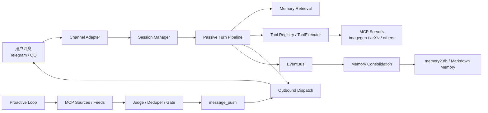
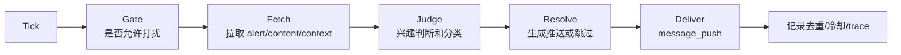

# 02. 架构设计

## 总体架构

这套架构可以分成五层：

- 渠道层：Telegram、QQ 等，把外部消息转成统一内部消息。
- 会话层：维护 history、session_key、source_ref 和上下文。
- Agent Runtime：Phase 生命周期、prompt 组装、LLM reasoning、工具调用、回复生成。
- 能力层：memory、tool registry、MCP、scheduler、proactive loop。
- 存储与评估层：SQLite、Markdown memory、日志、benchmark runner。

## 被动对话链路

一次用户主动发消息后的核心流程：

1. Channel adapter 收到消息，转成统一事件。
2. SessionManager 读取或创建会话，并追加用户消息。
3. BeforeTurn 阶段做预处理和记忆检索。
4. BeforeReasoning 阶段同步工具上下文，例如 channel、chat_id、timestamp、current_user_source_ref。
5. PromptRender 将 persona、历史消息、检索到的记忆、可见工具 schema 拼进模型上下文。
6. Reasoner 调用大模型，可能返回自然语言，也可能返回 tool calls。
7. ToolExecutor 执行工具，经过 pre/post hook、事件记录、结果规范化。
8. AfterTurn 生成 TurnCommitted 事件，触发 memory consolidation 等后处理。
9. OutboundDispatch 将最终回复发回 Telegram/QQ。

相关代码入口：

- `main.py`
- `bootstrap/app.py`
- `bootstrap/tools.py`
- `agent/core/passive_turn.py`
- `agent/lifecycle/phases/before_reasoning.py`
- `agent/lifecycle/phases/after_turn.py`

## Phase 生命周期

Phase 的价值是把一轮对话拆成可插拔阶段，让插件和系统模块通过 slot 依赖编排，而不是把所有逻辑写死在一个巨大函数里。

典型阶段：

- BeforeTurn：读取输入、预检索、补上下文。
- BeforeReasoning：构造 reasoning context，触发插件修改或中止。
- PromptRender：组装 system/user/tool prompt。
- Reasoner：调用模型，处理多轮 ReAct 工具调用。
- AfterReasoning：对模型输出做格式化、媒体处理、特殊工具后处理。
- AfterTurn：提交 TurnCommitted，写会话、触发 memory/post hooks。

面试表达：

> 我把单轮对话拆成多个 Phase，每个 Phase 由多个模块组成，模块声明 requires 和 produces，由 topo sort 决定执行顺序。这样 memory、工具上下文、插件和统计逻辑都可以独立插入，不需要在核心对话循环里堆 if else。

## 事件系统

EventBus 用于把核心链路和旁路能力解耦。例如 AfterTurn 产生 TurnCommitted 后，memory 插件可以订阅这个事件做异步写入，Dashboard 或日志模块也可以订阅同一个事件做观测。

优势：

- 主链路只负责把事件发出去，不关心谁消费。
- 新增能力时减少侵入式修改。
- 适合处理 memory consolidation、工具日志、主动推送状态等副作用。

相关代码：

- `bus/event_bus.py`
- `bus/events_lifecycle.py`
- `core/memory/markdown.py`
- `plugins/default_memory/engine.py`

## 工具执行链路

工具注册在 ToolRegistry 中，执行时统一经过 ToolExecutor：

1. ToolRegistry 保存工具对象、schema、风险等级、来源和搜索文档。
2. 模型发起 tool call。
3. ToolExecutor 先执行 preflight / pre hook，可以拒绝、改参或记录。
4. 调用 ToolRegistry.execute 执行真实工具。
5. 执行后产生 AfterToolResultCtx，用于日志、插件、特殊后处理。
6. imagegen 和 arXiv 这类工具结果可以被即时推送到 Telegram。

面试表达：

> 工具系统不是简单字典调用，而是带 registry、schema、risk、source、hook 和 event 的统一执行层。这样可以支持内置工具、插件工具和 MCP 工具共用一条执行链路。

## 主动推送链路

主动推送不是普通定时任务，而是 Agent 自己做一轮判断：

个人助手场景中，典型用法是：

- 定时搜索 arXiv。
- 结合用户长期偏好判断论文是否相关。
- 生成摘要和推荐理由。
- 主动推送到 Telegram。

相关代码：

- `proactive_v2/loop.py`
- `proactive_v2/agent_tick_factory.py`
- `agent/core/proactive_turn.py`
- `proactive_v2/tools.py`
- `proactive_v2/mcp_sources.py`

## 架构亮点

- 解耦：Phase + EventBus 让核心流程和插件能力分离。
- 可扩展：ToolRegistry + MCP 让新能力以工具形式接入。
- 可控：deferred tool search 降低 prompt 工具污染。
- 可追溯：memory 和工具调用都保留 source_ref / trace。
- 可评估：LongMemEval runner 能把记忆能力量化。

## 当前边界

- 个人助手记忆是当前主线，群聊 memory 只作为后续扩展。
- memory 写入仍依赖 LLM 提取，存在误写和漏写风险。
- 大规模全量评测成本较高，需要进一步优化 grouped/shared-context runner。
- 主动推送质量依赖信息源质量、用户偏好建模和去重策略。

