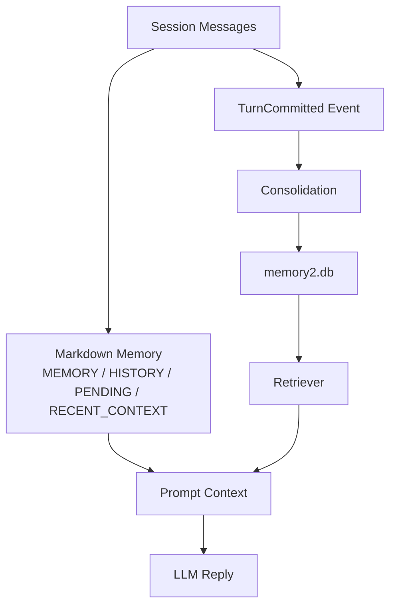

# 03. 个人长期记忆系统

## 设计目标

个人助手的 memory 目标不是“把聊天记录都存起来”，而是让 Agent 在未来新会话中仍能正确理解用户：

- 用户是谁：背景、长期状态、拥有的资源、正在做的项目。
- 用户喜欢什么：解释风格、推荐偏好、技术关注方向。
- 用户希望助手怎么做：固定工作流、工具使用习惯、输出格式要求。
- 过去发生了什么：重要事件、任务进展、已完成操作和证据。

## Memory 与 RAG 的区别

RAG 通常是“给定一个外部知识库，按问题检索相关文档”。个人 memory 更像“持续维护用户状态”：

| 维度 | RAG | 个人 Memory |
| --- | --- | --- |
| 数据来源 | 文档、网页、知识库 | 用户对话、操作记录、工具结果 |
| 生命周期 | 通常静态或批量更新 | 持续在线写入、更新、遗忘 |
| 目标 | 回答知识问题 | 个性化理解用户和执行偏好 |
| 冲突处理 | 文档版本管理 | preference/profile/procedure 的 supersede |
| 可靠性 | 依赖文档片段 | 需要 source_ref 追溯到原始消息 |

面试回答：

> RAG 解决的是外部知识召回，Memory 解决的是用户状态维护。个人助手需要知道用户长期偏好、工作流和历史决策，而且这些信息会变化，所以必须支持写入门控、更新、遗忘和证据追溯。

## 当前系统分层

当前系统是混合架构：

- Raw session：保存原始消息，负责可追溯证据。
- Markdown memory：维护可读的长期记忆文件和近期上下文。
- SQLite memory2：保存结构化记忆、embedding、source_ref、状态和更新关系。
- Retriever：负责向量、关键词、RRF 融合和注入预算。

相关代码：

- `bootstrap/memory.py`
- `core/memory/markdown.py`
- `plugins/default_memory/engine.py`
- `memory2/store.py`
- `memory2/memorizer.py`
- `memory2/retriever.py`
- `agent/tools/recall_memory.py`
- `agent/tools/memorize.py`
- `agent/tools/forget_memory.py`

## 记忆类型

当前个人助手最适合主讲这几类：

1. profile  
   关于用户本人的长期事实，例如身份背景、长期项目、设备、稳定状态。

2. preference  
   用户希望助手如何服务，例如“回答要简洁”“推荐论文关注 agent memory”“优先给可执行命令”。

3. procedure  
   用户要求未来类似任务遵守的操作规则，例如“做本地排障时先跑命令验证”“工具多时先 tool_search 再调用”。

4. event  
   具体时间发生的事情，例如项目评测结果、一次配置变更、某次工具执行结果。

面试中建议强调：

> profile/preference/procedure 是个人助手最有价值的长期记忆，event 则用于时间线和证据回溯。不同类型的记忆写入门槛不同，检索和注入策略也不同。

## 写入流程

一次对话结束后，AfterTurn 会生成 TurnCommitted 事件。memory 插件订阅事件，然后进行异步或后处理式写入。

简化流程：

1. 用户对话进入 session。
2. 回复结束后产生 TurnCommitted。
3. Markdown consolidation 更新 HISTORY/PENDING/RECENT_CONTEXT。
4. default_memory engine 读取 consolidation 结果或对话窗口。
5. LLM 提取 profile/preference/procedure。
6. Memorizer 去重、判断是否 supersede 旧记忆。
7. MemoryStore2 写入 SQLite，保存 source_ref、extra_json、embedding、status。

核心原则：

- 宁可漏写，不要误写。
- 只有用户明确表达的长期信息才写入 profile/preference/procedure。
- 助手自己的建议不能轻易变成用户偏好。
- 每条长期记忆都应该能追溯来源。

## 检索流程

用户新问题进入时，memory 检索不是单纯向量 top-k，而是多路召回：

1. 根据当前问题构造 query。
2. 可选生成 HyDE/aux queries，增强语义召回。
3. 向量检索召回语义相似记忆。
4. 关键词检索保留字面命中能力。
5. RRF 融合排序。
6. 按 memory_type、scope、时间过滤和分数阈值裁剪。
7. 组装 injection block 放入 prompt。

相关代码：

- `memory2/retriever.py`
- `memory2/store.py`
- `plugins/default_memory/engine.py`
- `agent/retrieval/default_pipeline.py`

面试表达：

> 我没有只依赖向量检索，因为个人记忆里有很多人名、工具名、日期、项目名，纯 embedding 容易漏掉字面信息。所以检索层做了向量 lane、关键词 lane，再用 RRF 融合，并按记忆类型和注入预算控制最终上下文。

## 更新与遗忘

个人助手的记忆不能只追加，否则用户偏好变化后会互相冲突。例如用户以前说“喜欢详细解释”，后来改成“面试回答要简洁”。系统需要 supersede 旧记忆。

当前机制：

- memory_items 有 status 字段，active/superseded 区分当前有效与历史版本。
- memory_replacements 记录新旧记忆替换关系。
- Memorizer 在写入 preference/procedure/profile 时查找相似旧记忆，并执行 supersede。
- forget_memory 可以显式遗忘匹配记忆。

面试表达：

> 长期记忆不能简单 append-only。对偏好、流程规则这类状态型记忆，我会做相似记忆匹配和 supersede，把旧版本标记为 superseded，同时保留 replacement 关系，既保证当前回答使用最新偏好，也保留审计能力。

## 可靠性设计

个人 memory 最大风险是“误记”。可以从四个层面回答：

1. 写入门控  
   提取 prompt 明确要求高门槛，只有 6 个月后仍有价值的信息才写入。

2. 类型约束  
   profile、preference、procedure 语义明确，不把普通闲聊或助手建议写成长期偏好。

3. 证据追溯  
   每条记忆保留 source_ref，回答重要问题时可回查原始消息。

4. 更新机制  
   用户偏好变化时 supersede 旧记忆，而不是并存多个互相冲突的结论。

## 可优化方向

- 引入更明确的 memory write gate，把“候选记忆生成”和“是否值得长期保存”拆成两步。
- 给每条记忆增加 confidence、valid_until、last_verified_at。
- 对 preference/procedure 建立更强的 schema，例如适用场景、触发条件、反例。
- 做定期 memory audit，找出冲突、过期、无来源、低价值记忆。
- 将评估集按 profile/preference/procedure/event 分类，分别看召回和写入错误。

